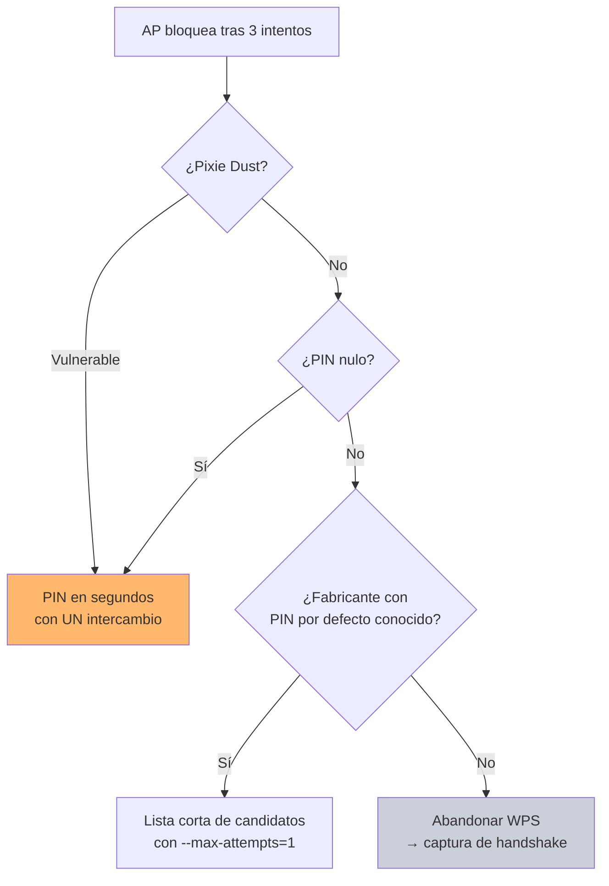

---
tags:
  - Wi-Fi/WPS
  - Pentesting/Explotacion
Descripción: "Cómo bloquean los APs tras varios PIN fallidos, qué opciones de reaver ayudan y las vías para forzar el desbloqueo sin quemar el objetivo"
Fecha de actualización: 2026-08-01
Nota previa: "[[03 - Fuerza bruta online del PIN]]"
Nota siguiente: "[[05 - PINs por defecto y bases de datos]]"
Area: "[[WPS.base|WPS]]"
---
---

Los fabricantes respondieron al ataque de 2011 con **bloqueo por intentos fallidos**. <mark style="background: #ADCCFFA6;">Es la única mitigación real que se desplegó, y no arregla el protocolo: sólo hace la fuerza bruta impracticable</mark>. Deja intactos Pixie Dust, el PIN nulo y los PINs por defecto, porque todos ellos necesitan pocos intentos o uno solo.

# Cómo se manifiesta

```shell-session
$ sudo reaver -i mon0 -c 1 -b 86:53:10:C3:1B:26 -v

[+] Trying pin "12345670"
[+] Associated with 86:53:10:C3:1B:26 (ESSID: HackMe)
[+] Trying pin "00005678"
[+] Trying pin "01235678"
[!] WARNING: Detected AP rate limiting, waiting 60 seconds before re-checking
```

Y en el reconocimiento paralelo, el estado cambia:

```shell-session
$ sudo airodump-ng mon0 --wps -c 1

 BSSID              PWR Beacons  CH  ENC  CIPHER AUTH WPS     ESSID
 86:53:10:C3:1B:26  -28     483   1  WPA2 CCMP   PSK  Locked  HackMe
```

<mark style="background: #FFB8EBA6;">Mantener un `airodump-ng --wps` en una segunda terminal mientras reaver trabaja es la forma de ver el bloqueo en tiempo real</mark> y detenerse antes de agotar los intentos.

# Los patrones de bloqueo

No hay un estándar; cada fabricante implementa lo suyo. Los comportamientos que se encuentran:

| Patrón | Descripción |
| ------ | ----------- |
| **Sin bloqueo** | Equipamiento antiguo o firmware sin parchear. La fuerza bruta completa es viable |
| **Retardo progresivo** | Cada fallo aumenta el tiempo de espera. Alarga el ataque sin impedirlo |
| **Bloqueo temporal** | Típicamente 60 s tras 3 fallos. Recuperable |
| **Bloqueo hasta reinicio** | El AP no vuelve a aceptar PINs hasta que alguien lo reinicia |
| **Bloqueo prolongado** | Algunos firmwares fijan periodos muy largos, en la práctica permanentes |

> [!warning]+ Matiz sobre el "bloqueo de 365 días"
> HTB afirma que "tras 10 intentos incorrectos el AP se bloquea durante 365 días". Es un comportamiento **de firmwares concretos**, no una regla general. Lo que sí se puede afirmar es que <mark style="background: #FF5582A6;">una parte del equipamiento moderno se bloquea de forma que, a efectos del engagement, es permanente</mark>. La consecuencia práctica es la misma y es la que importa: **agotar intentos puede quemar el objetivo para el resto de la prueba**, y eso hay que decidirlo antes de lanzar el ataque, no después.

# Ajustar reaver al comportamiento del AP

| Opción | Uso |
| ------ | --- |
| `-L`, `--ignore-locks` | Ignora el estado de bloqueo que reporta el AP. Útil cuando lo anuncia pero sigue respondiendo |
| `-N`, `--no-nacks` | No enviar `NACK` ante paquetes fuera de orden. Evita que el AP contabilice ciertos fallos |
| `-d <s>` | Retardo entre intentos. Subirlo reduce la probabilidad de disparar el límite |
| `-T <s>` | Timeout de M5/M7. Bajarlo acelera; subirlo estabiliza en enlaces malos |
| `-r x:y` | Dormir `y` segundos cada `x` intentos. La forma de mantenerse bajo el umbral |
| `-l <s>` | Cuánto esperar cuando detecta bloqueo |
| `--max-attempts=N` | Limitar el daño: probar `N` PINs y parar |

Una configuración conservadora, pensada para no bloquear el AP:

```shell-session
$ sudo reaver -i mon0 -b 86:53:10:C3:1B:26 -c 1 -d 15 -r 3:60 -T 2 -L -vv
```

Tres intentos, un minuto de pausa, quince segundos entre PINs. <mark style="background: #FFB86CA6;">A ese ritmo, 11.000 intentos son semanas</mark> — lo que confirma que contra un AP con bloqueo la fuerza bruta completa no es una opción, y que estos ajustes sirven sólo para probar una lista corta de candidatos.

# Vías para desbloquear

## Cambiar de identidad

Es lo que HTB no menciona y suele ser lo primero que funciona. **Parte del equipamiento cuenta los intentos por MAC de origen**, no globalmente. Cambiar la MAC de la interfaz reinicia el contador:

```shell-session
$ sudo ip link set mon0 down
$ sudo macchanger -r mon0
$ sudo ip link set mon0 up
```

No funciona en todos los firmwares —los que llevan un contador global lo ignoran—, pero cuesta diez segundos comprobarlo. Ver [[08 - Bypass de filtrado MAC]] para la mecánica.

## Provocar un reinicio

Muchos APs se desbloquean al reiniciar. Un `mdk4` sostenido puede tumbar el servicio WPS o el propio AP en equipamiento doméstico — es lo que cubre [[10 - DoS contra WPS con MDK4]].

> [!warning]+ Esto es denegación de servicio
> Reiniciar un AP corta la conectividad de todos sus usuarios. <mark style="background: #FF5582A6;">Necesita estar explícitamente en el alcance</mark>, y aun estándolo conviene hacerlo fuera de horario y avisando al contacto técnico. Un AP que no vuelve a levantarse es un incidente que se atribuye al pentest.

## Esperar

El bloqueo temporal expira. En un engagement de varios días, dejar el objetivo tranquilo y volver al día siguiente es a menudo más rentable que insistir — y no genera ninguna alerta adicional.

# Replantear el ataque

Si el AP bloquea de forma agresiva, la respuesta correcta no es afinar reaver sino cambiar de vector:



<mark style="background: #8000E1A6;">El bloqueo es una defensa contra el *volumen*, no contra la técnica</mark>. Pixie Dust necesita un solo intercambio EAP —llega hasta M3 y ya tiene lo que necesita—, así que un AP que bloquea a los tres intentos sigue siendo completamente vulnerable si su chipset genera nonces predecibles.

Y si nada funciona, WPS se descarta y se vuelve a la captura del handshake WPA2, que no depende de esto en absoluto.

La vía de las listas cortas de candidatos es [[05 - PINs por defecto y bases de datos]].
