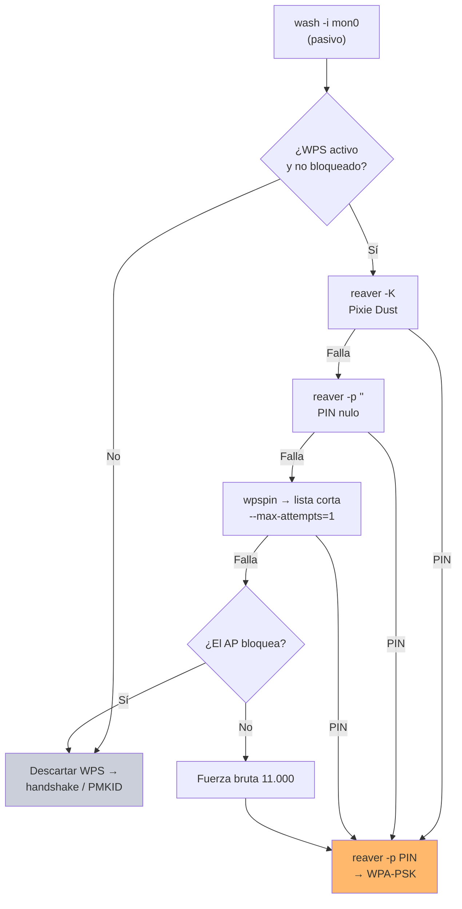

---
tags:
  - Wi-Fi/WPS
  - Tipo/Arsenal
  - Pentesting/Explotacion
Descripción: "Qué herramientas del ecosistema WPS siguen mantenidas, cuáles están abandonadas y el flujo de trabajo recomendado en un engagement"
Fecha de actualización: 2026-08-04
Nota previa: "[[11 - Detección y evasión de ataques WPS]]"
Nota siguiente: 
Area: "[[WPS.base|WPS]]"
---
---

<mark style="background: #ADCCFFA6;">El ecosistema de herramientas WPS está mayoritariamente congelado</mark>: son proyectos de 2011–2016 que resuelven un problema que no ha cambiado. Eso no las invalida —el protocolo es el mismo— pero sí obliga a saber cuáles siguen recibiendo correcciones y cuáles arrastran dependencias muertas.

# Estado real de las herramientas

Comprobado contra sus repositorios el **2026-08-01**:

| Herramienta | Última actividad | Estado |
| ----------- | ---------------- | ------ |
| [`hcxdumptool`](https://github.com/ZerBea/hcxdumptool) | 2026-07 · release 7.1.2 | **El más activo del ecosistema Wi-Fi** |
| [`airgeddon`](https://github.com/v1s1t0r1sh3r3/airgeddon) | 2026-07 | **Activo.** Envoltorio integrado de todo lo demás |
| [`pixiewps`](https://github.com/wiire-a/pixiewps) | 2026-04 · release 1.4.2 (2018) | Activo en `master` |
| [`OneShot` (fulvius31)](https://github.com/fulvius31/OneShot) | 2026-06 | Activo. Sustituye al repo original desaparecido |
| [`reaver` (t6x)](https://github.com/t6x/reaver-wps-fork-t6x) | 2025-10 · release v1.6.6 (2020) | Mantenido en `master`, release antigua |
| [`WPS-PIN`](https://github.com/linkp2p/WPS-PIN) | 2023-12 | Funcional, poco movimiento |
| [`bully`](https://github.com/aanarchyy/bully) | 2023-10 | **Estancado.** Sigue funcionando |
| [`nmk`](https://github.com/kcdtv/nmk) | 2021-10 | Muy específico (Arcadyan/Livebox) |
| [`Default-wps-pin`](https://github.com/eye9poob/Default-wps-pin) | **2014-09** | **Abandonado.** Python 2 |
| `drygdryg/OneShot` · `drygdryg/wpspin` | — | **Desaparecidos de GitHub** |

> [!warning]+ Dos avisos que HTB no da
> El módulo enlaza `Default-wps-pin`, sin tocar desde **septiembre de 2014** y escrito en **Python 2**, retirado en enero de 2020. Y apunta a repositorios de `wpspin`/`OneShot` cuyo original ya no existe.
>
> <mark style="background: #FF5582A6;">Un fork de una herramienta desaparecida es un blanco evidente para suplantación</mark>: cualquiera puede publicar un repositorio con el nombre huérfano. Antes de ejecutar como root una herramienta de seguridad clonada de GitHub, revisar el código y comprobar la actividad del autor. Aplica especialmente a los scripts de generación de PIN, que son cortos y fáciles de leer.

# El flujo de trabajo



Los comandos, en orden:

```shell-session
# 1 · Reconocimiento pasivo
$ sudo wash -i mon0
$ sudo airodump-ng --wps --manufacturer -c 1 mon0

# 2 · Pixie Dust
$ sudo reaver -K -vvv -i mon0 -b <BSSID> -c <canal>

# 3 · PIN nulo
$ sudo reaver -i mon0 -b <BSSID> -c <canal> -p ""

# 4 · PINs por defecto
$ wpspin <BSSID> | grep -Eo '\b[0-9]{8}\b' > pins.txt

# 5 · Canjear el PIN por la contraseña
$ sudo reaver -i mon0 -b <BSSID> -c <canal> -p <PIN>
```

# Reparto por función

| Función | Herramienta | Nota |
| ------- | ----------- | ---- |
| Reconocimiento | `wash`, `airodump-ng --wps` | [[00 - Reaver y wash]] |
| Fuerza bruta online | `reaver`, `bully` | [[01 - Bully]] |
| Pixie Dust | `reaver -K`, `OneShot -K`, `pixiewps` | [[02 - Pixiewps]] |
| PBC | `wpa_cli wps_pbc`, `OneShot --pbc` | [[03 - OneShot y el estado del arte]] |
| Generación de PIN | `wpspin`, `WPS-PIN`, `nmk` | [[06 - Algoritmos de generación de PIN]] |
| DoS / desbloqueo | `mdk4` | [[00 - MDK4]] |
| Todo integrado | `airgeddon` | Menú interactivo, mantenido |

<mark style="background: #8000E1A6;">Para un engagement real, `airgeddon` es la vía más eficiente</mark>: encadena reconocimiento, Pixie Dust, PIN nulo, PINs por defecto y fuerza bruta desde un menú, y es de lo poco del ecosistema que sigue recibiendo cambios. Las herramientas sueltas siguen siendo necesarias cuando hace falta control fino sobre las temporizaciones o depurar por qué algo falla.

# El estado de WPS

Dos hechos que conviene tener claros al escribir el informe:

**WPS no ha desaparecido.** WPA3 no lo admite y su sustituto es **Wi-Fi Easy Connect** (`DPP`), pero <mark style="background: #FFB8EBA6;">la Wi-Fi Alliance no exige Easy Connect para certificar WPA3</mark>, y su adopción es marginal: en febrero de 2025 había apenas 23 dispositivos certificados de 6 fabricantes. Mientras tanto WPS sigue certificado por compatibilidad y activado de fábrica en buena parte del equipamiento doméstico y de PYME.

**El bloqueo por intentos no es una solución.** Se desplegó como respuesta al ataque de 2011 y funciona contra la fuerza bruta, pero Pixie Dust, el PIN nulo, los PIN derivados del BSSID y PBC lo esquivan por completo — todos necesitan uno o pocos intentos.

> [!important]+ Cómo redactar el hallazgo
> No es "WPS está habilitado". Es: **con WPS habilitado, la `WPA-PSK` de la red es recuperable en segundos con independencia de su longitud y complejidad**, y la mitigación desplegada por el fabricante (bloqueo tras N intentos) no cubre los vectores actuales. La recomendación es desactivarlo y verificarlo, no endurecerlo.
>
> Si además el AP resultó vulnerable a Pixie Dust, merece la pena nombrar el modo (`Mode: 1 (RT/MT/CL)`) y el chipset: es lo que permite al cliente decidir si tiene el mismo modelo desplegado en otras sedes.

# Qué revisar en el próximo engagement

- ¿Hay APs con WPS que nadie inventarió? Repetidores, equipos de sucursal, routers de respaldo 4G.
- ¿El interruptor de WPS de la interfaz web **realmente** lo desactiva? Comprobarlo con `wash` después de tocarlo.
- ¿Los AP tienen el botón físico accesible? Es una credencial en la pared — [[09 - Push Button Configuration y sus abusos]].
- ¿El controlador alerta de `WPS-SUCCESS` desde dispositivos desconocidos? Es la única detección que cubre Pixie Dust — [[11 - Detección y evasión de ataques WPS]].

> [!info]+ Si WPS no cede, la siguiente vía
> WPS es el atajo, no la única puerta. Cuando está desactivado o bloqueado, el ataque a la misma red continúa por el handshake o el PMKID — el árbol de decisión completo está en [[00 - Metodología del cracking de PSK]] y su arsenal en [[11 - Arsenal de cracking Wi-Fi]].
>
> Y al revés: **`hcxpsktool --wpskeys`** genera claves WPS sin depender de los repositorios de generación de PIN, dos de los cuales han desaparecido de GitHub — ver [[06 - Credenciales por defecto y keyspaces de fabricante]].
