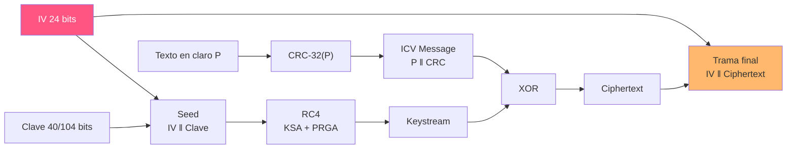

---
tags:
  - Wi-Fi/WEP
  - Pentesting/Explotacion
Descripción: "Implementación completa del cifrado WEP en Python, el formato real de la trama y en qué se diferencia el mock de la implementación del estándar"
Fecha de actualización: 2026-08-01
Nota previa: "[[02 - El ICV CRC-32 y su linealidad]]"
Nota siguiente: "[[04 - Identificar el IV en la captura]]"
Area: "[[WEP.base|WEP]]"
---
---

Con el keystream de [[01 - RC4 y la generación del keystream]] y el ICV de [[02 - El ICV CRC-32 y su linealidad]] ya se puede montar el algoritmo entero. <mark style="background: #ADCCFFA6;">Implementarlo es la forma más rápida de ver dónde encaja cada ataque</mark>.

# El algoritmo



En rojo, lo que viaja en claro y el atacante conoce siempre.

# Cifrar

```python
import zlib
from Crypto.Cipher import ARC4
from Crypto.Random import get_random_bytes

def wep_cifrar(texto_claro: bytes, clave: bytes) -> bytes:
    IV   = get_random_bytes(3)                     # 24 bits
    seed = IV + clave                              # 64 o 128 bits

    icv     = zlib.crc32(texto_claro).to_bytes(4, 'little')
    mensaje = texto_claro + icv                    # ICV Message

    keystream  = ARC4.new(seed)
    ciphertext = keystream.encrypt(mensaje)        # XOR con el keystream

    return IV + ciphertext                         # trama final
```

# Descifrar

Es la misma operación, porque el XOR es su propio inverso. Lo único que hace falta es separar el IV, que viene delante:

```python
def wep_descifrar(trama: bytes, clave: bytes):
    IV, ciphertext = trama[:3], trama[3:]
    keystream = ARC4.new(IV + clave)
    mensaje   = keystream.decrypt(ciphertext)

    texto_claro, icv = mensaje[:-4], mensaje[-4:]
    valido = zlib.crc32(texto_claro).to_bytes(4, 'little') == icv
    return texto_claro, valido
```

Con el IV fijado a `5d7eb7` para poder reproducir la salida:

```text
crc32          = 2950664974  (0xAFDF930E)
IV:              5d7eb7
Seed 64:         5d7eb70102030405
ICV Message:     b'Something Sensitive\x0e\x93\xdf\xaf'
Trama final:     5d7eb7791275684f0e99a0d5e03811c62b4f278125f63bc5e4b2
Descifrado:      b'Something Sensitive'   ICV válido: True
```

Se ve el ensamblaje completo: los 19 bytes del texto, los 4 del ICV en little-endian (`0e 93 df af`, que es `0xAFDF930E` al revés), y la trama final con el IV en claro delante de los 23 bytes cifrados.

> [!info]+ Diferencia con el mock de HTB
> El módulo 185 usa `to_bytes(4, 'big')` y por eso su ICV sale como `\xaf\xdf\x93\x0e` — los mismos cuatro bytes en orden inverso. <mark style="background: #FFB8EBA6;">Ninguna de las dos versiones es interoperable con WEP real</mark>; lo único que importa en un mock es que cifrado y descifrado usen la misma convención. Al comparar salidas entre ambos, el ICV parecerá distinto y no lo es.

<mark style="background: #FFB8EBA6;">Con el IV aleatorio, la trama final cambia en cada ejecución aunque el texto y la clave sean idénticos</mark>. Es lo único que impide que WEP sea trivialmente reconocible — y por eso las colisiones de IV son tan graves.

# Lo que el mock no reproduce

Este código sirve para entender el algoritmo, no para hablar con un AP real. Las diferencias con el estándar:

| Aspecto | Mock | 802.11 real |
| ------- | ---- | ----------- |
| **Cabecera WEP** | Sólo 3 bytes de IV | 4 bytes: IV + `Key ID` (2 bits) + relleno |
| **Cuatro claves** | Una | El estándar admite 4 claves, seleccionadas por `Key ID` |
| **Generación del IV** | Aleatoria | Sin especificar. Muchas implementaciones lo hacen **secuencial** |
| **Encapsulado** | Texto plano | El cuerpo real es una trama LLC/SNAP |
| **FCS** | No | La trama 802.11 lleva su propio CRC-32 externo, sin cifrar |

El detalle del **IV secuencial** es más relevante de lo que parece: si dos dispositivos arrancan a la vez y ambos empiezan en cero, colisionan desde el primer paquete. <mark style="background: #FFB86CA6;">La aleatoriedad del mock es en realidad el caso *más favorable* para WEP</mark>; muchas implementaciones reales son peores.

# Dónde ataca cada técnica

| Punto del algoritmo | Ataque |
| ------------------- | ------ |
| El IV viaja en claro | Recolección estadística → FMS, KoreK, PTW |
| El IV es de 24 bits | Colisión de keystream → XOR de textos en claro |
| El ICV es lineal | Bit-flipping, [[07 - KoreK ChopChop]], [[06 - Ataque de fragmentación]] |
| La clave es estática | El material acumulado nunca caduca |
| Shared Key regala keystream | *Fake auth* → [[09 - Atacar un AP WEP sin clientes]] |
| El AP responde a lo que se le inyecta | Aceleración de IVs → [[05 - ARP Request Replay]] |

Todos convergen en lo mismo: <mark style="background: #8000E1A6;">acumular IVs distintos lo más rápido posible</mark>. El cracking no es fuerza bruta sobre la clave, sino análisis estadístico que necesita volumen — y los ataques de inyección existen para generar ese volumen en minutos en lugar de días.

# Verlo en un paquete real

Sobre una captura, el filtro de Wireshark que aísla el tráfico WEP:

```text
wlan.fc.protected == 1 && !(wlan.rsn.ie)
```

Y los campos concretos:

```text
wlan.wep.iv        # el IV de 3 bytes
wlan.wep.key       # el índice de clave
wlan.wep.icv       # el ICV cifrado
```

Cómo localizarlos e interpretarlos es [[04 - Identificar el IV en la captura]].
