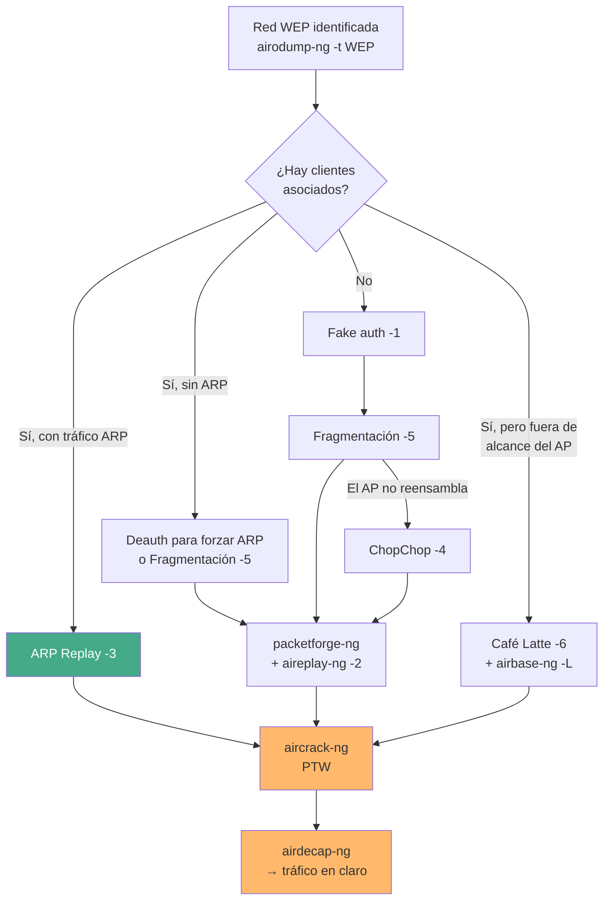

---
tags:
  - Wi-Fi/WEP
  - Tipo/Arsenal
  - Pentesting/Explotacion
Descripción: "El árbol de decisión completo de los ataques a WEP, las herramientas que siguen sirviendo y dónde encontrar WEP veinte años después de su retirada"
Fecha de actualización: 2026-08-01
Nota previa: "[[11 - Detección y evasión de ataques WEP]]"
Nota siguiente: 
Area: "[[WEP.base|WEP]]"
---
---

WEP es el único tema de este path donde <mark style="background: #ADCCFFA6;">las herramientas de hace quince años siguen siendo exactamente las correctas</mark>: el protocolo no ha cambiado, los ataques no han mejorado porque no les hace falta, y `aircrack-ng` lo cubre entero. Lo que sí ha cambiado es dónde se encuentra WEP y qué significa encontrarlo.

# El árbol de decisión



| Situación | Vía | Nota |
| --------- | --- | ---- |
| Cliente con tráfico ARP | ARP Replay | [[05 - ARP Request Replay]] |
| Cliente sin ARP | Deauth o fragmentación | [[06 - Ataque de fragmentación]] |
| Cliente lejos de su red | Café Latte | [[08 - Café Latte y ataques al cliente]] |
| Sin clientes | Fake auth + frag/chop | [[09 - Atacar un AP WEP sin clientes]] |
| El AP no fragmenta | ChopChop | [[07 - KoreK ChopChop]] |
| Pocos IVs | Diccionario | [[10 - Cracking - PTW, FMS y KoreK]] |

# El arsenal

Todo vive en la suite [[00 - La suite Aircrack-ng|Aircrack-ng]]:

| Herramienta | Papel |
| ----------- | ----- |
| `airodump-ng` | Localizar la red, contar IVs, capturar. `-t WEP`, `--ivs` |
| `aireplay-ng` | Los seis ataques: `-1` fake auth, `-2` replay interactivo, `-3` ARP, `-4` ChopChop, `-5` fragmentación, `-6` Café Latte, `-7` cfrag |
| `packetforge-ng` | Forjar un ARP cifrado a partir del keystream |
| `airbase-ng` | AP falso para Café Latte (`-W 1 -L`) |
| `aircrack-ng` | Recuperar la clave. PTW por defecto, `-K` para KoreK |
| `airdecap-ng` | Descifrar la captura con la clave obtenida |
| `tcpdump` / Wireshark | Analizar el paquete descifrado y sacar el direccionamiento |

<mark style="background: #FFB8EBA6;">Es el único escenario del path donde `aircrack-ng` sigue siendo la mejor opción de cracking</mark>: no es fuerza bruta, así que `hashcat` no aporta nada. Para WPA2 la recomendación se invierte por completo — ver [[06 - Aircrack-ng]].

**Alternativas:** `airgeddon` (activo en 2026) encadena todo el flujo desde un menú y es cómodo para no recordar la secuencia de `-1`, `-5`, `packetforge-ng`, `-2`. `wifite2` automatiza el barrido pero da poco control cuando algo falla.

# Comandos de referencia

```shell-session
# Localizar
$ sudo airodump-ng --band abg -t WEP wlan0mon

# Capturar el objetivo
$ sudo airodump-ng -c <CH> --bssid <BSSID> -w WEP wlan0mon

# Con cliente: ARP replay
$ sudo aireplay-ng -3 -x 200 -b <BSSID> -h <MAC_CLIENTE> wlan0mon

# Sin cliente: fake auth mantenido
$ sudo aireplay-ng -1 1000 -o 1 -q 5 -e <ESSID> -a <BSSID> -h <MI_MAC> wlan0mon

# Conseguir keystream
$ sudo aireplay-ng -5 -b <BSSID> -h <MAC> wlan0mon     # fragmentación
$ sudo aireplay-ng -4 -b <BSSID> -h <MAC> wlan0mon     # ChopChop

# Forjar e inyectar
$ packetforge-ng -0 -a <BSSID> -h <MAC> -k 255.255.255.255 -l 255.255.255.255 \
                 -y keystream.xor -w forgedarp.cap
$ sudo aireplay-ng -2 -r forgedarp.cap wlan0mon

# Crackear y descifrar
$ aircrack-ng -b <BSSID> WEP-01.cap
$ airdecap-ng -w <CLAVE_HEX> WEP-01.cap
```

# Dónde sigue habiendo WEP

Veinte años después de su retirada, no aparece por descuido sino por **restricciones de ciclo de vida**:

| Entorno | Por qué |
| ------- | ------- |
| **ICS / SCADA** | Equipamiento con 20–30 años de vida útil, certificado con un firmware concreto |
| **Sanidad** | Bombas de infusión, monitores y equipos de imagen anteriores a WPA2 |
| **Logística** | Lectores de códigos de barras y terminales de almacén heredados |
| **Hostelería** | Redes de invitados de hoteles y gimnasios que nadie revisó |
| **Comunidades y PYME** | Routers de operador de hace década y media |
| **Modo migración WPA/WEP** | APs que aceptan ambos por compatibilidad — una red "WPA" que es WEP en la práctica |

<mark style="background: #FF5582A6;">El patrón común: sistemas donde actualizar exige recertificar, parar producción o sustituir hardware caro</mark>. Nadie mantiene WEP por ignorancia; lo mantiene porque migrar cuesta dinero y tiempo. Eso condiciona cómo se escribe la recomendación: proponer "cambiar a WPA3" sin más será ignorado.

# Lo que WEP enseña y sigue aplicando

Los tres errores de WEP siguen apareciendo en auditorías de 2026, fuera de Wi-Fi:

| Error de WEP | Dónde reaparece |
| ------------ | --------------- |
| **Cifrar sin autenticar** | Cookies cifradas sin firmar, JWE mal usado, protocolos propietarios con AES-CBC sin MAC |
| **Checksum donde hace falta un MAC** | Tokens con CRC, "firmas" que son un hash sin clave |
| **Nonce/IV demasiado corto o reutilizado** | AES-GCM con nonce repetido — que pierde la clave de autenticación, no sólo la confidencialidad |
| **Oráculo de descifrado** | *Padding oracle*, respuestas que distinguen "descifrado inválido" de "dato inválido" |

<mark style="background: #8000E1A6;">ChopChop es un padding oracle antes de que el término existiera</mark>. Reconocer el patrón aquí ayuda a reconocerlo en un binario o en una API.

# Lo que hay que llevar al informe

1. **La longitud de la clave es irrelevante.** 40 o 104 bits caen igual; sólo cambia el número de IVs necesarios. Cualquier recomendación de "usar una clave más larga" es incorrecta.
2. **El compromiso es retroactivo.** Con la clave se descifra todo lo capturado antes, porque no hay derivación por sesión.
3. **Sin clientes no está a salvo**, sólo tarda más. En cuanto un dispositivo se conecta, la clave cae en minutos.
4. **El perímetro no protege.** Café Latte recupera la clave desde otra ciudad, a través de un portátil con el perfil guardado.
5. **La única corrección es migrar.** Si no es posible, aislar en VLAN sin encaminamiento y tratar el segmento como no confiable.

> [!important]+ La demostración que convence
> Enseñar la clave recuperada rara vez mueve a nadie. Lo que mueve es el **tráfico descifrado**: ejecutar `airdecap-ng` y abrir el `.cap` resultante en Wireshark mostrando credenciales, nombres de host, protocolos internos y qué sistemas hablan con qué. <mark style="background: #FFB86CA6;">Ver su propia red en claro es lo que convierte un hallazgo técnico en presupuesto para sustituir equipamiento</mark>. Ver [[05 - Airdecap-ng]].
