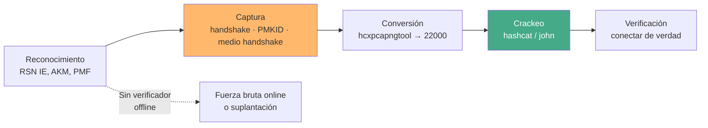

---
tags:
  - Wi-Fi/WPA
  - Tipo/Introduccion
  - Pentesting/Explotacion
Descripción: "Qué se puede crackear y qué no según el protocolo de la red, dónde se decide el éxito antes de lanzar hashcat, y por qué PMF marca la frontera del método clásico"
Fecha de actualización: 2026-08-04
Nota previa: 
Nota siguiente: "[[01 - Capturar el material criptográfico]]"
Area: "[[Cracking Wi-Fi.base|Cracking Wi-Fi]]"
---
---

Crackear una red Wi-Fi es un problema de **recolección**, no de cómputo. La GPU importa mucho menos que la respuesta a dos preguntas que se contestan durante el reconocimiento: <mark style="background: #ADCCFFA6;">¿este protocolo deja un verificador que se pueda atacar offline, y tengo forma de provocarlo?</mark> Si la respuesta a cualquiera de las dos es no, ningún rig arregla el ataque.

# Qué deja atacar cada protocolo

| Red | Material capturable | Ataque | Coste |
| --- | ------------------- | ------ | ----- |
| **WEP** | IV repetidos | Estadístico, sin diccionario | Minutos — ver [[10 - Cracking - PTW, FMS y KoreK]] |
| **WPA2-PSK** | 4-way handshake o PMKID | **Offline**, diccionario/máscara | Depende de la passphrase |
| **WPA3-SAE** | Nada crackeable offline | **Online** contra el AP | Decenas de intentos/segundo |
| **WPA3 transición** | Handshake WPA2 vía downgrade | Offline, como WPA2 | Igual que WPA2 |
| **WPA2/3-Enterprise** | Reto/respuesta MSCHAPv2, identidades | Offline (el reto), online (el login) | Depende del método EAP |
| **OWE / abierta** | Nada: no hay contraseña | Suplantación, no crackeo | — |

<mark style="background: #8000E1A6;">La línea que separa todo lo demás es si existe un verificador offline</mark>. WPA2 lo tiene por diseño: el MIC del segundo mensaje del handshake es una función de la contraseña que cualquiera puede recalcular. [[04 - WPA3, SAE y OWE|SAE]] lo elimina, y por eso WPA3 cambia el ataque de sitio en vez de hacerlo más caro.

# La cadena completa

Cada paso puede fallar por motivos distintos, y confundirlos hace perder horas:

- **El reconocimiento** decide el método. Leer el `RSN IE` de un beacon en Wireshark da AKM y `PMF` en diez segundos y evita intentar una deauth contra una red que la descarta. El detalle del elemento está en [[03 - RSN, WPA2 y el 4-way handshake]].
- **La captura** es donde se pierde más tiempo. Un `.cap` con tramas sueltas que no forman par no sirve, aunque `airodump-ng` haya escrito «WPA handshake» en la cabecera.
- **La conversión** es la que dice la verdad: `hcxpcapngtool` informa de qué pares hay y de qué calidad — ver [[02 - El formato 22000 y los message pairs]].
- **El crackeo** sólo es cuestión de diccionario y hardware.
- **La verificación** no es opcional: una passphrase capturada contra un AP falso puede no ser la de la red real.

# PMF cambió el juego

La receta clásica —desautenticar a un cliente para que se reconecte y capturar su handshake— depende de que las tramas de gestión no estén protegidas. Con **802.11w (`PMF`)** activo, la deauth forjada se descarta y esa vía muere.

> [!important]+ PMF ya no es opcional en el parque moderno
> `PMF` es **obligatorio** para certificar desde Wi-Fi 6 (2020), y WPA3 lo exige siempre. Wi-Fi 7 añade además **beacon protection**. HTB presenta la deauth como el método estándar de captura sin mencionarlo, y esa omisión es la diferencia entre un ataque que funciona y uno que no deja rastro útil. Lo que se lee en el beacon son los bits `MFPC` (capable) y `MFPR` (required) de `RSN Capabilities`.

Con `PMF` activo quedan tres vías: <mark style="background: #FF5582A6;">el **PMKID**, que no necesita cliente ni deauth</mark>; **esperar** pacientemente a una asociación natural; o forzar la reconexión por medios que `PMF` no cubre (beacons falsificados con parámetros inválidos, saturación del canal). Se desarrollan en [[01 - Capturar el material criptográfico]] y [[10 - Detección y evasión del cracking Wi-Fi]].

# Dónde se decide el éxito

En un engagement real la mayoría de handshakes **no se crackean**. Eso no es un fracaso del proceso: una passphrase generada por el fabricante con 12 caracteres aleatorios es matemáticamente inalcanzable, y ese resultado es un hallazgo positivo que se reporta.

Lo que sí se puede hacer es cargar el dado antes de tirarlo:

| Pregunta del reconocimiento | Qué habilita si la respuesta es sí |
| --------------------------- | ---------------------------------- |
| ¿El SSID delata al fabricante? | Keyspace de fábrica acotado — [[06 - Credenciales por defecto y keyspaces de fabricante]] |
| ¿Hay WPS activo? | Vía completamente distinta, casi siempre más rápida — ver [[WPS.base\|WPS]] |
| ¿La red es corporativa? | Identidades de usuario reutilizables — [[08 - Cracking de identidades WPA-Enterprise]] |
| ¿Hay web pública del cliente? | Jerga interna para la wordlist — [[05 - Wordlists dirigidas a redes Wi-Fi]] |
| ¿Conoces la política de contraseñas? | Máscara dirigida en vez de diccionario ciego |

<mark style="background: #FFB86CA6;">Un ataque informado por el contexto rompe en minutos lo que un `rockyou.txt` ciego no rompe nunca</mark>. Ese es todo el contenido operativo del tema; el resto son detalles de herramienta.

# El límite legal y contractual

Un handshake capturado es un **verificador de la contraseña de la red del cliente**. Sacarlo del entorno del cliente —a un rig propio, y no digamos a la nube— es un tratamiento de datos que necesita autorización explícita por escrito antes del engagement, no después de capturarlo.

En España, además, la captura de tráfico Wi-Fi ajeno encaja en el `art. 197.1 CP` (interceptación de telecomunicaciones) y el acceso posterior en el `art. 197 bis CP`. Las ondas no respetan el perímetro del cliente: en un edificio compartido se captan redes de terceros que **no** están en el alcance. Filtrar por ESSID autorizado desde el primer comando no es higiene, es lo que separa una auditoría de un delito.
