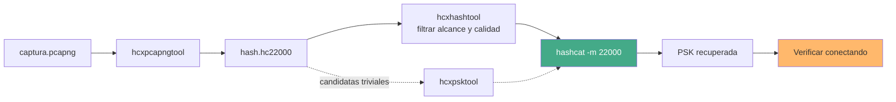

---
tags:
  - Wi-Fi/WPA
  - Seguridad/Contraseñas
  - Pentesting/Explotacion
Descripción: "Qué herramienta usar para crackear una PSK y cuál está muerta: modos de hashcat vigentes y obsoletos, dónde gana aircrack-ng, dónde John, y por qué cowpatty ya no cuenta"
Fecha de actualización: 2026-08-04
Nota previa: "[[02 - El formato 22000 y los message pairs]]"
Nota siguiente: "[[04 - Anatomía de una contraseña Wi-Fi]]"
Area: "[[Cracking Wi-Fi.base|Cracking Wi-Fi]]"
---
---

Los tutoriales de cracking Wi-Fi arrastran herramientas que llevan casi una década sin mantenimiento. <mark style="background: #ADCCFFA6;">El reparto real hoy es sencillo: `hcxpcapngtool` convierte, `hashcat` craquea y `aircrack-ng` sigue valiendo para comprobaciones rápidas</mark>. Todo lo demás son casos particulares o piezas de museo.

# La capa de conversión

| Herramienta | Estado | Para qué |
| ----------- | ------ | -------- |
| **`hcxpcapngtool`** | Vivo, `hcxtools` 7.1.2 (feb-2026) | Canónica: `pcap/pcapng` → `hc22000`. Recomendada por el propio hashcat |
| `wpapcap2john` | Vivo, dentro de `openwall/john` | Formato nativo de John, sólo si se va a usar John |
| `cap2hccapx` | Obsoleta | Producía `hccapx`, el formato que `22000` sustituyó |

> [!warning]+ No descargues `wpapcap2john` de un fork suelto
> HTB enlaza `wpapcap2john` desde `willstruggle/john`, un fork de terceros. <mark style="background: #FF5582A6;">La herramienta es parte de John the Ripper *jumbo*</mark> (`src/wpapcap2john.c` en `openwall/john`) y viene instalada con el paquete. Bajar un binario de conversión de credenciales desde un fork anónimo es un riesgo de cadena de suministro gratuito.

# Modos de hashcat: cuáles siguen vivos

| Modo | Nombre | Estado |
| ---- | ------ | ------ |
| **`22000`** | WPA-PBKDF2-PMKID+EAPOL | **El que se usa.** Cubre PMKID y handshake a la vez |
| `22001` | WPA-PMK-PMKID+EAPOL | Para atacar con **PMK ya calculados**, no con contraseñas |
| `2500` / `2501` | WPA-EAPOL-PBKDF2 / -PMK | **Deprecados** en favor de 22000 |
| `16800` / `16801` | WPA-PMKID-PBKDF2 / -PMK | **Deprecados** en favor de 22000 |

El aviso de deprecación está en el propio código de hashcat (`module_02500.c`): *"The plugin 2500 is deprecated and was replaced with plugin 22000"*. Si un apunte te dice que uses `-m 2500` con un `.hccapx`, es de antes de 2019.

<mark style="background: #FFB8EBA6;">`22001` es el modo que casi nadie usa y que resuelve un problema real</mark>: acepta PMK de 256 bits en vez de contraseñas, así que sirve para reutilizar tablas precomputadas o para probar un PMK obtenido por otra vía. Es la vía moderna de lo que `cowpatty` hacía con `genpmk` — ver [[07 - Precomputación de PMK y su vigencia real]].

```shell-session
$ hashcat -m 22000 hash.hc22000 wordlist.txt -r /usr/share/hashcat/rules/best64.rule
$ hashcat -m 22000 hash.hc22000 --show          # lo ya crackeado, del potfile
```

> [!info]+ El modo 37100 existe en hcxtools pero todavía no en hashcat
> `hcxpcapngtool -f` escribe un fichero que su propia ayuda etiqueta como `hashcat -m 37100`, pensado para *"get full advantage of reuse of PBKDF2 on PMKID and EAPOL"* — es decir, compartir el cálculo PBKDF2 entre el PMKID y el handshake de una misma red en vez de repetirlo. <mark style="background: #FFB8EBA6;">Ese modo **no está implementado en hashcat**</mark> (verificado: cero coincidencias de `37100` en el repositorio). Es una optimización anticipada por el autor de hcxtools; hasta que aterrice, `-o` y `-m 22000` es lo que hay.

# Dónde gana cada herramienta

| Herramienta | Cuándo es la mejor opción |
| ----------- | ------------------------- |
| **hashcat** | Siempre que haya GPU. Reglas, máscaras, híbridos, sesiones reanudables |
| **aircrack-ng** | Comprobación rápida en el sitio, sin GPU, o consumir un flujo por `stdin` |
| **John (jumbo)** | Ya está el flujo montado en John, o hacen falta sus modos externos |
| **cowpatty** | Nunca. Ver abajo |

[[06 - Aircrack-ng|`aircrack-ng`]] no ha muerto ni mucho menos: es CPU pura y sigue siendo lo más cómodo para una prueba de treinta segundos desde el portátil, sin convertir nada. Y acepta el diccionario por tubería, que es la forma correcta de usar un generador sin escribir terabytes:

```shell-session
$ aircrack-ng -w wordlist.txt -b 80:2D:BF:FE:13:83 captura.cap    # -b acota al BSSID objetivo
$ crunch 8 8 -t Corp%%%% | aircrack-ng -w - -b 80:2D:BF:FE:13:83 captura.cap   # -w - lee de stdin
```

> [!warning]+ La velocidad que muestra `aircrack-ng` no son contraseñas por segundo
> El contador `k/s` de su pantalla es engañoso, y conviene saber por qué antes de sacar conclusiones de él. Probar **una** candidata WPA exige derivar el PMK: `PBKDF2-HMAC-SHA1` con 4096 iteraciones y salida de 256 bits, es decir dos bloques de 4096 iteraciones, cada una con dos compresiones SHA-1. Salen del orden de **16.000 compresiones SHA-1 por candidata**.
>
> Un núcleo moderno hace unos pocos millones de compresiones por segundo —bastantes más con instrucciones `SHA-NI`—, así que el rendimiento real está en el orden de **miles de candidatas por segundo y núcleo**, no de cientos de miles. <mark style="background: #FF5582A6;">Una CPU queda dos o tres órdenes de magnitud por debajo de una GPU</mark> en este hash concreto, que es exactamente el motivo por el que existe `-m 22000`.
>
> Es también la razón de desconfiar de las salidas de los cursos: un `626.74 k/s` en una máquina sin GPU, como el que muestra HTB, no cuadra con la aritmética.

John aporta el formato `wpapsk` y el `wpapsk-pmk` para PMK precalculados, más `--fork` para repartir en CPU y `--restore` para reanudar:

```shell-session
$ wpapcap2john captura.cap > hash.john
$ john hash.john --format=wpapsk --wordlist=rockyou.txt
$ john hash.john --show
```

<mark style="background: #FFB8EBA6;">John avisa cuando el hash encaja en dos formatos</mark> (`wpapsk` y `wpapsk-pmk`): si no se fija con `--format`, puede cargar el equivocado y no encontrar nada aunque la contraseña esté en el diccionario.

# Lo que está muerto

`cowpatty` y su acompañante `genpmk` aparecen en casi todos los cursos. <mark style="background: #FF5582A6;">Su último commit es del **4 de diciembre de 2018** y su última versión, la 4.8, es de julio de ese año</mark> (verificado contra la API de GitHub sobre `joswr1ght/cowpatty`). Ocho años sin mantenimiento.

Sigue funcionando para dos cosas menores, y conviene saber por qué se pueden sustituir:

| Uso de cowpatty | Sustituto actual |
| --------------- | ---------------- |
| `cowpatty -c -r x.cap` para validar la captura | `hcxpcapngtool`, que además dice **qué** pares hay y de qué calidad |
| `genpmk` + `cowpatty -d` para tablas precomputadas | `hcxpsktool` para candidatas, `-m 22001` para atacar con PMK |

La validación de `cowpatty` es además engañosa: imprime *"Collected all necessary data"* sin distinguir un par `challenge` de uno `authorized`, que es justo la distinción que decide si el resultado sirve — ver [[02 - El formato 22000 y los message pairs]].

# El flujo que se usa hoy



Un detalle que ahorra disgustos: **`--force` no es un flag de uso normal**. HTB lo pone en todos sus ejemplos porque su laboratorio no tiene GPU y hashcat protesta. En un equipo real, `--force` silencia avisos que suelen indicar un backend mal instalado, y hashcat puede producir resultados incorrectos. Si hace falta `--force`, lo que hay que arreglar es el driver.

El detalle de reglas, máscaras, híbridos y ajuste de dispositivos vive en la herramienta, no aquí: [[02 - Combinator e híbridos a fondo]], [[03 - Máscaras y charsets personalizados]] y [[04 - Backends, dispositivos y tuning]].
