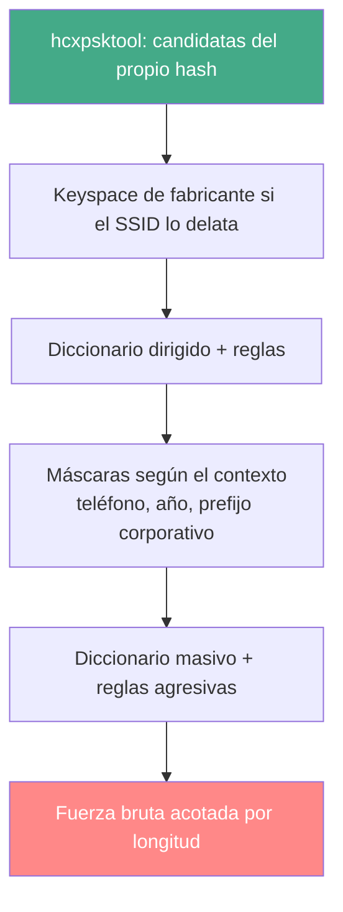

---
tags:
  - Wi-Fi/WPA
  - Seguridad/Contraseñas
  - Pentesting/Explotacion
Descripción: "Por qué el mínimo de 8 caracteres de WPA2 cambia la distribución respecto a una contraseña de web o de dominio, y qué keyspaces son alcanzables de verdad"
Fecha de actualización: 2026-08-04
Nota previa: "[[03 - Herramientas de crackeo y su estado en 2026]]"
Nota siguiente: "[[05 - Wordlists dirigidas a redes Wi-Fi]]"
Area: "[[Cracking Wi-Fi.base|Cracking Wi-Fi]]"
---
---

Los patrones humanos genéricos —nombres de mascotas, `leet`, años al final— están desarrollados en [[01 - Wordlists y reglas personalizadas]] y valen igual aquí. Lo que cambia en Wi-Fi son **dos restricciones estructurales** que ninguna otra contraseña tiene, y que reordenan por completo qué ataque merece la pena.

# La restricción que lo cambia todo

<mark style="background: #ADCCFFA6;">Una passphrase WPA2 debe tener entre **8 y 63 caracteres**</mark>. No es una política del administrador: es el estándar, y `hashcat` lo aplica en el kernel (`module_22000.c` fija `pw_min = 8` y `pw_max = 63`).

Consecuencia inmediata: **buena parte de cualquier wordlist genérica no llega a candidata**. Se ve en el contador `Rejected` de hashcat, que crece con todo lo que mide menos de 8. Filtrarlo de antemano ahorra E/S y hace legible el progreso:

```shell-session
$ awk 'length>=8 && length<=63' rockyou.txt > rockyou-wpa.txt
```

Con reglas hay un matiz: `best64` **alarga** muchas candidatas, así que una palabra de 6 caracteres puede acabar siendo válida. Filtrar la lista de origen a ≥8 antes de aplicar reglas descarta candidatas legítimas. Lo correcto es rechazar dentro del propio fichero de reglas, con `>8` y `<63` (ver [[01 - Wordlists y reglas personalizadas]]), o dejar que hashcat rechace y aceptar el contador.

La segunda restricción es que <mark style="background: #FFB8EBA6;">la contraseña la escribe **una persona una sola vez** y luego la teclea todo el mundo</mark>. Nadie usa un gestor para el Wi-Fi de casa: se elige algo dictable por teléfono, y a menudo se escribe en una pegatina del router. Eso empuja hacia dos extremos —lo trivialmente memorable o lo generado en fábrica— y vacía el centro.

# Qué hay realmente detrás de una PSK

| Familia | Ejemplo | Ataque que la rompe |
| ------- | ------- | ------------------- |
| **Por defecto de fábrica** | `sleeksalamander113` | Keyspace del fabricante — [[06 - Credenciales por defecto y keyspaces de fabricante]] |
| **Número de teléfono** | `600123456` | Máscara de dígitos, segundos |
| **Frase memorable** | `casaenlaplaya` | Diccionario + reglas |
| **Mínimo de política** | `Empresa2026!` | Híbrido: diccionario + máscara |
| **Generada de verdad** | `xK7#pQ2!mZ` | Ninguno. Se reporta como bien configurada |

La familia del teléfono merece atención porque es <mark style="background: #FFB86CA6;">la demostración empírica más contundente que existe de que el contexto vale más que el diccionario</mark>. Ido Hoorvitch (CyberArk, 2021) recorrió el centro de Tel Aviv con una ALFA AWUS036ACH, recogió **5.000 hashes** y rompió **más del 70 %** apoyándose en la costumbre local de usar el móvil como clave del Wi-Fi. No es una wordlist mejor: es una máscara de nueve dígitos.

# La aritmética que decide el ataque

Todos los números siguientes son el tiempo de **agotar** el espacio a `2.533,3 kH/s`, que es lo que marca una RTX 4090 en `-m 22000` en el [benchmark de referencia de Chick3nman](https://gist.github.com/Chick3nman/32e662a5bb63bc4f51b847bb422222fd):

| Espacio | Candidatas | Tiempo |
| ------- | ---------- | ------ |
| `rockyou.txt` completo | 14.344.392 | **6 s** |
| 8 dígitos (`?d`×8) | 10⁸ | **39 s** |
| 8 minúsculas (`?l`×8) | 2,09 × 10¹¹ | **22,9 h** |
| 8 alfanuméricas minúsculas (`-1 ?l?d`, 36⁸) | 2,82 × 10¹² | **12,9 días** |
| 8 con mayúsculas y dígitos (62⁸) | 2,18 × 10¹⁴ | **3 años** |
| 8 caracteres cualesquiera (`?a`×8) | 6,63 × 10¹⁵ | **83 años** |
| 10 minúsculas (`?l`×10) | 1,41 × 10¹⁴ | **645 días** |

> [!info]+ Por qué WPA2 aguanta tanto comparado con otros hashes
> En esa misma tarjeta y ese mismo benchmark, **NTLM va a 288,5 GH/s**. La diferencia con los 2,53 MH/s de WPA2 es de <mark style="background: #8000E1A6;">**unas 114.000 veces**</mark>, y no viene de la contraseña sino de la función: NTLM es un MD4 de una pasada, mientras que el PMK exige 4096 iteraciones de `PBKDF2-HMAC-SHA1` sobre dos bloques.
>
> Es la razón de que un volcado de NTDS se craquee en minutos y un handshake no: **el mismo diccionario, cinco órdenes de magnitud de diferencia**. Y también de que, en WPA2, invertir en información sobre el objetivo rinda mucho más que invertir en GPU.

<mark style="background: #8000E1A6;">Un diccionario entero se agota en seis segundos; el espacio de ocho caracteres arbitrarios, en ochenta años</mark>. Ahí está todo el oficio: el trabajo no consiste en tener más GPU, sino en no tener que recorrer `?a?a?a?a?a?a?a?a`.

> [!important]+ Dos dígitos más cambian el problema
> Pasar de 8 a 10 minúsculas multiplica el espacio por 676. Por eso una recomendación de "mínimo 12 caracteres" en el informe es más eficaz que cualquier exigencia de complejidad: <mark style="background: #FF5582A6;">la longitud gana a los símbolos por varios órdenes de magnitud</mark>, y además es lo que la gente puede recordar.

# El orden correcto de ataque



El error habitual es empezar por `rockyou` porque es lo que dice el tutorial. Cuesta seis segundos, así que **hacerlo primero no es el problema**; el problema es quedarse ahí. Los dos pasos que más rinden son los que HTB apenas menciona: las candidatas que `hcxpsktool` deriva del propio hash y el keyspace del fabricante.

# Máscaras que valen la pena en Wi-Fi

| Máscara | Cubre | Espacio |
| ------- | ----- | ------- |
| `?d?d?d?d?d?d?d?d?d` | Móvil de 9 dígitos (España) | 10⁹ |
| `6?d?d?d?d?d?d?d?d` | Móvil español, prefijo fijo | 10⁸ |
| `?u?l?l?l?l?l?d?d?d?d` | `Nombre` + año | 3 × 10¹¹ |
| `?u?l?l?l?l?l?l?l?d?d?d?d!` | Mínimo de política corporativa | 5 × 10¹³ |
| `Empresa?d?d?d?d` | Prefijo conocido del cliente | 10⁴ |

La última fila es la lección: **un prefijo conocido reduce el espacio a diez mil candidatas**, cuatro milisegundos de GPU. Lo que se paga es reconocimiento, no cómputo — de ahí que [[05 - Wordlists dirigidas a redes Wi-Fi]] tenga más impacto que comprar otra tarjeta.

La sintaxis completa de máscaras, charsets propios y `--increment` vive en la herramienta: [[03 - Máscaras y charsets personalizados]].

# Cuando no se craquea

En un parque corporativo bien gestionado la mayoría de PSK **no caen**, y ese resultado hay que saber presentarlo. No es "no encontramos nada": es un hallazgo positivo que se cuantifica.

Lo que se reporta es el **esfuerzo aplicado**, no la ausencia de resultado: qué diccionarios y reglas se usaron, qué keyspaces se agotaron por completo, cuántas horas-GPU y a qué velocidad. <mark style="background: #FFB86CA6;">"No se recuperó la PSK tras agotar 2,8 × 10¹² candidatas" dice algo; "no se pudo crackear" no dice nada</mark>. El desglose y su formato en el informe están en [[06 - Cómo redactar un hallazgo]].
