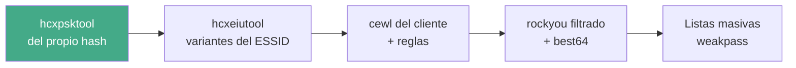

---
tags:
  - Wi-Fi/WPA
  - Seguridad/Contraseñas
  - Pentesting/Enumeracion
Descripción: "Cómo construir el diccionario desde lo que la propia red emite —ESSID, probe requests, información de dispositivo— además de la jerga del cliente"
Fecha de actualización: 2026-08-04
Nota previa: "[[04 - Anatomía de una contraseña Wi-Fi]]"
Nota siguiente: "[[06 - Credenciales por defecto y keyspaces de fabricante]]"
Area: "[[Cracking Wi-Fi.base|Cracking Wi-Fi]]"
---
---

Las técnicas generales de generación —perfilado OSINT con `CUPP`, rastreo web con `cewl`, patrones con `crunch`, reglas de mutación— están en [[01 - Wordlists y reglas personalizadas]] y no se repiten aquí. Lo propio del Wi-Fi es que <mark style="background: #ADCCFFA6;">la red **te dicta** parte del diccionario antes de que empieces a investigar</mark>: el ESSID, los nombres que los clientes buscan y la información que los dispositivos publican de sí mismos.

# La wordlist que sale de la propia captura

`hcxpcapngtool` no sólo convierte hashes: extrae texto explotable de las tramas. Estas cuatro salidas no aparecen en ningún tutorial y son la base de la wordlist dirigida:

| Opción | Produce |
| ------ | ------- |
| `-E <fichero>` | Todos los ESSID vistos en cualquier trama |
| `-R <fichero>` | Sólo los de las *probe requests* — la **PNL** de los clientes |
| `-I` / `-U` | Identidades y usuarios EAP (redes corporativas) |
| `-D <fichero>` | Fabricante, modelo, número de serie y nombre de dispositivo |

```shell-session
$ hcxpcapngtool -o hash.hc22000 -E elist -R plist -D dinfo captura.pcapng
```

<mark style="background: #FFB86CA6;">La salida `-D` es oro puro</mark>: los mensajes WPS y las tramas de asociación publican `MANUFACTURER`, `MODELNAME`, `SERIALNUMBER` y `DEVICENAME` en claro. Un nombre de dispositivo suele ser el nombre de una persona (`iPhone de Marta`) y el modelo acota el keyspace de fábrica que se ataca en [[06 - Credenciales por defecto y keyspaces de fabricante]].

La `-R` merece mención aparte: las *probe requests* revelan la lista de redes preferidas del cliente. Son nombres de redes **de casa, del hotel del último viaje, de la oficina anterior** — vocabulario personal que ningún `rockyou` contiene, y el mismo material que habilita los ataques [[07 - Karma y MANA|Karma/MANA]].

# `hcxeiutool`: derivar variantes del ESSID

El autor de `hcxtools` incluye una herramienta específica para esto. Toma la lista de ESSID y produce las variantes que la gente construye a partir del nombre de su red:

```shell-session
$ hcxeiutool -i elist -d digitlist -x xdigitlist -c charlist -s sclist
```

| Salida | Qué contiene |
| ------ | ------------ |
| `-d` | Sólo los dígitos extraídos de cada ESSID |
| `-x` | Los caracteres hexadecimales |
| `-c` | Sólo `A-Za-z`, el resto eliminado |
| `-s` | Igual, pero partiendo por los separadores — **la recomendada para aplicar reglas** |

El flujo completo que documenta la propia herramienta combina las salidas y las multiplica con reglas:

```shell-session
$ cat elist digitlist xdigitlist charlist sclist > tmp.txt
$ hashcat --stdout -r best64.rule charlist >> tmp.txt
$ hashcat --stdout -r best64.rule sclist   >> tmp.txt
$ sort -u tmp.txt > wordlist-dirigida.txt
$ hashcat -m 22000 hash.hc22000 wordlist-dirigida.txt
```

La lógica es que <mark style="background: #8000E1A6;">un ESSID `CasaLopez_5G` sugiere `casalopez`, `CasaLopez`, `Lopez5G`, `casalopez2026`</mark>, y esas candidatas no están en ningún diccionario público pero sí en la cabeza de quien configuró el router. Es barato —unos miles de candidatas— y se ejecuta antes que cualquier lista masiva.

# El SSID como semilla de reconocimiento

Más allá de las variantes automáticas, el nombre de la red suele filtrar información aprovechable:

| ESSID observado | Qué sugiere |
| --------------- | ----------- |
| `MOVISTAR_A3F2` | Router de operador → keyspace de fábrica conocido |
| `Inmobiliaria Vega` | Nombre comercial → web pública para `cewl` |
| `Wifi_Piso3B` | Dirección → callejero, código postal, número de portal |
| `StarLight-BYOD` | Convención corporativa → hay más SSID hermanos |

En un engagement corporativo, el sufijo del ESSID delata la **segmentación**: encontrar `-BYOD`, `-SEC`, `-PRT` o `-INT` dice qué redes existen aunque no todas estén emitiendo en ese momento. Eso es reconocimiento, no cracking, pero alimenta la wordlist con la jerga interna real.

# Jerga del cliente, filtrada a WPA

`cewl` sobre la web del cliente sigue siendo la vía estándar, con el ajuste de longitud propio de WPA:

```shell-session
$ cewl https://cliente.example -d 3 -m 8 --lowercase -w jerga.txt
```

> [!warning]+ Estado real de las herramientas de generación
> `CeWL` va por la **6.2.1** (jul-2024) y sigue mantenido. <mark style="background: #FF5582A6;">`CUPP` no tiene ninguna versión publicada</mark> y su opción `-a` apunta a la *Alecto DB*, un servicio muerto desde hace años; el repositorio recibe commits pero el modelo de "rellena un formulario con datos de la víctima" ha envejecido mal frente a `psudohash`, `Mentalist` o `pydictor`. Verificado contra la API de GitHub el 2026-08-04.

# Disciplina: una wordlist por red, no una para todo

El error de método más caro es mantener un `mega-wordlist.txt` de 40 GB y lanzarlo contra todo. En Wi-Fi no compensa por una razón concreta: <mark style="background: #FFB8EBA6;">el PMK depende del SSID</mark>, así que **nada se reutiliza entre redes** — ni caché, ni potfile, ni tabla previa. Cada red paga el PBKDF2 completo desde cero.

Lo que sí escala es lo contrario: listas pequeñas y muy específicas, en este orden.



Los tres primeros bloques suman unos pocos millones de candidatas —minutos de GPU— y son los que aprovechan información que nadie más tiene. Empezar por el cuarto es tirar la ventaja del engagement.

Un último apunte de higiene: las candidatas se deduplican y se recortan al rango válido antes de lanzarlas, y **el fichero de wordlist dirigida forma parte de la evidencia**. Si el informe afirma que se agotó un espacio concreto, ese fichero es lo que lo respalda.
