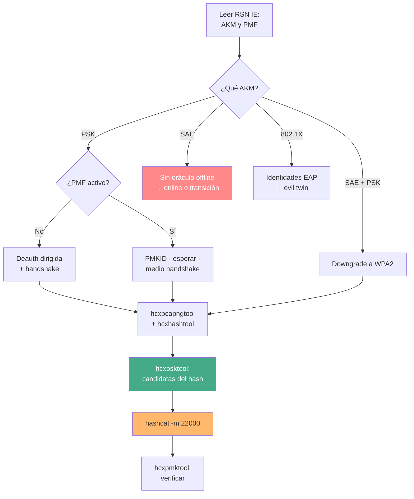

---
tags:
  - Wi-Fi/WPA
  - Tipo/Arsenal
  - Pentesting/Explotacion
Descripción: "El toolkit de recuperación de PSK en 2026 con su estado real verificado, qué pieza sustituye a cuál y el árbol de decisión completo del ataque"
Fecha de actualización: 2026-08-04
Nota previa: "[[10 - Detección y evasión del cracking Wi-Fi]]"
Nota siguiente: 
Area: "[[Cracking Wi-Fi.base|Cracking Wi-Fi]]"
---
---

Estado verificado contra la API de GitHub y las páginas oficiales el **2026-08-04**. La conclusión corta: <mark style="background: #ADCCFFA6;">el ecosistema se ha concentrado en dos proyectos vivos —`hashcat` y la familia `hcx`— mientras que casi todo lo que enseñan los cursos lleva entre cinco y ocho años parado</mark>.

# Captura

| Herramienta | Versión / actividad | Cuándo |
| ----------- | ------------------- | ------ |
| **`hcxdumptool`** | 7.1.2 (feb-2026), activo | Por defecto: PMKID, handshakes, filtro BPF, `--exitoneapol` |
| `airodump-ng` | Suite 1.7 (**may-2022**) | Reconocimiento visual rápido, formato que todo consume |
| `aireplay-ng` | Ídem | Deauth dirigida cuando no hay PMF |
| `hostapd` | Activo | AP falso para medio handshake y downgrade |
| `Kismet` | **2025-09-R1** (sep-2025), activo | Entornos ruidosos, muchos AP, correlación cliente↔AP |

`aircrack-ng` **no está muerto**, pero lleva sin versión estable desde mayo de 2022. Sigue siendo insustituible para WEP y muy cómodo para una comprobación en el sitio; para captura seria, `hcxdumptool` gana en filtrado, cobertura de banda y sigilo.

# Conversión y triaje

| Herramienta | Papel |
| ----------- | ----- |
| **`hcxpcapngtool`** | `pcapng` → `hc22000`. Además: `-E`/`-R` wordlists de ESSID, `-I`/`-U` identidades EAP, `-D` info de dispositivo |
| **`hcxhashtool`** | Filtrado por alcance (`--essid`, `--oui-ap`) y por calidad (`--authorized`, `--rc`) |
| **`hcxpsktool`** | Candidatas derivadas del hash: keyspaces de fabricante, `--maconly` |
| **`hcxeiutool`** | Variantes de ESSID para wordlist dirigida |
| **`hcxpmktool`** | Verificar una PSK contra el hash, offline (`exit 0` / `2`) |
| `wpapcap2john` | Sólo si el flujo va por John. **Viene con `openwall/john`**, no de un fork |

<mark style="background: #FFB86CA6;">La familia `hcx` no es "una alternativa a aircrack-ng": es el triaje que decide si merece la pena encender la GPU</mark>, y ninguna otra herramienta hace ese trabajo.

# Crackeo

| Herramienta | Versión | Cuándo |
| ----------- | ------- | ------ |
| **`hashcat`** | **7.1.2** (ago-2025) | Siempre que haya GPU. `-m 22000` |
| `aircrack-ng` | 1.7 | CPU, prueba rápida, consumo por `stdin` |
| `John the Ripper` jumbo | Activo, sin releases | `--fork`, `--restore`, modos externos |
| `crack.sh` | Operativo | MSCHAPv2 de WPA-Enterprise: barrido DES completo |

HTB trabaja con **hashcat v6.1.1 y v6.2.5**; la rama actual es la **7.x**, que trajo el *assimilation bridge*, autodetección de modo (`--identify`) y dispositivos virtuales. Nada de eso cambia el ataque a WPA2, pero sí el rendimiento y la ergonomía — detalle en [[04 - Backends, dispositivos y tuning]].

# Generación de candidatas

| Herramienta | Estado | Uso en Wi-Fi |
| ----------- | ------ | ------------ |
| `hcxpsktool` | Activo | **Primero siempre**: keyspaces de fabricante |
| `hcxeiutool` | Activo | Variantes del propio ESSID |
| `CeWL` | 6.2.1 (jul-2024) | Jerga del cliente, con `-m 8` |
| `username-anarchy` | v0.6 (sep-2024) | Usuarios para Enterprise |
| `crunch` | Estable | Patrones, **siempre por tubería**, nunca a disco |
| `CUPP` | Sin releases, `-a` roto | Sustituido por `psudohash`, `Mentalist`, `pydictor` |

# Hardware

El estudio de Hoorvitch que rompió el 70 % de 5.000 redes de Tel Aviv usó una **ALFA AWUS036ACH** de unos 50 €. La elección de adaptador —chipset, inyección, bandas, soporte de 6 GHz— está desarrollada en [[04 - Interfaces, chipsets y drivers]] y no se repite aquí.

Para el crackeo, la referencia de rendimiento es `-m 22000`: una **RTX 4090 hace 2.533,3 kH/s** y una 3090 ronda los 1.100 kH/s. Para calibrar cuánto es eso, esa misma 4090 hace **288,5 GH/s** en NTLM: unas 114.000 veces más. La cuenta de qué keyspaces son alcanzables está en [[04 - Anatomía de una contraseña Wi-Fi]].

> [!warning]+ La nube de HTB no se puede seguir
> El módulo propone crear una VM con **8 × NVIDIA Tesla K80** en Google Cloud. <mark style="background: #FF5582A6;">El K80 se marcó como obsoleto el 1 de mayo de 2023 y se apagó el 1 de mayo de 2024</mark>: desde entonces no se pueden crear ni arrancar VMs con esa GPU. Además su arquitectura Kepler quedó fuera de las versiones de CUDA que hashcat necesita. Las opciones actuales son T4, L4, A100 o H100 — y `apt-get install hashcat` sin el driver y el toolkit CUDA deja un binario que sólo ve la CPU. Ver [[05 - Cracking en la nube y rigs]].

# Lo que hay que dejar de usar

| Pieza | Estado verificado | Sustituto |
| ----- | ----------------- | --------- |
| `cowpatty` | Último commit **2018-12-04** | `hcxpcapngtool` para validar |
| `genpmk` | Ídem (mismo repo) | `-m 22001`, o nada — ver [[07 - Precomputación de PMK y su vigencia real]] |
| `drygdryg/wpspin` | **404 en GitHub** | `hcxpsktool --wpskeys` |
| `drygdryg/OneShot` | **404 en GitHub** | [`fulvius31/OneShot`](https://github.com/fulvius31/OneShot) |
| `air-hammer` | Sin releases, `python2` | Spraying acotado; mejor, captura offline |
| `.hccapx` / `-m 2500` | Deprecado por hashcat | `hc22000` / `-m 22000` |
| `wlangenpmkocl` | Retirado de `hcxtools` | — |

<mark style="background: #8000E1A6;">Los dos `404` merecen énfasis</mark>: son URLs que cursos y tutoriales siguen enlazando, con la cuenta de origen libre para que cualquiera la registre y publique bajo ella. Instalar una herramienta de credenciales desde ahí es un riesgo de cadena de suministro evitable.

# El árbol de decisión



El flujo mínimo, de captura a contraseña verificada:

```shell-session
$ sudo hcxdumptool -i wlan0 -c 6a --bpf=alcance.bpf --exitoneapol -w cap.pcapng
$ hcxpcapngtool -o hash.hc22000 -E elist -D dinfo cap.pcapng
$ hcxhashtool -i hash.hc22000 --essid=CorpWiFi --authorized -o objetivo.hc22000
$ hcxpsktool -c objetivo.hc22000 --maconly --weakpass | sort -u > cand.txt
$ hashcat -m 22000 objetivo.hc22000 cand.txt
$ hashcat -m 22000 objetivo.hc22000 rockyou.txt -r best64.rule
$ hcxpmktool -l "$(head -1 objetivo.hc22000)" -p 'PSKrecuperada' ; echo $?
```

Las herramientas de ataque a [[12 - Arsenal y estado de WPS en 2026|WPS]] y [[12 - WEP en 2026 y arsenal|WEP]] tienen su propio arsenal, y el conjunto del área está en [[10 - Arsenal de herramientas Wi-Fi]].
