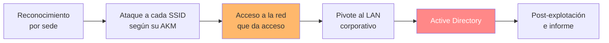

---
tags:
  - Wi-Fi/Enterprise
  - Tipo/Introduccion
  - Pentesting/Reporting
Descripción: "Cómo se acota un pentest inalámbrico real: alcance por SSID, el problema del perímetro que las ondas no respetan y qué exigir en el RoE antes de encender la tarjeta"
Fecha de actualización: 2026-08-04
Nota previa: 
Nota siguiente: "[[01 - Reconocimiento de un parque de APs]]"
Area: "[[Wi-Fi corporativo.base|Wi-Fi corporativo]]"
---
---

Un pentest Wi-Fi corporativo no es una sucesión de ataques a redes sueltas: es <mark style="background: #ADCCFFA6;">una cadena que empieza en el aparcamiento y puede terminar en el controlador de dominio</mark>. Este sub-tema recorre esa cadena completa, en modo playbook, sobre un caso realista de tres sedes.

# El escenario

El caso guía es un hospital con tres emplazamientos, cada uno con su conjunto de SSID en alcance:

| Clínica 1 | Clínica 2 | Sede corporativa |
| --------- | --------- | ---------------- |
| `Guest` (abierta + portal cautivo) | `BYOD` (WPA2-PSK, TKIP) | `ENT` (WPA2-Enterprise) |
| `WCD` (WPA2-PSK, WPS activo) | `SEC` (WPA3-SAE puro) | |
| `PRT` (WPA3 en **modo transición**) | | |
| `INT` (AP caído, clientes buscándolo) | | |

Esa tabla ya contiene el plan de ataque, y por eso el reconocimiento vale más que cualquier herramienta: <mark style="background: #FFB86CA6;">cada tipo de red admite un conjunto distinto de vías, y varias se descartan sólo con leer un beacon</mark>. El mapeo completo está en [[00 - Metodología del pentest Wi-Fi]].

# Lo que hay que tener firmado

| Documento | Qué fija |
| --------- | -------- |
| **SoW** | Metodología, calendario, entregables |
| **RoE** | Qué se puede hacer, cuándo y contra qué |
| Lista de SSID en alcance | El límite técnico real del engagement |
| Autorización de crackeo offline | Si el material sale del entorno del cliente |
| Contactos de escalado | A quién llamar cuando algo se cae |

Las exclusiones típicas —y su motivo— son tan importantes como el alcance:

- **Ataques físicos**: un pentest inalámbrico se hace desde donde llega la señal, no entrando en el edificio.
- **DoS y acciones destructivas**: en un hospital esto no es una formalidad. Una desautenticación masiva puede tumbar equipamiento clínico conectado.
- **Cambios sin autorización escrita**: incluye tocar la configuración de un AP aunque se tenga acceso administrativo.

> [!warning]+ Las ondas no respetan el perímetro contratado
> Es la particularidad que distingue a un engagement inalámbrico de cualquier otro. <mark style="background: #FF5582A6;">La tarjeta capta las redes de los vecinos, del edificio de al lado y de la calle</mark>, y ninguna de ellas está en el alcance.
>
> Eso obliga a dos cosas desde el primer comando: **acotar la captura a los BSSID autorizados** con un filtro BPF compilado (`--bpf`, ver [[01 - hcxdumptool]]) o con `--essid`/`--bssid` en `airodump-ng`, y **documentar ese filtro** como evidencia. En España, capturar tráfico ajeno encaja en el `art. 197.1 CP`; la autorización del cliente no cubre a terceros que nunca la firmaron.

# La ventana de pruebas es una decisión técnica

En el caso guía la ventana es de cinco días, 24/7, más dos de informe. Que sea 24/7 no es un detalle administrativo: **muchos ataques inalámbricos dependen de que haya clientes conectados**.

| Momento | Qué habilita |
| ------- | ------------ |
| Inicio de jornada | Asociaciones masivas → handshakes sin provocar nada |
| Horario laboral | Clientes activos → evil twin, deauth, MITM |
| Madrugada | Barrido de PMKID y reconocimiento sin molestar a nadie |
| Fin de semana | El AP está, los clientes no → sólo PMKID y WPS |

<mark style="background: #8000E1A6;">Negociar una ventana amplia sustituye ruido por paciencia</mark>: con acceso a la hora punta, se capturan handshakes sin emitir una sola trama, y eso es a la vez más sigiloso y menos arriesgado para el cliente.

# Cajas de ataque desplegadas

En el caso guía el cliente instala un equipo del auditor en cada sede, accesible en remoto. Es el patrón habitual cuando hay varias ubicaciones, y tiene implicaciones propias:

- **La caja es un activo del cliente durante el engagement**: hay que endurecerla, y su retirada forma parte del cierre.
- **El alcance geográfico queda fijado por dónde está la caja**, lo que ayuda a acotar el problema del párrafo anterior.
- **Hacen falta varias interfaces**: reconocimiento en modo monitor, AP falso y cliente asociado son tres roles simultáneos que no caben en una sola radio.

# Estructura del ataque

El punto de inflexión es **C**: en un pentest Wi-Fi, romper la clave de la red de invitados no vale nada si esa red está bien segmentada, y romper la corporativa lo vale todo. Por eso el orden de prioridad no es el de dificultad, sino el de **acceso que concede** — y en el caso guía la vía que abre el dominio es la Enterprise, no las PSK.

Un matiz que conviene tener claro desde el principio: <mark style="background: #FFB8EBA6;">muchos de los ataques que se intentan **van a fallar**, y eso también es entregable</mark>. Un WIDS que detecta el rogue AP, un cliente que rechaza el certificado, un WPA3 sin modo transición: cada intento fallido documentado demuestra al cliente qué controles están funcionando, que es información por la que ha pagado igual.

# Ubicación en el vault

Este sub-tema **no reexplica** las técnicas que tienen su propio módulo. Enlaza a ellas y desarrolla las transiciones, las decisiones y los callejones sin salida. Cuando una técnica aparece aquí por primera vez —porque su módulo aún no está extraído— se explica lo suficiente para ejecutarla, con un enlace al sitio donde se desarrollará a fondo.
