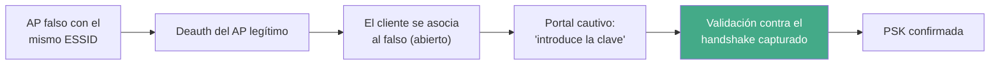

---
tags:
  - Wi-Fi/Evil-Twin
  - Pentesting/Explotacion
Descripción: "Cuando la PSK no cae, se ataca al usuario: AP falso con portal de phishing, validación del handshake para no recoger basura, y los límites éticos del vector"
Fecha de actualización: 2026-08-04
Nota previa: "[[03 - WPA2-PSK en un engagement]]"
Nota siguiente: "[[05 - WPA3 en modo transición y downgrade]]"
Area: "[[Wi-Fi corporativo.base|Wi-Fi corporativo]]"
---
---

Cuando el diccionario se agota sin resultado, queda un camino que no depende de la entropía de la contraseña: <mark style="background: #ADCCFFA6;">pedírsela al usuario</mark>. El evil twin con portal hostil desplaza el ataque de la criptografía a la persona, y por eso su tasa de éxito no guarda relación con lo fuerte que sea la clave.

> [!important]+ Esto es ingeniería social, y necesita constar en el alcance
> Un portal que imita una actualización de firmware es un **ataque contra empleados**, no contra un sistema. Muchos RoE excluyen la ingeniería social por defecto, y en entornos como el sanitario la desautenticación previa puede afectar a equipamiento en uso. <mark style="background: #FF5582A6;">Lanzarlo sin autorización explícita convierte un pentest en un incidente</mark>. Si está autorizado, conviene acordar además qué se hace con las credenciales recogidas y cómo se destruyen.

# La mecánica



El paso **E** es el que separa un ataque profesional de uno inútil, y es la razón de ser de `--handshake-capture`.

# `wifiphisher`

```shell-session
$ sudo systemctl stop systemd-resolved      # libera el puerto 53 para dnsmasq
$ sudo wifiphisher -aI wlan1 -eI wlan2 -p firmware-upgrade \
      --handshake-capture cap-01.cap -kN
```

| Flag | Función |
| ---- | ------- |
| `-aI`, `--apinterface` | Interfaz que hospeda el AP falso |
| `-eI`, `--extensionsinterface` | Interfaz que desautentica |
| `-p`, `--phishingscenario` | Plantilla del portal |
| `--handshake-capture` | **Valida la clave introducida** contra un handshake real |
| `-kN`, `--keepnetworkmanager` | No detiene NetworkManager |

<mark style="background: #FFB86CA6;">Sin `--handshake-capture`, el portal acepta cualquier cosa que teclee el usuario</mark> y el informe acaba con una contraseña inventada. Con él, `wifiphisher` deriva el PMK de lo introducido y lo contrasta con el MIC del handshake antes de darlo por bueno — el mismo cálculo que hace `hcxpmktool`, descrito en [[07 - Precomputación de PMK y su vigencia real]].

Flags que HTB no menciona y que cambian el resultado:

| Flag | Para qué |
| ---- | -------- |
| `--quitonsuccess` | Termina al capturar. Menos tiempo emitiendo, menos exposición |
| `--nodeauth` | AP falso **sin desautenticar**: mucho más sigiloso y sin DoS |
| `--known-beacons` | Emite balizas de SSID comunes para atraer clientes |
| `--disable-karma` | Desactiva la respuesta indiscriminada a probes |
| `--no-mac-randomization` | Conserva la MAC, útil cuando el WIPS ya la conoce |
| `--phishing-pages-directory` | Plantillas propias, adaptadas al cliente |

`--nodeauth` merece una mención: con `PMF` activo la desautenticación no funciona igualmente, así que **conviene desactivarla** y esperar a que un cliente se asocie por su cuenta. Se gana sigilo y se evita generar alertas inútiles.

Al terminar hay que devolver el sistema a su estado:

```shell-session
$ sudo systemctl restart NetworkManager systemd-resolved
```

# Estado real de las herramientas

| Herramienta | Estado (2026-08-04) | Notas |
| ----------- | ------------------- | ----- |
| **`airgeddon`** | Muy activo (jul-2026) | Menú unificado: evil twin, WPS, WEP, WPA3. La más viva |
| `Fluxion` | Activo (jul-2026) | Especializada en portal cautivo + validación de handshake |
| `wifiphisher` | Repo activo (may-2026), **última release v1.4 de enero de 2018** | Plantillas ricas; el desfase entre repo y release conviene tenerlo presente |
| `wifipumpkin3` | Estancado (ene-2024) | Framework MITM más general |

<mark style="background: #FFB8EBA6;">Que el repositorio reciba commits no equivale a que haya versión publicada</mark>: `wifiphisher` lleva ocho años sin release etiquetada, así que en la práctica se instala desde `git`. Es información que importa al montar la caja de ataque de un cliente.

# Por qué funciona todavía

La pregunta razonable es por qué alguien introduce la clave del Wi-Fi en una web. Tres razones que se sostienen en 2026:

1. **El contexto es creíble.** El usuario acaba de perder la conexión (por la deauth) y aparece una página que dice que el router necesita actualizarse. La causa y el efecto encajan.
2. **No hay indicador de seguridad que consultar.** Un portal cautivo es HTTP por diseño; el navegador no muestra nada anómalo porque no hay nada anómalo que mostrar.
3. **Nadie ha entrenado para esto.** La formación antiphishing habla de correos y de dominios parecidos, no de portales Wi-Fi.

Por eso el hallazgo que sale de aquí es doble: **la técnica funciona** y **no hay control que la detecte**. La segunda parte suele tener más recorrido con el cliente.

# Detección y contramedidas

| Señal | Alerta |
| ----- | ------ |
| SSID anunciado por un BSSID no autorizado | `APSPOOF` en Kismet; *rogue AP* en Cisco aWIPS, Aruba RFProtect o Meraki Air Marshal |
| Potencia anómala para la distancia | `OVERPOWERED` |
| Ráfaga de desautenticaciones previa | `DEAUTHFLOOD` |
| AP que responde a cualquier probe | `KARMAOUI` |

Un WIPS con contención automática desasocia a los clientes del AP falso en segundos, y ese es el control que hay que recomendar. Los umbrales concretos y la disciplina para quedarse por debajo están en [[12 - Detección y evasión en entorno corporativo]].

Del lado del cliente, la medida que de verdad cierra el vector es no depender de la PSK: **802.1X con validación de certificado** hace que no exista ninguna clave que el usuario pueda regalar. Su propio conjunto de problemas se trata en [[08 - WPA2-Enterprise, evil twin y robo de credenciales]].
