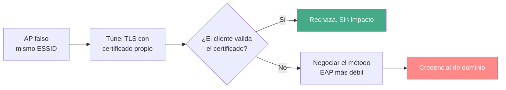

---
tags:
  - Wi-Fi/Enterprise
  - Pentesting/Explotacion
Descripción: "El ataque que convierte una red inalámbrica en un compromiso de dominio: EAPHammer, downgrade de método EAP y las dos líneas de configuración que lo impiden"
Fecha de actualización: 2026-08-04
Nota previa: "[[07 - Karma y MANA]]"
Nota siguiente: "[[09 - Explotación del gateway inalámbrico]]"
Area: "[[Wi-Fi corporativo.base|Wi-Fi corporativo]]"
---
---

Una red `WPA2-Enterprise` no tiene contraseña compartida: cada usuario se autentica contra RADIUS con **su credencial de dominio**. Eso la hace más segura frente al crackeo y mucho más peligrosa cuando falla, porque <mark style="background: #FFB86CA6;">lo que se roba no es la clave del Wi-Fi, es una cuenta de Active Directory</mark>.

En `airodump-ng` se identifica por la columna `AUTH`:

```text
BSSID              CH  ENC   CIPHER  AUTH  ESSID
9C:9A:03:39:BD:7A   1  WPA2  CCMP    MGT   StarLight-ENT
```

`MGT` (*management*) significa 802.1X. El resto de valores —`PSK`, `SAE`— indican clave precompartida.

# El fallo, en una línea

802.1X monta un túnel TLS entre el cliente y el servidor RADIUS. La seguridad de todo el esquema descansa en que **el cliente compruebe que habla con el RADIUS correcto**. Si no lo comprueba, un AP falso con un certificado cualquiera recibe la credencial dentro de un túnel perfectamente cifrado… hacia el atacante.



# EAPHammer

`EAPHammer` ([s0lst1c3/eaphammer](https://github.com/s0lst1c3/eaphammer), **v1.14.1** de septiembre de 2024) empaqueta el AP falso, el RADIUS y la captura de credenciales.

```shell-session
$ sudo ./eaphammer --cert-wizard
$ sudo ./eaphammer --interface wlan1 --auth wpa-eap --essid StarLight-ENT \
      --negotiate weakest --creds
```

`--cert-wizard` genera la CA y el certificado de servidor sin los errores de la secuencia manual descrita en [[07 - Karma y MANA]]. Los campos que pide —país, organización, `CN`— **deben imitar a los del certificado legítimo**, visibles en una captura del EAP real.

| Opción `--negotiate` | Efecto |
| -------------------- | ------ |
| `weakest` | Fuerza el método más débil que el cliente acepte: GTC, TTLS-PAP → **contraseña en claro** |
| `balanced` | Negocia PEAP-MSCHAPv2: reto crackeable, más creíble |
| `gtc-downgrade` | Downgrade específico a GTC |

<mark style="background: #ADCCFFA6;">`--negotiate weakest` es a la vez el ataque y la prueba diagnóstica</mark>: si el cliente acepta bajar a GTC, el hallazgo es doble —no valida el certificado **y** no restringe métodos—.

Para que el cliente se plantee migrar hay que estar en su canal y, si no se ha suplantado el BSSID, ofrecer mejor señal:

```shell-session
$ sudo iw dev wlan0mon set channel 1
$ sudo aireplay-ng --deauth 3 -a 9C:9A:03:39:BD:7A -c 00:1B:44:A7:48:62 wlan0mon
```

Con `PMF` activo la deauth no funcionará: entonces se espera a que el cliente haga *roaming* por su cuenta, que es lo que sucede al moverse por el edificio.

# Lo que se recoge

```text
mschapv2: Sat Sep 20 10:16:28 2025
    username:  jdorian
    challenge: aa:f2:44:ed:0b:4e:d3:b3
    response:  a9:36:21:d5:c0:63:94:68:0a:fa:ad:8d:d8:96:26:00:55:51:55:ea:a0:51:de:c2
    hashcat NETNTLM: jdorian::::a93621d5...:aaf244ed0b4ed3b3

GTC: Sat Sep 20 10:16:51 2025
    username: jdorian
    password: <en claro>
```

El reto MSCHAPv2 se craquea offline con `-m 5500`, y con crack.sh el éxito está garantizado por barrido completo del espacio DES. El detalle —y por qué la longitud de la contraseña es irrelevante ahí— está en [[08 - Cracking de identidades WPA-Enterprise]].

# La identidad y su matiz

```text
MANA EAP Identity Phase 0: STARLIGHT\jdorian
```

> [!important]+ Ver el usuario real en claro **es** el hallazgo
> PEAP y TTLS permiten enviar una **identidad externa** (`anonymous@empresa.com`) y reservar la real para dentro del túnel. Cuando la captura pasiva muestra `DOMINIO\usuario`, lo que se ha detectado es que los suplicantes **no tienen configurada identidad anónima**.
>
> <mark style="background: #FF5582A6;">El impacto va mucho más allá del Wi-Fi</mark>: permite enumerar usuarios del dominio desde el aparcamiento, sin autenticarse y sin tocar nada, y alimenta phishing dirigido y *password spraying*. Se extrae en masa con `hcxpcapngtool -I` / `-U`.

# Del Wi-Fi a la red interna

Con credenciales válidas se entra por la vía legítima. En el escenario guía, conectarse a `StarLight-ENT` con la cuenta robada asigna una IP en `172.16.10.0/24` — el LAN corporativo:

```shell-session
$ ip route
$ nxc smb 172.16.10.72 -u jdorian -p 'P4ssw0rd123456789'
```

<mark style="background: #8000E1A6;">Ese salto es el hallazgo central de todo el engagement</mark>: la red inalámbrica no está segmentada del entorno de Active Directory, así que una credencial robada por radio equivale a una toma de red interna. La continuación está en [[10 - Del Wi-Fi al dominio - la cadena]].

Conviene notar el detalle de configuración que lo hace posible en el laboratorio y en la vida real: al conectar desde el gestor de red hay que marcar **"no se requiere certificado de CA"**. Que eso funcione contra la red real es, en sí mismo, la confirmación del fallo.

# Las contramedidas, por orden de eficacia

| Medida | Qué corta |
| ------ | --------- |
| **`ca_cert` + `domain_suffix_match`** en el suplicante | El AP falso. Es **la** solución |
| Restringir métodos EAP (sólo PEAP-MSCHAPv2, nunca GTC/PAP) | El downgrade a texto claro |
| `anonymous_identity` | La enumeración pasiva de usuarios |
| **EAP-TLS** (certificado de cliente) | Todo lo anterior: no hay contraseña que robar |
| Segmentar la VLAN inalámbrica del LAN | El pivote, aunque caiga la credencial |
| WPA3-Enterprise | `PMF` obligatorio; **no** arregla la validación de certificado |

Las dos primeras se despliegan por GPO o MDM en un único sitio y protegen a toda la flota. <mark style="background: #FFB8EBA6;">Cambiar la contraseña del usuario comprometido no arregla nada</mark>: el siguiente que se conecte entregará la suya igual.

`domain_suffix_match` merece su propia línea porque suele olvidarse: sin él, **un certificado válido emitido por cualquier CA de confianza** engaña al cliente. Comprobar la CA no basta; hay que comprobar también el nombre del servidor.

> [!info]+ Detección
> Un AP falso Enterprise dispara `APSPOOF` (SSID con BSSID no autorizado) y, si supera en potencia al legítimo, `OVERPOWERED`. Del lado cableado, el RADIUS **deja de ver** las autenticaciones de ese cliente durante el ataque: una caída súbita de sesiones de un usuario que sigue en el edificio es una señal que casi nadie monitoriza y que conviene recomendar.
