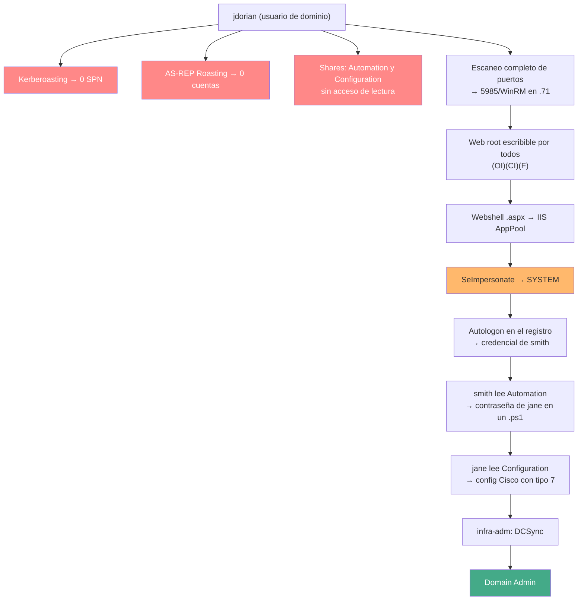

---
tags:
  - Wi-Fi/Enterprise
  - Active-Directory
  - Pentesting/Post-Explotacion
Descripción: "La cadena completa desde una credencial robada por radio hasta Domain Admin, con las decisiones y los callejones sin salida en vez de la repetición de técnicas"
Fecha de actualización: 2026-08-04
Nota previa: "[[09 - Explotación del gateway inalámbrico]]"
Nota siguiente: "[[11 - Post-explotación y valor para el cliente]]"
Area: "[[Wi-Fi corporativo.base|Wi-Fi corporativo]]"
---
---

Esta nota **no reexplica** las técnicas de Active Directory: cada una tiene su desarrollo en [[00 - Introducción a la enumeración y ataques en AD|el área de AD]]. Lo que documenta es <mark style="background: #ADCCFFA6;">la secuencia de decisiones que lleva de una credencial capturada por radio hasta el dominio</mark>, incluidos los intentos que no llevan a ninguna parte, que son la mitad del trabajo real.

# El punto de partida

Del [[08 - WPA2-Enterprise, evil twin y robo de credenciales|evil twin Enterprise]] sale una credencial de dominio y, al usarla para asociarse legítimamente, una IP en el LAN corporativo. Esa es toda la ventaja inicial: **una cuenta sin privilegios y acceso de red**.

```shell-session
$ ip route                                   # ¿a qué segmento se llega?
$ sudo nmap -sn -n 172.16.10.0/24
$ sudo nmap --open -iL vivos.txt
```

<mark style="background: #FFB86CA6;">El hallazgo estructural ya está aquí</mark>, antes de tocar Active Directory: la red inalámbrica no está segmentada del entorno corporativo. Se reporta aunque la cadena no llegue más lejos.

# La cadena, con sus callejones



Los tres primeros nodos en rojo son intentos **fallidos**, y merecen tanto espacio como los que funcionan.

# Lo que no funcionó, y por qué se intentó igual

| Intento | Resultado | Por qué se prueba igualmente |
| ------- | --------- | ---------------------------- |
| [[11 - Kerberoasting]] | `No entries found!` | Es el primer disparo con cualquier credencial válida: barato y a veces decisivo |
| AS-REP Roasting | Ninguna cuenta sin preautenticación | Además **enumera usuarios**: el error distingue cuenta inexistente de cuenta sin el flag |
| Módulos de NetExec (`gpp_password`, `enum_ca`) | Nada | Segundos de coste; GPP y AD CS son fallos frecuentes |
| Shares del DC | `Automation` y `Configuration` sin lectura | **Se anotan**: si más tarde cae otra cuenta, se reintentan |

> [!important]+ Anotar lo inaccesible es lo que hace avanzar la cadena
> `Automation` y `Configuration` aparecen en la primera enumeración sin permisos, y son exactamente los dos recursos que abren los siguientes dos saltos. <mark style="background: #8000E1A6;">La disciplina de reintentar todo el inventario con **cada** credencial nueva</mark> es lo que convierte una lista de recursos negados en una cadena. La metodología está en [[03 - Enumeración de servicios expuestos y disciplina de callejones sin salida]].

Otro detalle de método: el escaneo rápido inicial no vio el puerto 5985. Sólo apareció al hacer `-p-` sobre el host que devolvía un `403`. <mark style="background: #FFB8EBA6;">Un host "aburrido" con un solo puerto web merece un barrido completo</mark> antes de descartarlo.

# El salto que abre todo

Con acceso WinRM al servidor web, la comprobación que lo cambia todo son los permisos del `web root`:

```powershell
*Evil-WinRM* PS C:\> icacls C:\inetpub\wwwroot
C:\inetpub\wwwroot BUILTIN\Users:(OI)(CI)(F)
```

`(F)` para `BUILTIN\Users` significa **control total para cualquier usuario del dominio**. Subir un `.aspx` da ejecución como `iis apppool\defaultapppool`, que trae `SeImpersonatePrivilege` habilitado — y ese privilegio es SYSTEM. El desarrollo está en [[04 - SeImpersonate y la familia Potato]].

> [!warning]+ `JuicyPotato` sólo sirve en sistemas antiguos
> El escenario corre sobre **Server 2016 (build 14393)**, donde `JuicyPotato` funciona. <mark style="background: #FF5582A6;">A partir de Windows 10 1809 y Server 2019, Microsoft cerró el vector del CLSID de BITS</mark> y la herramienta dejó de servir; su repositorio no se toca desde diciembre de 2021.
>
> En un objetivo moderno, la familia vigente es **`PrintSpoofer`**, **`GodPotato`** o `SigmaPotato`, y la elección depende de la versión exacta del sistema. Usar `JuicyPotato` contra un Server 2022 es perder una tarde. La tabla de decisión está en [[04 - SeImpersonate y la familia Potato]].

# La cosecha en cadena

Desde SYSTEM, cada credencial abre exactamente un recurso más:

| Paso | Dónde estaba | Qué abría |
| ---- | ------------ | --------- |
| Contraseña de autologon | `LSA Secrets` + `DefaultUserName` en el registro | Cuenta `smith` |
| Contraseña en un `.ps1` de backup | Share `Automation` | Cuenta `jane` |
| Config Cisco con contraseñas tipo 7 | Share `Configuration` | Cuenta `infra-adm` |
| `infra-adm` | — | **Derechos de replicación → DCSync** |

El patrón se repite en casi todos los engagements: <mark style="background: #FFB86CA6;">las credenciales no están en los sistemas, están en los ficheros</mark> — scripts de automatización, backups de configuración, documentación. El detalle en [[17 - Ficheros con credenciales]] y [[09 - Reconocimiento interno y pillaging de shares]].

Dos apuntes concretos de este recorrido:

- **`lsadump::secrets` da la contraseña de autologon pero no el usuario.** El nombre está en `HKLM:\SOFTWARE\Microsoft\Windows NT\CurrentVersion\Winlogon\DefaultUserName`, y sin él la credencial no sirve.
- **Las contraseñas Cisco tipo 7 se revierten en local, sin crackear.** Y su valor no es el switch: es que un administrador de red **reutiliza** esa contraseña en su cuenta de dominio. Ver [[09 - Contraseñas de dispositivos de red Cisco]].

# El cierre: BloodHound y DCSync

```shell-session
$ .\SharpHound.exe -d starlight.ad -c All --DomainController 172.16.10.72 --ZipFileName BH.zip
$ secretsdump.py infra-adm:'<pass>'@172.16.10.72 -outputfile starlight_ntds
```

BloodHound revela que `infra-adm` tiene `GetChanges` y `GetChangesAll` sobre el objeto de dominio: [[15 - DCSync]] directo, sin ser administrador de dominio. Y con el hash del `Administrator` (RID 500), acceso al DC:

```shell-session
$ wmiexec.py administrator@172.16.10.72 -hashes :<NT hash>
```

> [!info]+ BloodHound CE es lo actual
> El flujo con `neo4j start` + la GUI de escritorio corresponde a **BloodHound legacy**. Desde 2023 el proyecto vigente es **BloodHound Community Edition**, que se despliega con Docker Compose, trae su propia base de datos y usa un `SharpHound` distinto. Las consultas y los *edges* han cambiado de nombre en varios casos. Ver [[26 - Arsenal de herramientas AD]].

# Lo que hace especial a esta cadena

Nada de lo anterior es exclusivo del Wi-Fi: es un compromiso de dominio corriente. <mark style="background: #8000E1A6;">Lo relevante es el punto de entrada</mark>: no hubo phishing, ni un servicio expuesto a internet, ni una VPN. Hubo un empleado cuyo portátil aceptó un certificado que no debía, desde un coche en el aparcamiento.

Eso reordena las prioridades del informe. La cadena tiene una decena de hallazgos, pero **el que la hace posible** es la validación de certificado en el suplicante, y **el que la hace grave** es que la VLAN inalámbrica alcance el LAN corporativo. Los demás son consecuencia.
