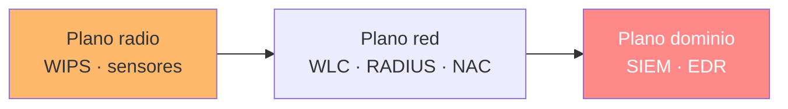

---
tags:
  - Wi-Fi/Enterprise
  - Tipo/Deteccion
  - Pentesting/Post-Explotacion
Descripción: "Qué ve el defensor en cada eslabón de la cadena, desde el WIPS hasta el SIEM, y qué disciplina mantiene un engagement inalámbrico por debajo del umbral"
Fecha de actualización: 2026-08-04
Nota previa: "[[11 - Post-explotación y valor para el cliente]]"
Nota siguiente: "[[13 - Arsenal del engagement Wi-Fi corporativo]]"
Area: "[[Wi-Fi corporativo.base|Wi-Fi corporativo]]"
---
---

Un engagement inalámbrico atraviesa tres planos de detección muy distintos, y <mark style="background: #ADCCFFA6;">el más ruidoso —la radio— es también el que menos organizaciones vigilan</mark>. Entender qué mira cada uno decide dónde conviene ser paciente y dónde da igual.

# Los tres planos

| Plano | Qué ve | Madurez habitual |
| ----- | ------ | ---------------- |
| **Radio** | Deauth, rogue AP, potencia anómala, Karma | Baja: muchos parques no tienen WIPS activo |
| **Red** | Asociaciones fallidas, `Access-Reject`, MAC nuevas | Media: los datos existen, casi nadie los alerta |
| **Dominio** | Kerberoasting, DCSync, webshell, PtH | **Alta**: es donde vive el EDR y el SOC |

<mark style="background: #8000E1A6;">La consecuencia es contraintuitiva</mark>: la parte llamativa del ataque —montar un AP falso, desautenticar clientes— suele pasar desapercibida, y lo que enciende las alarmas es un `secretsdump` rutinario. Quien planifique el sigilo al revés gastará esfuerzo donde no hace falta.

# Plano radio

Los WIPS comerciales —**Cisco aWIPS**, **Aruba RFProtect**, **Meraki Air Marshal**— comparten catálogo de firmas con `Kismet`, cuyas reglas son públicas y sirven de referencia:

| Alerta | Qué la dispara en este engagement |
| ------ | --------------------------------- |
| `DEAUTHFLOOD` | Forzar handshake o migración al AP falso |
| `APSPOOF` | Evil twin, MANA, colisión de BSSID |
| `OVERPOWERED` | AP falso más cerca del cliente que el legítimo |
| `KARMAOUI` | AP que responde a cualquier *probe* |
| `CRYPTODROP` | **Downgrade de WPA3 a WPA2** |
| `NOCLIENTMFP` | Clientes sin PMF (dato para el defensor, no ataque) |

La contención automática es lo que convierte la detección en respuesta: el WIPS desasocia a los clientes del AP falso en segundos. Cuando está activo, un evil twin deja de funcionar aunque los usuarios piquen.

> [!warning]+ La contención automática es un arma de doble filo
> Un WIPS mal configurado puede clasificar como *rogue* un AP legítimo de un vecino y desasociar a sus clientes. <mark style="background: #FF5582A6;">Eso es un ataque de denegación de servicio contra un tercero</mark>, con las mismas implicaciones legales que si lo lanzara el auditor. Es un hallazgo que conviene revisar durante el engagement, y una recomendación que los clientes agradecen.

# Plano red

Aquí está la telemetría que casi nadie mira y que registra **todo**:

| Fuente | Evento revelador |
| ------ | ---------------- |
| WLC | Asociaciones fallidas repetidas, MAC desconocidas, cambios de AP anómalos |
| RADIUS | Ráfaga de `Access-Reject`; **ausencia** de sesiones de un usuario presente |
| DHCP | Concesión a una MAC nunca vista |
| NAC | Dispositivo sin postura conocida en una VLAN corporativa |

La segunda fila merece énfasis: durante un evil twin Enterprise, el cliente autentica contra el RADIUS **del atacante**, así que el legítimo deja de ver sus sesiones. <mark style="background: #FFB86CA6;">Una interrupción de autenticaciones de un usuario que sigue en el edificio es la señal más limpia del ataque</mark>, y prácticamente nadie la monitoriza. Recomendarlo aporta más que otra regla de deauth.

El NAC es el control que rompe la cadena en su punto crítico: aunque la credencial se robe, un dispositivo sin certificado ni postura conocida no debería aterrizar en el segmento corporativo.

# Plano dominio

A partir del pivote, el ataque deja de ser inalámbrico y aplica la detección estándar de AD, desarrollada en [[25 - Detección y evasión en AD]] y [[16 - Detección y respuesta a lo largo de la cadena]]. Los eventos de esta cadena concreta:

| Acción | Evento | Ruido |
| ------ | ------ | ----- |
| Kerberoasting | `4769` con cifrado RC4 | Medio |
| AS-REP Roasting | `4768` sin preautenticación | Medio |
| Webshell `.aspx` | Creación de fichero en `wwwroot` + proceso hijo de `w3wp.exe` | **Alto** |
| Potato / SeImpersonate | Creación de proceso con token suplantado | **Alto** con EDR |
| `secretsdump` / DCSync | `4662` con los GUID de replicación | **Muy alto** |
| Pass the Hash | `4624` tipo 3 con NTLM desde origen inusual | Alto |

<mark style="background: #FFB8EBA6;">El escalón de ruido está en el webshell</mark>: hasta ahí todo es tráfico de un usuario legítimo con su credencial legítima. Un proceso hijo de `w3wp.exe` es una de las detecciones más básicas de cualquier EDR.

# Disciplina de evasión

Lo que sigue funcionando es el mismo principio que en el perímetro de red: **hacer menos y parecerse a lo normal**.

| Fase | Práctica |
| ---- | -------- |
| Reconocimiento | Pasivo, con filtro de alcance. No emite nada |
| Captura | PMKID antes que deauth; deauth dirigida de 2-3 tramas |
| Evil twin | `--nodeauth` y esperar el *roaming* natural; potencia mínima |
| Ventanas | Horas de alta rotación: los handshakes llegan solos |
| Identidad | MAC aleatoria y distinta por sesión y por interfaz |
| Interno | Herramientas firmadas, LOLBins, ritmo humano |

Y lo que ya **no** evade nada:

| Técnica | Por qué falla |
| ------- | ------------- |
| Deauth masiva | Alerta garantizada, y con `PMF` ni siquiera funciona |
| Suplantar la MAC de un cliente | Colisión: se detecta **y** rompe servicio |
| AP falso a máxima potencia | `OVERPOWERED` existe justo para eso |
| `mana_loud=1` sin necesidad | Anunciar decenas de SSID es la firma de `KARMAOUI` |
| Confiar en que nadie mira 2,4 GHz | Los AP modernos escanean fuera de banda de continuo |

# La recomendación que ordena todo

Si el cliente sólo puede aplicar tres medidas, en este orden:

1. **`ca_cert` + `domain_suffix_match` por GPO/MDM.** Cierra el vector de entrada. Sin esto, lo demás sólo encarece el ataque.
2. **Segmentar la VLAN inalámbrica y aplicar NAC.** Convierte un robo de credencial en un incidente contenido en vez de una toma de red.
3. **Alertar sobre la telemetría que ya se está generando** — WLC y RADIUS. No requiere comprar nada.

<mark style="background: #8000E1A6;">El WIPS es la cuarta, no la primera</mark>. Detecta bien el ataque llamativo, pero el que abrió el dominio en este engagement —un cliente aceptando un certificado— no genera ninguna alerta de radio.
