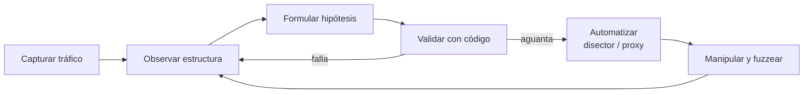

---
tags:
  - Protocolos
  - Redes
  - Pentesting/Enumeracion
  - Tipo/Introduccion
Descripción: "Marco mental de tres capas (contenido, codificación, transporte) para atacar un protocolo propietario del que no existe ni RFC ni documentación"
Fecha de actualización: 2026-08-03
Nota previa: 
Nota siguiente: "[[01 - Captura pasiva y sus límites]]"
Area: "[[Análisis de protocolos.base|Análisis de protocolos]]"
---
---

Cuando el objetivo habla `HTTP`, `SMB` o `DNS`, el trabajo ya está hecho: hay RFC, hay disectores en Wireshark y hay herramientas dedicadas. El problema real aparece con el <mark style="background: #ADCCFFA6;">protocolo propietario</mark> — el binario que se inventó el fabricante del ERP, del dispositivo industrial, del cliente *thick* o del *backend* de una app móvil. No hay documentación, no hay disector, y muchas veces ni siquiera hay un nombre.

Ese es el terreno de esta área. La referencia base es *Attacking Network Protocols* (James Forshaw, No Starch Press, 2018) — un libro cuya **metodología sigue intacta** aunque parte de su *tooling* haya muerto; las notas de este bloque señalan explícitamente qué se ha quedado atrás y con qué se sustituye hoy.

## Por qué el modelo OSI no sirve aquí

El modelo de 4 capas del *Internet Protocol Suite* (enlace, internet, transporte, aplicación) describe cómo viaja un paquete, y para eso está bien. Pero como marco de **análisis** de un protocolo de aplicación es el nivel de abstracción equivocado: te obliga a razonar sobre Ethernet y TCP cuando lo que quieres entender es qué le está pidiendo el cliente al servidor.

Forshaw propone un modelo alternativo de tres capas, pensado no para transmitir sino para **analizar**:

| Capa | Qué responde | Ejemplo (petición web) |
| - | - | - |
| **Contenido** | Qué se quiere comunicar, en lenguaje humano | «quiero el fichero `image.jpg`» |
| **Codificación** | Qué reglas representan ese contenido | `GET /image.jpg HTTP/1.1` |
| **Transporte** | Cómo llegan esos bytes al otro extremo | TCP/IP al puerto 80 |

La potencia del modelo está en que <mark style="background: #8000E1A6;">las capas son relativas al análisis, no absolutas</mark>: puedes colapsar todo lo que ya entiendes en «transporte» y quedarte solo con lo que te interesa.

> [!example]+ El caso que lo justifica
> Analizas el tráfico de un *malware* que recibe órdenes por HTTP. Ves esto:
>
> ```http
> GET /image.jpg?e=SEND%20secret.doc%11%22 HTTP/1.1
> ```
>
> Con el modelo clásico concluyes «está pidiendo `image.jpg`» y te vas con las manos vacías. Con el modelo de tres capas colapsas **HTTP sobre TCP/IP entero** en la capa de transporte —da igual cómo funciona, funciona— y analizas la capa que importa:
>
> - **Contenido**: exfiltrar el fichero `secret.doc`.
> - **Codificación**: comando de texto `SEND <fichero> <datos>`.
> - **Transporte**: parámetro de query HTTP con *percent-encoding*.
>
> El protocolo real del C2 no es HTTP. HTTP es solo el sobre.

Ese reencuadre es la diferencia entre documentar el sobre y leer la carta. Aplícalo también al revés: si un protocolo binario propietario resulta llevar `JSON` dentro de un *framing* TLV, el TLV pasa a ser transporte y el JSON es tu capa de codificación real.

## El bucle de análisis

El trabajo no es lineal, es <mark style="background: #FFB8EBA6;">iterativo y acumulativo</mark>: cada vuelta valida o rompe la hipótesis anterior.



1. **Capturar** — pasiva ([[01 - Captura pasiva y sus límites]]) o activa a través de un proxy ([[03 - Proxies de intercepción para protocolos no-HTTP]]). Si el tráfico no es tuyo, primero hay que ponerse en el camino ([[00 - Ponerse en el camino - routing, NAT y forwarding]]).
2. **Observar** — *hex dumps*, patrones repetidos, cabeceras mágicas, campos que cambian de tamaño. Aquí es donde reconoces las estructuras de [[00 - Anatomía de un protocolo binario]].
3. **Hipótesis** — «estos 4 bytes son la longitud», «este byte es el tipo de mensaje».
4. **Validar con código** — un *script* de 20 líneas que parsea el fichero entero y **peta si la hipótesis es falsa** es infinitamente más rápido que seguir mirando el volcado ([[05 - Del hex dump a la estructura del protocolo]]).
5. **Automatizar** — un disector de Wireshark ([[06 - Dissectors de Wireshark en Lua]]) o un proxy que reescribe el protocolo ([[07 - Modificar el protocolo en vuelo]]).
6. **Manipular** — desactivar cifrado o compresión, y de ahí al *fuzzing* ([[00 - Fuzzing de protocolos de red]]).

Genera **tráfico variado a propósito** antes de mirar nada: ejecuta todas las funciones del cliente, con dos usuarios, abriendo y cerrando sesión varias veces. Los mensajes que solo aparecen en la conexión o la desconexión son justo los que se pierden si capturas una sesión rutinaria.

## Cuándo hay que abrir el binario

Si el protocolo cifra con algo propio, comprime con un algoritmo no estándar o el *framing* no se deja adivinar, el análisis desde el cable se agota. Entonces toca ingeniería inversa del cliente o del servidor ([[00 - Cuándo hay que abrir el binario]]). No es el primer recurso —es caro— pero sí el que desbloquea los casos duros.

## Del análisis al hallazgo

Entender el protocolo no es el objetivo: es el requisito previo. Una vez sabes cómo se estructura, aparecen los patrones de fallo — un campo de longitud que nadie acota, un índice que se usa sin comprobar, un contador que desborda. Ese catálogo vive en [[00 - Clases de vulnerabilidad en un servicio de red]], y la vía para encontrarlos a escala en [[00 - Fuzzing de protocolos de red]].

> [!warning]+ Alcance legal en España
> Interceptar comunicaciones ajenas encaja en el **art. 197.1 CP** (interceptación de telecomunicaciones) y el acceso al sistema en el **art. 197 bis CP**. Un ARP *poisoning* o un DHCP *rogue* afectan a **todo el segmento**, no solo a tu objetivo: en un *engagement* hace falta autorización escrita del titular y que el alcance de red esté acotado por escrito (VLAN, rangos IP, ventana horaria). Fuzzear un servicio en producción puede tumbarlo — eso se pacta antes, no se explica después.

## Fuentes

> [!info]+ Fuentes de este bloque
> - James Forshaw, *Attacking Network Protocols* (No Starch Press, 2018) — [[Attacking Network Protocols|ficha en la biblioteca]]. Metodología base, caps. 1-5.
> - [RFC 1122](https://datatracker.ietf.org/doc/html/rfc1122) — *Requirements for Internet Hosts*, para el modelo de capas del IPS.
> - Fundamentos de capas y encapsulación en el vault: [[Capas de red (1 - 4)]] y [[Capas de red (5 - 7)]].
