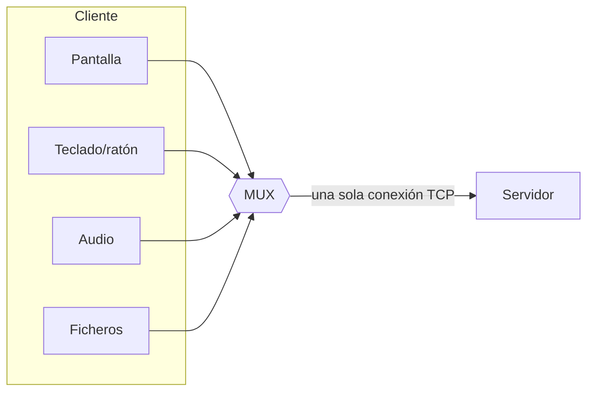

---
tags:
  - Protocolos
  - Redes
  - Pentesting/Enumeracion
Descripción: "Tag-Length-Value como esqueleto extensible de casi todo protocolo binario, y cómo multiplexación y fragmentación reparten un mensaje en trozos que hay que reensamblar para atacar"
Fecha de actualización: 2026-08-03
Nota previa: "[[01 - Datos de longitud variable]]"
Nota siguiente: "[[03 - Formatos binarios estructurados]]"
Area: "[[Estructuras de protocolo.base|Estructuras de protocolo]]"
---
---

Un protocolo que solo transporta un tipo de mensaje es un juguete. En cuanto necesita mandar cosas distintas —credenciales, un mensaje, un fichero, un *keep-alive*— hace falta una forma de decir **qué** viene, **cuánto** ocupa y **dónde** están los datos. Esa forma es el patrón **TLV**.

## Tag-Length-Value

```text
 0x08     0x00 0x03     0x12 0x34 0x56
  Tag      Longitud       Valor (3 octetos)
```

El orden no está fijado y el tag puede ir dentro o fuera del valor contado por la longitud — esa ambigüedad es justo lo que hay que resolver haciendo la aritmética ([[05 - Del hex dump a la estructura del protocolo]]).

<mark style="background: #ADCCFFA6;">Su virtud es la extensibilidad hacia delante: como cada estructura viene con su tipo y su tamaño, un parser antiguo puede saltarse un tag que no conoce sin romperse</mark>. Añadir campos nuevos no rompe clientes viejos.

> [!warning]+ Y esa virtud es la superficie de ataque
> «Saltarse lo que no entiende» significa que el parser **procesa datos que su lógica no valida**. De ahí salen tres fallos:
>
> - **Tags no documentados**. Si existen los tags 0-3 y 5-7, el 4 es un comando que el cliente nunca envía. Código sin ejercitar = código sin probar. Enviarlo a mano es de las primeras cosas que hay que intentar.
> - **Longitud incoherente con el tag**. Si el tag 3 espera una estructura de 16 octetos y anuncias 4, el parser puede leer más allá del búfer al acceder a los campos que «debería» haber.
> - **Tags anidados sin límite de profundidad**. Un TLV que contiene TLVs que contienen TLVs, parseado recursivamente y sin cota, agota la pila: *stack exhaustion* → denegación de servicio. Es la clase de fallo que aparece una y otra vez en parsers de ASN.1 y de X.509.

TLV está en todas partes: `DER` (y por tanto en X.509, LDAP, SNMP y Kerberos), en las opciones de DHCP, en los atributos de RADIUS, en los IE de 802.11, en los registros de TLS y en los *tag-wire type* de Protocol Buffers.

## Multiplexación

Un mismo socket transportando varias conversaciones lógicas. El ejemplo canónico es RDP: mientras el usuario mueve el ratón y teclea, el servidor manda actualizaciones de pantalla, va audio en ambos sentidos y se transfiere un fichero. Si esas cosas fueran secuenciales, un audio de 10 minutos congelaría la pantalla.



La multiplexación necesita un **identificador de canal** en cada trozo. Al analizar, se reconoce porque hay un campo corto que se repite cíclicamente y cuyo valor correlaciona con el tipo de contenido.

**Consecuencia para el análisis**: hay que **demultiplexar antes de analizar**. <mark style="background: #8000E1A6;">Mezclar canales produce un volcado incoherente donde parece que el protocolo cambia de formato cada dos mensajes</mark>. Si tu parser no separa por canal, estarás persiguiendo un patrón que no existe.

**Consecuencia ofensiva**: los canales suelen tener **niveles de confianza distintos** (el de control frente al de datos), y <mark style="background: #FF5582A6;">si el identificador de canal no se valida contra la sesión, se puede escribir en un canal al que no se debería tener acceso</mark> — un *authorization bypass* dentro del propio protocolo. HTTP/2 y HTTP/3 son protocolos multiplexados, y buena parte de sus ataques específicos vienen justo de ahí ([[13 - Introducción a HTTP2]]).

## Fragmentación

Las capas inferiores imponen tamaños máximos: Ethernet 1500 octetos de MTU, mientras que un paquete IP puede llegar a 65.535. La fragmentación trocea y reensambla.

> [!important]+ El reensamblado es donde se rompe la seguridad
> Fragmentar es **la técnica de evasión de IDS por excelencia**, y funciona porque el dispositivo de inspección y el destino final pueden reensamblar de forma distinta:
>
> - **Solapamiento de fragmentos**. Dos fragmentos que cubren el mismo rango con contenido distinto. ¿Gana el primero o el último? BSD y Windows no coinciden. El IDS reensambla una cosa y el host otra: el ataque pasa. Es lo que `fragroute` explotaba y lo que motiva el [RFC 5722](https://datatracker.ietf.org/doc/html/rfc5722), que **prohíbe** los fragmentos solapados en IPv6.
> - **Fragmentos diminutos**. Partir la cabecera TCP para que los flags queden en el segundo fragmento y el IDS no los vea. Es el `-f`/`--mtu` de Nmap ([[07 - Evasión de firewalls, IDS e IPS]]).
> - **Agotamiento de la cola de reensamblado**. Enviar primeros fragmentos y nunca los últimos: el destino guarda cada uno esperando el resto hasta agotar el temporizador. Con volumen suficiente, es DoS por memoria.
>
> Lo mismo, un nivel más arriba, es el *chunked encoding* de HTTP — y de ahí salen [[07 - CL.TE|CL.TE]], [[09 - TE.CL|TE.CL]] y compañía.

## Qué hacer con esto en un análisis

1. **Identifica el *framing***: ¿hay tag? ¿longitud? ¿ambos? ¿el tag va dentro de la longitud?
2. **Enumera los tags observados** y busca los huecos.
3. **Comprueba si hay canal**: si sí, separa los flujos antes de nada.
4. **Prueba incoherencias**: tag válido con longitud imposible, longitud 0, anidamiento profundo.
5. **Si hay fragmentación**, prueba solapamiento y fragmentos incompletos.

El siguiente paso es reconocer cuándo el protocolo **no** se ha inventado su TLV y ha reutilizado uno estándar: [[03 - Formatos binarios estructurados]].

> [!info]+ Fuentes
> - [RFC 5722](https://datatracker.ietf.org/doc/html/rfc5722) — prohibición de fragmentos solapados en IPv6, con la justificación de seguridad.
> - Ptacek & Newsham, *Insertion, Evasion, and Denial of Service: Eluding Network Intrusion Detection* (1998) — el trabajo fundacional sobre evasión por reensamblado; sigue siendo válido.
> - Forshaw, *Attacking Network Protocols*, cap. 3, «Tag, Length, Value Pattern» y «Multiplexing and Fragmentation».
