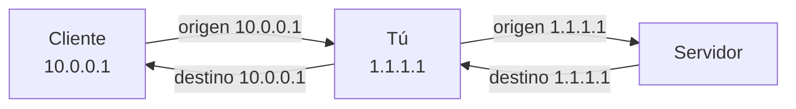

---
tags:
  - MITM
  - Redes
  - Protocolos
  - Pentesting/Explotacion
  - Tipo/Introduccion
Descripción: "Convertir tu máquina en gateway: forwarding, SNAT y DNAT con nftables, y por qué sin SNAT solo ves la mitad de la conversación"
Fecha de actualización: 2026-08-03
Nota previa: 
Nota siguiente: "[[01 - ARP poisoning]]"
Area: "[[MITM de red.base|MITM de red]]"
---
---

Los proxies de [[03 - Proxies de intercepción para protocolos no-HTTP]] suponen que puedes configurar el cliente. Cuando no puedes —un dispositivo empotrado, un *appliance*, una impresora, un PLC, un móvil de empresa gestionado— hay que atacar la capa de red: hacer que el tráfico **pase por ti** sin que el objetivo se entere.

Eso son dos problemas separados, y confundirlos es la causa habitual de que «el MITM no funcione»:

1. **Que el tráfico llegue a tu máquina** → engañar a la resolución de siguiente salto: [[01 - ARP poisoning]], [[02 - DHCP spoofing y rogue DHCP]], [[03 - IPv6 - RA spoofing y DHCPv6 con mitm6]].
2. **Que tu máquina lo reenvíe correctamente** → esta nota.

<mark style="background: #FF5582A6;">Si resuelves el 1 y no el 2, has montado una denegación de servicio</mark>: el tráfico llega y muere ahí.

## Activar el reenvío

Por defecto ningún sistema operativo reenvía entre interfaces — con buen criterio, porque si tu router doméstico reenviara sin filtrar, Internet entraría directamente en tu LAN.

```shell-session
# Linux — inmediato, sin reiniciar
$ sudo sysctl -w net.ipv4.conf.all.forwarding=1
$ sudo sysctl -w net.ipv6.conf.all.forwarding=1

# macOS
$ sudo sysctl -w net.inet.ip.forwarding=1
```

Para que persista, `/etc/sysctl.d/99-forward.conf`. En Windows es una clave de registro y **requiere reinicio**:

```shell-session
C:\> reg add HKLM\System\CurrentControlSet\Services\Tcpip\Parameters ^
      /v IPEnableRouter /t REG_DWORD /d 1 /f
```

> [!warning]+ Acuérdate de desactivarlo
> Dejar `ip_forward=1` en tu máquina de auditoría al terminar es un fallo de higiene. Tu equipo queda reenviando tráfico entre las redes a las que esté conectado; si una es la del cliente y otra la tuya, has creado un puente entre ambas. Al cerrar el *engagement*, revertir a `0` y **vaciar las tablas NAT**.

## Reenviar no basta: el problema de la ruta de vuelta

Con `forwarding` activo, los paquetes salen. Pero muchas veces solo ves una dirección de la conversación, y la razón es que <mark style="background: #8000E1A6;">el **destino no sabe volver**</mark>: si el paquete que le llega dice venir de `10.0.0.1` y el servidor no tiene ruta hacia esa red, responderá por su gateway por defecto, que no eres tú.

Eso lo arregla el **SNAT** (*Source NAT*, también llamado *masquerading*): reescribes la IP de origen por la tuya, así que la respuesta vuelve obligatoriamente a ti.



## SNAT y DNAT con nftables

> [!important]+ `iptables` funciona, pero ya no es lo que ejecutas
> Desde Debian 10, RHEL 8 y Ubuntu 20.10 el binario `iptables` es en realidad **`iptables-nft`**, una capa de traducción sobre `nftables`. Netfilter tiene `iptables` en mantenimiento legado. Los comandos del libro siguen valiendo, pero conviene la sintaxis nativa — y sobre todo **no mezclar reglas de ambos mundos** en la misma máquina, porque el orden de evaluación resultante no es el que esperas.

```shell-session
# Preparar tabla y cadenas (una sola vez)
$ sudo nft add table ip nat
$ sudo nft 'add chain ip nat postrouting { type nat hook postrouting priority srcnat; }'
$ sudo nft 'add chain ip nat prerouting  { type nat hook prerouting  priority dstnat; }'

# SNAT: enmascarar todo lo que salga por eth0 (IP dinámica)
$ sudo nft add rule ip nat postrouting oifname "eth0" masquerade

# SNAT con IP fija (algo más eficiente)
$ sudo nft add rule ip nat postrouting oifname "eth0" snat to 1.1.1.1

# DNAT: desviar el tráfico al servidor real hacia tu proxy local
$ sudo nft add rule ip nat prerouting ip daddr 10.10.10.5 tcp dport 12345 \
      dnat to 127.0.0.1:4444
```

Equivalencias con la sintaxis heredada, por si el sistema solo tiene `iptables`:

| Objetivo | `iptables` |
| - | - |
| Vaciar NAT | `iptables -t nat -F` |
| SNAT dinámico | `iptables -t nat -A POSTROUTING -o eth0 -j MASQUERADE` |
| SNAT fijo | `iptables -t nat -A POSTROUTING -o eth0 -j SNAT --to 1.1.1.1` |
| DNAT | `iptables -t nat -A PREROUTING -p tcp -d ORIG --dport 443 -j DNAT --to-destination NUEVA:8080` |
| Redirigir tráfico propio | `iptables -t nat -A OUTPUT -p tcp --dport 443 -j REDIRECT --to-port 8080` |

<mark style="background: #FFB8EBA6;">**`PREROUTING` frente a `OUTPUT`** es el error clásico</mark>: `PREROUTING` solo toca paquetes que **entran por una interfaz**. El tráfico generado por la propia máquina no pasa por ahí — para eso está `OUTPUT`. Si estás analizando un cliente que corre en tu misma máquina y la regla de `PREROUTING` «no hace nada», es esto.

## Ver por dónde va el tráfico

```shell-session
$ ip route                          # tabla de rutas (0.0.0.0/0 = gateway por defecto)
$ ip neigh                          # caché ARP/NDP: qué MAC tiene cada IP
$ traceroute -n 10.10.10.5          # saltos hasta el destino
$ sudo nft list ruleset             # todas las reglas activas
$ sudo conntrack -L                 # conexiones que están siendo NATeadas ahora
```

`conntrack -L` es la herramienta de diagnóstico más útil cuando el NAT «no funciona»: si la conexión no aparece, el paquete ni siquiera llega a tus reglas y el problema está un paso antes (en el envenenamiento, o en el reenvío).

## De aquí en adelante

Con la máquina reenviando y NATeando, ya eres un router. Falta lo que hace que el objetivo te elija como tal — y eso son cuatro engaños distintos según la capa: ARP (capa 2, IPv4), DHCP (arranque, IPv4), RA/DHCPv6 (IPv6, y **el más rentable hoy**) y DNS (resolución de nombres).

> [!info]+ Fuentes
> - [nftables wiki — NAT](https://wiki.nftables.org/wiki-nftables/index.php/Performing_Network_Address_Translation_(NAT)) y [Netfilter — estado de iptables](https://netfilter.org/projects/iptables/).
> - [`ip-sysctl` en la documentación del kernel](https://docs.kernel.org/networking/ip-sysctl.html) para el detalle de `conf.all.forwarding`.
> - Forshaw, *Attacking Network Protocols*, cap. 4 (los comandos originales usan `iptables` e `ifconfig`, aquí actualizados).
