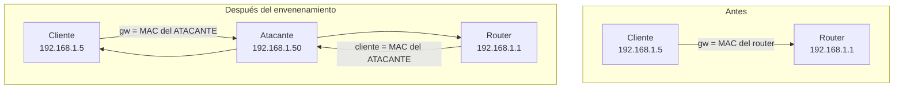

---
tags:
  - MITM
  - Redes
  - Pentesting/Explotacion
Descripción: "Envenenar la caché ARP para interponerse en una LAN conmutada: cómo funciona, cómo se hace con bettercap y arpspoof, y los tres errores que lo convierten en DoS"
Fecha de actualización: 2026-08-03
Nota previa: "[[00 - Ponerse en el camino - routing, NAT y forwarding]]"
Nota siguiente: "[[02 - DHCP spoofing y rogue DHCP]]"
Area: "[[MITM de red.base|MITM de red]]"
---
---

En una LAN Ethernet, para enviar un paquete IP a un vecino hace falta su MAC. `ARP` ([RFC 826](https://datatracker.ietf.org/doc/html/rfc826), de **1982**) resuelve esa correspondencia, y lo hace con una propiedad que hoy es indefendible: <mark style="background: #FF5582A6;">no tiene ningún tipo de autenticación</mark>. Cualquier nodo puede afirmar cualquier IP, y los demás lo creen.

## Cómo funciona ARP

1. El nodo A quiere hablar con `192.168.1.10` y no tiene su MAC.
2. Emite una **ARP Request** a la dirección de difusión `ff:ff:ff:ff:ff:ff`, con su propia MAC e IP y la IP objetivo.
3. El dueño de esa IP responde con una **ARP Reply** unicast que contiene su MAC.
4. A guarda el par IP↔MAC en su **caché ARP** durante un tiempo (típicamente 60 s en Linux, hasta minutos en Windows) y ya no vuelve a preguntar.

Los dos fallos de diseño que se explotan:

- **No hay verificación de origen.** Nadie comprueba que quien responde sea el dueño de la IP.
- **Se aceptan respuestas no solicitadas.** Muchas pilas actualizan la caché con una *ARP Reply* que nunca pidieron (*gratuitous ARP*), pensada originalmente para anunciar cambios de IP y detectar duplicados.

## El ataque



Envías al cliente respuestas ARP diciendo «`192.168.1.1` (el router) soy yo», y al router diciendo «`192.168.1.5` (el cliente) soy yo». Ambos actualizan su caché y te mandan todo a ti.

> [!warning]+ Envenena los dos extremos o no verás nada útil
> Con un solo lado capturas **media conversación**: las peticiones sin las respuestas, o al revés. Para casi cualquier análisis eso es inútil. Los dos casos legítimos de envenenamiento unilateral son (a) solo te interesa lo que el cliente envía, y (b) quieres reducir el ruido y el riesgo de detección al mínimo.

## Ejecución

**bettercap** (v2.41.7, mayo 2026) es hoy la herramienta estándar — activa, con módulos de sniffing, DNS y proxy integrados:

```shell-session
$ sudo bettercap -iface eth0
> set arp.spoof.targets 192.168.1.5
> set arp.spoof.fullduplex true          # envenena también al gateway
> arp.spoof on
> net.sniff on
```

**Ettercap** sigue vivo, en contra de lo que suele decirse: la **v0.8.4.1 «Garofalo» es de abril de 2026**. Su GUI (`ettercap -G`) es el flujo del libro y funciona; el modo texto es más práctico para *scripting*:

```shell-session
$ sudo ettercap -T -q -i eth0 -M arp:remote /192.168.1.5// /192.168.1.1//
```

Y `arpspoof` de `dsniff`, mínimo pero fiable, cuando quieres exactamente una cosa y nada más:

```shell-session
$ sudo arpspoof -i eth0 -t 192.168.1.5 192.168.1.1     # al cliente: yo soy el router
$ sudo arpspoof -i eth0 -t 192.168.1.1 192.168.1.5     # al router: yo soy el cliente
```

## Los tres errores que lo convierten en DoS

1. **Olvidar `ip_forward=1`.** El tráfico llega y muere. El cliente pierde la conectividad de golpe, que es el síntoma más visible que existe. Ver [[00 - Ponerse en el camino - routing, NAT y forwarding]].
2. **Envenenar demasiado.** Un `arp.spoof` contra toda la subred multiplica el tráfico que pasa por tu interfaz y te convierte en cuello de botella. Los *timeouts* que provoca disparan alertas y, sencillamente, molestan al cliente. **Apunta a hosts concretos.**
3. **No restaurar al terminar.** Las cachés caducan solas, pero mientras tanto la red va a trompicones. `bettercap` y `ettercap` reenvían las asociaciones correctas al salir limpiamente — mátalos con `Ctrl+C`, no con `kill -9`.

## Qué se consigue de verdad en 2026

Aquí conviene ser honesto sobre el rendimiento del ataque:

- **HTTPS no se cae solo.** Interponerse no descifra nada. Necesitas que el cliente confíe en tu CA, o degradar a HTTP — y **HSTS con precarga** hace inviable el *SSL stripping* clásico contra sitios grandes ([[08 - SSL Stripping]]).
- **Lo que sí sigue cayendo**: protocolos internos sin cifrar (SNMP v1/v2c, telnet, FTP, syslog, LDAP simple, réplicas de bases de datos, backends de aplicaciones legadas), tráfico de dispositivos empotrados e industriales, y **cualquier protocolo propietario** — que es exactamente el objeto de esta área.
- **La combinación rentable**: el envenenamiento no como fin, sino como forma de **meter tu proxy en el camino** de un protocolo binario que no se puede reconfigurar.

Y el matiz que suele olvidarse: <mark style="background: #FFB86CA6;">envenenar ARP afecta a todo el dominio de difusión, no solo a tu objetivo</mark>. En un *engagement*, el alcance tiene que decir explícitamente que se puede — es una técnica con riesgo real de interrumpir sistemas de terceros que comparten VLAN.

## Detección

Es de los ataques más detectables que existen; el detalle está en [[05 - Detección y evasión del MITM de capa 2]], pero en resumen: dos IPs con la misma MAC en la tabla de vecinos, ráfagas de *gratuitous ARP*, y `arpwatch`/DAI cantando de inmediato.

> [!info]+ Fuentes
> - [RFC 826](https://datatracker.ietf.org/doc/html/rfc826) — Address Resolution Protocol.
> - [bettercap — arp.spoof](https://www.bettercap.org/modules/ethernet/spoofers/arp.spoof/). Versión verificada v2.41.7 (2026-05-11).
> - [Ettercap](https://github.com/Ettercap/ettercap/releases) — v0.8.4.1 «Garofalo» (2026-04-07), contra la creencia extendida de que está abandonado.
> - MITRE ATT&CK [T1557.002](https://attack.mitre.org/techniques/T1557/002/) — *Adversary-in-the-Middle: ARP Cache Poisoning*.
