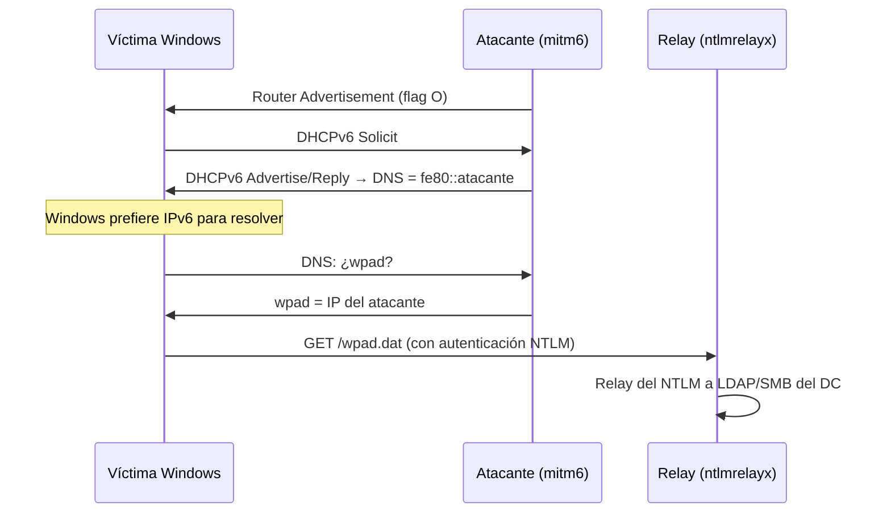

---
tags:
  - MITM
  - Redes
  - Active-Directory
  - Pentesting/Explotacion
Descripción: "El ataque MITM más rentable de una red Windows moderna: IPv6 va activado y desatendido, y mitm6 lo convierte en DNS bajo control y relay NTLM"
Fecha de actualización: 2026-08-03
Nota previa: "[[02 - DHCP spoofing y rogue DHCP]]"
Nota siguiente: "[[04 - DNS spoofing y redirección de nombres]]"
Area: "[[MITM de red.base|MITM de red]]"
---
---

Esto no está en *Attacking Network Protocols* — el libro es de 2018 y no menciona IPv6 en absoluto — y es <mark style="background: #FFB86CA6;">probablemente el vector MITM más productivo contra una red corporativa Windows en 2026</mark>. La razón es sencilla y no ha cambiado en una década: **IPv6 viene activado por defecto en Windows, y nadie lo administra**.

La consecuencia es que existe una red paralela sin DHCP legítimo, sin snooping, sin monitorización y sin nadie mirando. Y en Windows, **IPv6 tiene preferencia sobre IPv4** en la resolución de nombres ([RFC 6724](https://datatracker.ietf.org/doc/html/rfc6724)).

## Cómo se autoconfigura un host IPv6

IPv6 no necesita DHCP para funcionar. El descubrimiento de vecinos (**NDP**, [RFC 4861](https://datatracker.ietf.org/doc/html/rfc4861)) hace el trabajo con mensajes ICMPv6:

| Mensaje | Función | Equivalente IPv4 |
| - | - | - |
| Router Solicitation (RS) | «¿Hay algún router?» | — |
| **Router Advertisement (RA)** | «Yo soy router, este es el prefijo» | Anuncio de gateway |
| Neighbor Solicitation (NS) | «¿Quién tiene esta IPv6?» | ARP Request |
| Neighbor Advertisement (NA) | «Yo la tengo, esta es mi MAC» | ARP Reply |

Y como ARP, **NDP no autentica nada**. Existe SEND ([RFC 3971](https://datatracker.ietf.org/doc/html/rfc3971), *SEcure Neighbor Discovery*) desde 2005, y su despliegue real es prácticamente nulo.

De los flags del RA sale el comportamiento del cliente:

- **Flag `A`** (autónomo) → el host se autoasigna dirección con SLAAC a partir del prefijo anunciado.
- **Flag `M`** (managed) → el host pide dirección por **DHCPv6**.
- **Flag `O`** (other config) → el host pide *solo la configuración* (DNS, dominio) por DHCPv6.

## El ataque de mitm6

`mitm6` (Fox-IT / Dirk-jan Mollema) hace algo deliberadamente **quirúrgico**: no intenta ser el router. Anuncia un RA con el flag `O` puesto y responde a las peticiones DHCPv6 **repartiendo únicamente su propia dirección como servidor DNS**.



<mark style="background: #FF5582A6;">Con solo controlar el DNS ya tienes la cadena entera</mark>: WPAD → el cliente pide el fichero de proxy → autentica con NTLM sin que nadie se lo pida → `ntlmrelayx` retransmite esa autenticación a LDAP o SMB del controlador de dominio.

```shell-session
# Terminal 1 — el MITM de IPv6
$ sudo mitm6 -d dominio.local

# Terminal 2 — el relay, con delegación para persistir
$ ntlmrelayx.py -6 -t ldaps://dc01.dominio.local -wh atacante-wpad --delegate-access
```

`-6` habilita IPv6 en el relay, `-wh` levanta el servidor WPAD y `--delegate-access` crea una cuenta de equipo y le configura delegación restringida basada en recursos (RBCD) — persistencia como administrador sobre la máquina de la víctima.

> [!important]+ Por qué funciona tan bien
> Cuatro cosas se alinean:
> 1. **IPv6 activado por defecto** en todo Windows desde Vista, y desactivarlo por completo está **desaconsejado por Microsoft** (rompe componentes que lo asumen).
> 2. **Precedencia de IPv6** sobre IPv4 al resolver ([RFC 6724](https://datatracker.ietf.org/doc/html/rfc6724)).
> 3. **WPAD activo** en la configuración por defecto de Internet Explorer/Edge heredada, con autenticación automática hacia sitios de la intranet.
> 4. **Nadie vigila IPv6.** Ni DHCP snooping (es de IPv4), ni RA Guard (hay que habilitarlo a mano), ni reglas de detección.

## Mitigación real (para el informe)

Esto acaba en un hallazgo, así que las recomendaciones tienen que ser accionables y correctas:

- **RA Guard** y **DHCPv6 Guard** en los switches de acceso — es la contramedida directa, y es la que casi nunca está.
- **Bloquear DHCPv6 entrante** (UDP 546/547) por *firewall* en los endpoints si no se usa.
- **Desactivar WPAD**: entrada `wpad` en el DNS interno apuntando a `::1`/`127.0.0.1`, o política `WpadOverride`. **No** basta con quitarlo del navegador: el servicio `WinHTTP Web Proxy Auto-Discovery` lo sigue usando.
- **Firmar y sellar**: exigir firma SMB y LDAP signing + *channel binding* en los DC. Eso corta el *relay*, que es lo que convierte el MITM en compromiso de dominio. Ver [[23 - Hardening de Active Directory]].
- **No «desactivar IPv6»** sin más: Microsoft lo desaconseja explícitamente. Lo correcto es administrarlo, no fingir que no está.

## Más allá de mitm6

Otros vectores IPv6 del mismo paquete (`THC-IPv6`):

- **`fake_router6`** — hacerse router de verdad, no solo DNS. Más ruidoso y más disruptivo.
- **`flood_router26`** — inundar con RAs de prefijos distintos; DoS por agotamiento (cada RA hace que el host se genere una dirección más).
- **`parasite6`** — el equivalente IPv6 del ARP poisoning, vía NA falsificados.
- **SLAAC attack** — anunciar prefijo propio y hacerse gateway IPv6 de todo el segmento.

Combina bien con el envenenamiento de nombres de IPv4: `Responder` para LLMNR/NBT-NS/mDNS ([[06 - Envenenamiento LLMNR y NBT-NS]]) y `mitm6` para IPv6 cubren las dos vías de resolución que quedan sin autenticar.

> [!info]+ Fuentes
> - [mitm6](https://github.com/dirkjanm/mitm6) — Dirk-jan Mollema (Fox-IT), con el artículo original *«Compromising IPv4 networks via IPv6»*.
> - [RFC 4861](https://datatracker.ietf.org/doc/html/rfc4861) (NDP) y [RFC 6724](https://datatracker.ietf.org/doc/html/rfc6724) (selección de dirección de origen y precedencia de IPv6).
> - [Microsoft — Guidance for configuring IPv6](https://learn.microsoft.com/en-us/troubleshoot/windows-server/networking/configure-ipv6-in-windows): desaconseja desactivarlo.
> - MITRE ATT&CK [T1557.003](https://attack.mitre.org/techniques/T1557/003/) — *AiTM: DHCP Spoofing*.
