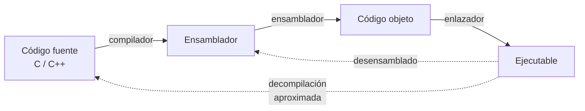

---
tags:
  - Reversing
  - Protocolos
  - Pentesting/Enumeracion
  - Tipo/Introduccion
Descripción: "Los cuatro escenarios que obligan a pasar del cable al binario, cómo se compila y enlaza un ejecutable, y qué formato tienes delante según la plataforma"
Fecha de actualización: 2026-08-03
Nota previa: 
Nota siguiente: "[[01 - Arquitectura y ABI - lo mínimo para leer desensamblado]]"
Area: "[[Reversing de protocolos.base|Reversing de protocolos]]"
---
---

Analizar desde el cable es barato y llega lejos. Pero hay un punto donde se agota, y seguir mirando volcados hexadecimales pasa de ser productivo a ser terquedad. Esta nota va de reconocer ese punto y de lo mínimo que hay que saber sobre ejecutables para cruzarlo.

## Los cuatro escenarios que obligan a abrir el binario

1. **Cifrado propietario.** No es TLS y no puedes interponerte. Sin la clave o el algoritmo, el volcado es ruido.
2. **Compresión o codificación no estándar.** Ningún decodificador genérico parsea el bloque y la entropía es alta.
3. **El *framing* no se deja adivinar.** Campos calculados, longitudes derivadas, checksums con clave, o estructura que cambia según un estado que no observas.
4. **Necesitas el conjunto completo de comandos.** El cliente solo ejercita una parte del protocolo; los tags que nunca envía son justo los que quieres probar ([[05 - Del hex dump a la estructura del protocolo]]).

> [!important]+ Antes de desensamblar, prueba lo barato
> El reversing estático es caro en tiempo. Tres atajos que resuelven el caso a menudo:
> - **¿Es código gestionado?** .NET y Java **decompilan a fuente casi original**. Eso no es reversing, es leer código ([[04 - Aplicaciones gestionadas - .NET, Java y ofuscación]]).
> - **¿Hay símbolos?** Un binario sin *strip*, un `.pdb` accidentalmente distribuido o un ejecutable de depuración te dan los nombres de las funciones y te ahorran el 80 % del trabajo.
> - **¿Puedes engancharlo en runtime?** Frida sobre la función de cifrado te da el texto plano sin entender el algoritmo ([[03 - Reversing dinámico - debuggers y hooking]]). Muchas veces es lo único que necesitas.

## De código fuente a máquina

Entender qué se perdió en el camino explica qué puedes y qué no puedes recuperar.

El desensamblado es **exacto y reversible**: instrucción máquina ↔ mnemónico, correspondencia uno a uno. La decompilación a C es **aproximada**: los decompiladores modernos (Ghidra, Hex-Rays) producen C legible, pero nombres de variables, comentarios, tipos y estructura original se perdieron en la compilación. Lo que ves es una reconstrucción plausible, no el fuente.

Los lenguajes **interpretados** (Python, Ruby, PHP) no compilan a máquina: si tienes los `.py`, tienes el fuente. Y los **gestionados** (.NET, Java) compilan a un bytecode intermedio con metadatos abundantes — nombres de clases, de métodos, tipos — lo que los hace **decompilables casi al original**.

## Enlazado estático y dinámico

- **Estático**: el código de las librerías se copia dentro del ejecutable. Un solo fichero, sin dependencias — y desde el punto de vista del reversing, un binario grande donde `send()` y `recv()` están **dentro**, sin nombre, mezclados con el código propio. Go y Rust producen binarios estáticos por defecto.
- **Dinámico**: el ejecutable solo guarda una referencia (`ws2_32.dll!send`, `libc.so.6!send`) que el cargador resuelve al arrancar. <mark style="background: #8000E1A6;">Esa tabla de importaciones es tu mejor punto de entrada</mark>: lista literalmente qué APIs de red y de criptografía usa el programa ([[02 - Localizar el código de red en un binario]]).

Con un binario estático hay que recurrir a la identificación de funciones de librería por firma — `FLIRT` en IDA, `Function ID` en Ghidra, o `capa` de Mandiant, que reconoce capacidades («abre un socket TCP», «cifra con AES») a partir de patrones.

## Formatos de ejecutable

| Plataforma | Formato | Extensiones | Símbolos de depuración |
| - | - | - | - |
| Windows | **PE** (*Portable Executable*) | `.exe`, `.dll`, `.sys` | Fichero `.pdb` **externo** |
| Linux, BSD, Solaris | **ELF** | (sin extensión), `.so` | **Dentro** del propio fichero, salvo `strip` |
| macOS, iOS | **Mach-O** | (sin extensión), `.dylib` | Paquete `.dSYM` externo; algunos símbolos dentro |

Todos comparten la misma anatomía: **secciones** con nombre, tamaño, dirección de carga y permisos.

| Sección típica | Contenido | Permisos |
| - | - | - |
| `.text` | Código máquina | Lectura + ejecución |
| `.data` | Datos inicializados | Lectura + escritura |
| `.bss` | Datos sin inicializar | Lectura + escritura |
| `.rdata` / `.rodata` | Constantes y cadenas | Solo lectura |

Los permisos importan **directamente** para la explotación: que `.text` no sea escribible y que `.data` no sea ejecutable es lo que hoy llamamos **DEP/NX**, y es la razón de que exista el ROP ([[08 - Mitigaciones modernas y cómo se saltan]]).

## Símbolos: el atajo que a veces regalan

- **Windows**: la información de depuración va en un `.pdb` **separado**. Rara vez se distribuye con software cerrado — con una excepción enorme: **Microsoft publica los símbolos públicos de casi todo Windows**, incluido el kernel, en su servidor de símbolos. Ghidra e IDA los descargan solos.
- **Linux**: van **dentro** del ELF salvo que se pase `strip`. Muchos paquetes de distribución tienen su `-dbgsym`/`-debuginfo` en repositorios aparte.
- **macOS**: paquete `.dSYM` aparte, pero Mach-O conserva símbolos básicos si no se ha pasado `strip`.

Aunque no haya símbolos completos, una **librería dinámica está obligada a exportar** los nombres de las funciones que ofrece — y eso siempre da algo por donde empezar.

## El plan de trabajo

1. Identificar formato y arquitectura (`file`, `Detect It Easy`).
2. Cargar en el desensamblador y dejar que analice.
3. Buscar el código de red por importaciones, cadenas y constantes ([[02 - Localizar el código de red en un binario]]).
4. Confirmar dinámicamente con *breakpoints* en `send`/`recv` ([[03 - Reversing dinámico - debuggers y hooking]]).
5. Seguir el flujo hacia atrás desde ahí hasta encontrar dónde se construyen los paquetes.

> [!info]+ Fuentes
> - [PE Format](https://learn.microsoft.com/en-us/windows/win32/debug/pe-format) (Microsoft), [ELF Specification](https://refspecs.linuxfoundation.org/elf/elf.pdf) (Linux Foundation) y [Mach-O Format Reference](https://developer.apple.com/documentation/kernel/mach_o) (Apple).
> - [capa](https://github.com/mandiant/capa) — identificación automática de capacidades en ejecutables.
> - Ficha del libro de referencia del vault para profundizar: [[The Ghidra Book]].
> - Forshaw, *Attacking Network Protocols*, cap. 6.
