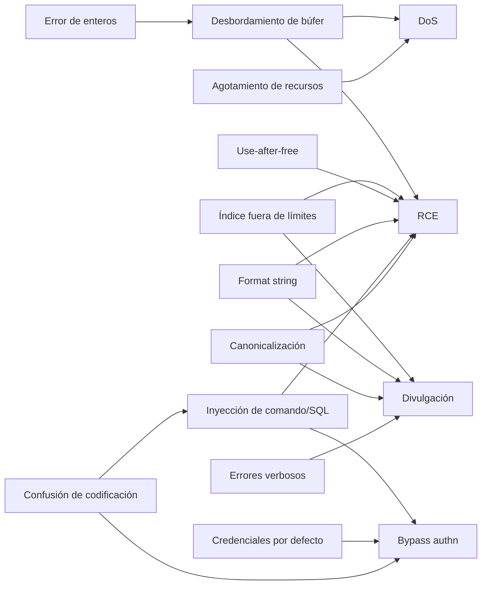

---
tags:
  - Protocolos
  - Corrupcion-Memoria
  - Pentesting/Explotacion
  - Tipo/Introduccion
Descripción: "Las cinco clases de impacto (RCE, DoS, fuga, bypass de autenticación y de autorización) y el mapa de qué causa raíz lleva a cuál"
Fecha de actualización: 2026-08-03
Nota previa: 
Nota siguiente: "[[01 - Desbordamientos de búfer - fijos y variables]]"
Area: "[[Causas raíz de vulnerabilidades.base|Causas raíz de vulnerabilidades]]"
---
---

Este bloque es el catálogo de **cómo se rompe la implementación** de un protocolo. Son fallos distintos de los de diseño —cifrado débil, ausencia de autenticación, *replay* posible— que van en [[HTTPs-TLS.base|HTTPs-TLS]] y en las notas de criptografía: aquí el protocolo puede ser correcto sobre el papel y estar mal escrito.

El vault cubre a fondo estas mismas clases **en el mundo web**. Lo que aporta este bloque es la mitad que falta: los fallos de <mark style="background: #ADCCFFA6;">servicios binarios escritos en lenguajes sin seguridad de memoria</mark>, que es lo que te vas a encontrar en infraestructura, dispositivos empotrados, OT y protocolos propietarios.

## Las cinco clases por impacto

| Clase | Qué consigue el atacante | Gravedad típica |
| - | - | - |
| **Ejecución remota de código (RCE)** | Ejecuta código en el contexto del servicio | Crítica |
| **Denegación de servicio (DoS)** | Tumba o cuelga el servicio | Media-alta |
| **Divulgación de información** | Lee memoria, rutas, credenciales | Media-crítica |
| **Bypass de autenticación** | Se autentica como alguien sin credenciales | Crítica |
| **Bypass de autorización** | Accede a recursos fuera de sus permisos | Alta |

Dos distinciones que se confunden constantemente y que importan al redactar el informe:

> [!important]+ Autenticación ≠ autorización
> El **bypass de autenticación** te convierte en un usuario concreto a ojos del sistema: pasas a ser `admin`. El **bypass de autorización** te da acceso a un recurso desde un estado de autenticación incorrecto — puedes seguir siendo anónimo y aun así leer el fichero de otro. Confundirlos en un informe cambia la remediación que se recomienda.

Y en DoS, **persistente frente a no persistente**: si el ataque corrompe estado en disco y el servicio vuelve a caer al reiniciar, es persistente y su severidad sube mucho — puede requerir intervención manual para recuperar el servicio.

## El mapa de causa raíz a impacto

Lo que ese grafo dice, y que conviene tener presente: **los errores de enteros casi nunca son el fallo final**, son el paso intermedio que convierte una reserva de memoria correcta en una insuficiente. Y **la corrupción de memoria es un multiplicador**: casi cualquier corrupción controlada acaba siendo RCE si el atacante tiene paciencia.

## Memoria segura frente a memoria insegura

La variable que más determina qué vas a encontrar:

| | C / C++ / ASM | Rust / Go / Java / C# / Python |
| - | - | - |
| Comprobación de límites | Ninguna | Automática |
| Gestión de memoria | Manual | GC u ownership |
| Corrupción de memoria | **Frecuente** | Rara (bugs del runtime, o bloques `unsafe`) |
| Errores de enteros | Silenciosos | Excepción, saturación o *panic* |
| Fallos que sí aparecen | Todos | Lógica, inyección, agotamiento, deserialización |

Determinar el lenguaje antes de nada ahorra tiempo: **fuzzear un servicio Java buscando desbordamientos de pila es tirar CPU**. Ahí hay que buscar deserialización insegura, agotamiento de recursos y fallos de lógica.

> [!important]+ La contramedida real de la industria es cambiar de lenguaje
> No es una opinión de nadie: **CISA y la NSA recomiendan explícitamente migrar a lenguajes con seguridad de memoria**, y la Casa Blanca (ONCD) publicó en 2024 un informe pidiendo lo mismo. Microsoft y Google han cifrado repetidamente en **~70 %** la proporción de sus CVEs graves atribuibles a seguridad de memoria. Android bajó las vulnerabilidades de memoria del 76 % al 24 % de su total entre 2019 y 2024 escribiendo el código nuevo en Rust.
>
> Para el pentester eso significa dos cosas: (1) el código nuevo es cada vez menos vulnerable a esta familia, y (2) **el código viejo en C sigue ahí y ahora tiene menos ojos encima**. Los dispositivos empotrados, OT y los *appliances* son donde vive.

## Cómo se buscan

| Vía | Encuentra bien | Encuentra mal |
| - | - | - |
| **Fuzzing** | Corrupción de memoria, caídas, agotamiento | Lógica, autorización |
| **Revisión de código** | Todo, si tienes fuente | Nada, si no la tienes |
| **Reversing** | Lógica y parseo, con esfuerzo | Escala mal |
| **Pruebas manuales** | Autenticación, autorización, lógica | Corrupción sutil |

Lo eficaz es combinarlas: *fuzzing* para la corrupción de memoria (barato y automatizable, ver [[00 - Fuzzing de protocolos de red]]) y pruebas manuales dirigidas para la lógica, usando lo que sabes de la estructura ([[07 - Modificar el protocolo en vuelo]]).

## Correspondencia con CWE

Para el informe, cada causa raíz tiene su identificador y conviene usarlo — es lo que espera un cliente y lo que alimenta las métricas:

| Causa raíz | CWE |
| - | - |
| Desbordamiento de búfer | [CWE-787](https://cwe.mitre.org/data/definitions/787.html) (escritura fuera de límites), [CWE-121](https://cwe.mitre.org/data/definitions/121.html) (pila), [CWE-122](https://cwe.mitre.org/data/definitions/122.html) (heap) |
| Lectura fuera de límites | [CWE-125](https://cwe.mitre.org/data/definitions/125.html) |
| Error de enteros | [CWE-190](https://cwe.mitre.org/data/definitions/190.html) (overflow), [CWE-191](https://cwe.mitre.org/data/definitions/191.html) (underflow) |
| Use-after-free | [CWE-416](https://cwe.mitre.org/data/definitions/416.html) |
| Consumo incontrolado de recursos | [CWE-400](https://cwe.mitre.org/data/definitions/400.html) |
| Format string | [CWE-134](https://cwe.mitre.org/data/definitions/134.html) |
| Inyección de comando | [CWE-78](https://cwe.mitre.org/data/definitions/78.html) |
| Path traversal | [CWE-22](https://cwe.mitre.org/data/definitions/22.html) |
| Credenciales embebidas | [CWE-798](https://cwe.mitre.org/data/definitions/798.html) |

> [!info]+ Fuentes
> - [CWE Top 25 (2024)](https://cwe.mitre.org/top25/) — CWE-787 sigue en el primer puesto.
> - [CISA/NSA — *The Case for Memory Safe Roadmaps*](https://www.cisa.gov/resources-tools/resources/case-memory-safe-roadmaps) y el informe del ONCD de febrero de 2024.
> - [Google Security Blog — *Eliminating Memory Safety Vulnerabilities at the Source*](https://security.googleblog.com/2024/09/eliminating-memory-safety-vulnerabilities-Android.html) para las cifras de Android.
> - Forshaw, *Attacking Network Protocols*, cap. 9.
