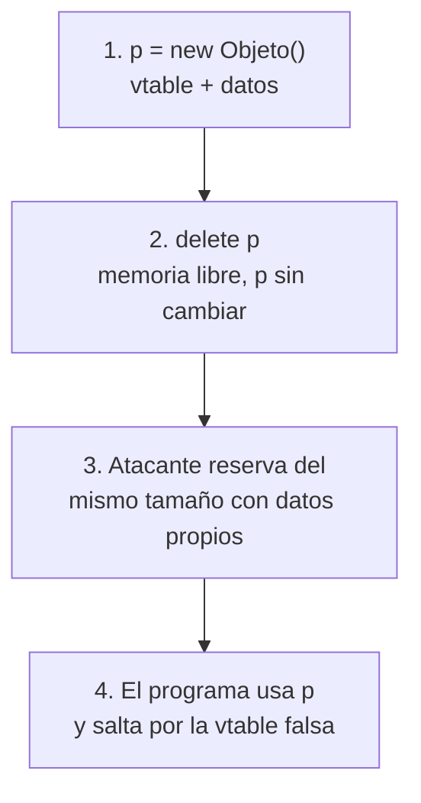

---
tags:
  - Corrupcion-Memoria
  - Protocolos
  - Pentesting/Explotacion
Descripción: "Fallos de ciclo de vida en vez de límites: usar memoria ya liberada, liberarla dos veces o interpretarla con el tipo equivocado"
Fecha de actualización: 2026-08-03
Nota previa: "[[03 - Indexación fuera de límites y expansión de datos]]"
Nota siguiente: "[[05 - Vulnerabilidades de agotamiento de recursos]]"
Area: "[[Causas raíz de vulnerabilidades.base|Causas raíz de vulnerabilidades]]"
---
---

Los desbordamientos corrompen memoria escribiendo donde no toca. Esta familia corrompe **el estado del programa**: la memoria está intacta, lo que está mal es *cuándo* y *cómo* se usa. Es más difícil de encontrar, más difícil de diagnosticar y hoy **más frecuente que el desbordamiento clásico** — los desbordamientos llevan décadas de mitigaciones encima, y el ciclo de vida de los objetos no se puede mitigar tan fácilmente.

El libro apenas roza el tema (lo menciona de pasada en el capítulo 10); merece nota propia por su peso real.

## Use-after-free (CWE-416)

```c
struct sesion *s = crear_sesion();
// ...
liberar_sesion(s);            // ① free(s)
// ...
s->manejador(s, datos);       // ② s sigue apuntando ahí: USO DESPUÉS DE LIBERAR
```

El error es que **no se puso el puntero a `NULL`** al liberar. La memoria vuelve al *allocator* y puede reutilizarse para otra reserva; si el atacante consigue que el hueco se rellene con datos que él controla, controla el contenido del objeto «muerto».



<mark style="background: #FF5582A6;">El paso 3 es todo el trabajo</mark>: hay que conseguir una reserva del **mismo tamaño** en el momento adecuado. En un servicio de red eso se logra normalmente con el propio protocolo — abrir y cerrar conexiones (si cada una reserva una estructura), enviar mensajes de longitud elegida, o cualquier comando que reserve memoria bajo control del atacante. El detalle está en [[05 - Explotación de heap y VTables]].

**Dónde aparece en un servidor de protocolo**, por frecuencia:

- **Manejo de errores.** El camino de fallo libera la sesión y el flujo continúa usándola. Los caminos de error son los menos probados de todo el programa.
- **Desconexión.** El cliente cierra mientras hay una operación en vuelo; se libera el contexto y la operación pendiente lo toca al terminar.
- **Concurrencia.** Un hilo libera lo que otro está usando. Es un UAF **y** una condición de carrera ([[00 - Fundamentos de Race Conditions (TOCTOU)|race conditions]]), y por eso es tan difícil de reproducir.
- **Callbacks y temporizadores** registrados que sobreviven al objeto que los registró.

## Double-free (CWE-415)

Liberar dos veces el mismo bloque. Como el *allocator* mantiene sus listas de libres dentro de la propia memoria liberada, la segunda liberación corrompe esas estructuras — históricamente, la vía directa a una **escritura arbitraria** cuando el *allocator* desenlazaba el bloque (*unlink attack*).

Los *allocators* modernos (glibc ≥ 2.26 con *tcache*, Windows Segment Heap, jemalloc, mimalloc) llevan comprobaciones que abortan ante un doble free evidente. No lo eliminan —hay técnicas de *tcache poisoning* que lo esquivan— pero sí lo han degradado de «RCE fiable» a «explotación compleja».

## Confusión de tipos (CWE-843)

La memoria se interpreta con un tipo distinto del que tiene:

```c
struct base    { uint32_t tipo; };
struct mensaje { uint32_t tipo; char texto[64]; };
struct fichero { uint32_t tipo; void (*escribir)(void*); size_t tam; };

void procesar(struct base *b) {
    if (b->tipo == TIPO_FICHERO) {
        struct fichero *f = (struct fichero *)b;
        f->escribir(f);            // ← si b era en realidad un 'mensaje',
    }                              //   'escribir' son bytes controlados por el atacante
}
```

Si el campo `tipo` se puede falsificar desde el protocolo, o si el objeto se creó como una cosa y se procesa como otra, el programa **salta a un puntero que son datos del atacante**. Sin corromper un solo byte.

Es la clase dominante en navegadores y motores de scripting, y aparece en protocolos con **uniones etiquetadas** — que es exactamente lo que es un TLV donde el tag decide cómo interpretar el valor ([[02 - El patrón TLV, multiplexación y fragmentación]]). Prueba obligatoria: **enviar un tag que no corresponda con el contenido**.

## Por qué son tan difíciles de diagnosticar

> [!warning]+ El crash ocurre lejos del bug
> Tras un `free`, el contenido de la memoria **no se borra**. El programa puede seguir funcionando perfectamente durante minutos usando un puntero muerto, porque los datos siguen ahí. La caída llega cuando alguien reutiliza ese bloque — en otra parte del código, en otro hilo, mucho después.
>
> Consecuencia práctica: **la pila de llamadas del crash no señala al fallo**. Sin herramientas específicas, el triaje es un infierno. Y a veces no hay crash en absoluto: solo comportamiento incorrecto.

Lo que sí los caza:

- **AddressSanitizer** con *quarantine*: retiene los bloques liberados sin reutilizarlos y aborta en el instante del uso, con **dos pilas de llamadas** — la de la liberación y la del uso. Es la diferencia entre horas y minutos ([[03 - Sanitizers y heap de depuración]]).
- **Valgrind / Memcheck**: más lento, no necesita recompilar.
- **Page Heap** en Windows (`gflags -i app.exe +hpa`): desmapea la página al liberar, así que el uso posterior es un fallo de acceso inmediato.
- **`MALLOC_PERTURB_`** en glibc: rellena la memoria liberada con un patrón, lo que convierte muchos UAF silenciosos en caídas ruidosas.

## La solución de verdad

Estos fallos **no existen** en lenguajes con seguridad de memoria. El *ownership* de Rust los detecta en compilación; los recolectores de basura de Java, Go y C# los hacen imposibles por construcción. En C++ moderno, `std::unique_ptr` y `std::shared_ptr` los reducen mucho, pero no cuando hay punteros crudos de por medio, que es lo habitual en código con años.

Es la razón concreta detrás de la recomendación de CISA/NSA de migrar a lenguajes seguros ([[00 - Clases de vulnerabilidad en un servicio de red]]): esta familia es la que peor responde a las mitigaciones.

En hardware, **ARM MTE** (*Memory Tagging Extension*) etiqueta punteros y bloques de memoria y comprueba la correspondencia en cada acceso: detecta UAF y desbordamientos **en producción**, no solo en pruebas. Android ya lo despliega en componentes seleccionados ([[08 - Mitigaciones modernas y cómo se saltan]]).

> [!info]+ Fuentes
> - [CWE-416](https://cwe.mitre.org/data/definitions/416.html), [CWE-415](https://cwe.mitre.org/data/definitions/415.html), [CWE-843](https://cwe.mitre.org/data/definitions/843.html).
> - [AddressSanitizer — algoritmo y quarantine](https://github.com/google/sanitizers/wiki/AddressSanitizer).
> - [Arm MTE en Android](https://source.android.com/docs/security/test/memory-safety/arm-mte).
