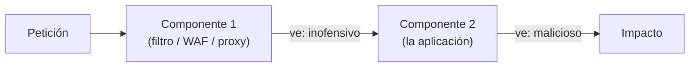

---
tags:
  - Protocolos
  - Pentesting/Explotacion
Descripción: "Validar en una representación y actuar en otra: best-fit mapping, Unicode y las discrepancias entre parsers que atraviesan filtros intactas"
Fecha de actualización: 2026-08-03
Nota previa: "[[08 - Fallos de autenticación y autorización en protocolos]]"
Nota siguiente: 
Area: "[[Causas raíz de vulnerabilidades.base|Causas raíz de vulnerabilidades]]"
---
---

El patrón que unifica toda esta nota: <mark style="background: #8000E1A6;">la validación se hace sobre una representación del dato y la acción sobre otra</mark>. Entre ambas hay una transformación —conversión de codificación, normalización, un segundo parser— y en esa transformación el dato cambia lo justo para volverse peligroso después de haber pasado el filtro.

## Conversión de codificaciones

No todas las conversiones son reversibles. Pasar de Unicode a un juego estrecho pierde información, y hay dos formas de perderla:

1. **Sustituir por un marcador** — típicamente `?`. Ya es un problema si `?` significa algo aguas abajo (inicio de *query string* en una URL, comodín en un glob).
2. **Best-fit mapping** — sustituir por el carácter «más parecido». Y aquí está el fallo.

```c
void anadir_usuario(int sock) {
    wchar_t *usuario = leer_cadena_unicode(sock);
    if (wcschr(usuario, L'\'') != NULL) return;          // ① sin comillas simples
    char cmd[512];
    snprintf(cmd, sizeof(cmd), "/sbin/add_user '%s'", a_ascii(usuario));  // ② convierte
    system(cmd);                                          // ③ ejecuta
}
```

El filtro busca `U+0027` (`'`). El atacante envía `U+2019` (`’`, comilla tipográfica derecha), que **no es** `U+0027` y pasa el filtro. Al convertir a ASCII, el *best-fit* de Windows la mapea a `'`. La cadena que llega a `system()` **sí lleva la comilla**, y hay inyección de comandos ([[06 - Format strings e inyección en servicios de red]]).

Los mapeos más rentables en las tablas de código de Windows:

| Unicode | Carácter | Best-fit a ASCII |
| - | - | - |
| `U+2018` / `U+2019` | `'` `'` | `'` |
| `U+201C` / `U+201D` | `"` `"` | `"` |
| `U+FF0F` | `／` (fullwidth) | `/` |
| `U+FF3C` | `＼` (fullwidth) | `\` |
| `U+FF1C` / `U+FF1E` | `＜` `＞` | `<` `>` |
| `U+02BA` | `ʺ` | `"` |
| `U+00A0` | espacio duro | espacio |

> [!warning]+ Esto no es historia: **WorstFit** (2024-2025)
> Orange Tsai y splitline (DEVCORE) presentaron en **Black Hat Europe 2024** la investigación ***WorstFit: Unveiling Hidden Transformers in Windows ANSI***, que convierte el *best-fit mapping* en una clase de ataque completa: *path traversal*, **inyección de argumentos** y **RCE**. Afecta a todo lo que llama a las APIs `...A` de Windows (`CreateProcessA`, `CommandLineToArgvW`) — PHP, cURL, Office, y herramientas de línea de comandos como `git`, `pip` y `composer`.
>
> Su CVE bandera es **[CVE-2024-4577](https://nvd.nist.gov/vuln/detail/CVE-2024-4577)**: RCE **no autenticada** en cualquier servidor PHP-CGI en Windows configurado con página de códigos china o japonesa, con una sola petición. Fue explotada masivamente en 2024-2025.
>
> El mecanismo es exactamente el de esta sección: la conversión Unicode→ANSI reintroduce metacaracteres (`ｰ` U+FF0D → `-`) que la validación previa había descartado por no ser el carácter ASCII. **Y es la demostración de que este fallo no es de nicho**: vive en la capa de compatibilidad de Windows y lo hereda todo lo que corre encima.

Y la variante inversa, tan clásica como vigente: **UTF-8 sobrelargo**. `U+002F` (`/`) se codifica legalmente como `2F`, pero un decodificador permisivo acepta también `C0 AF` o `E0 80 AF` — las mismas bits rellenadas con ceros a la izquierda en una secuencia más larga. Un filtro que busque el byte `0x2F` no ve nada; el decodificador de después produce `/`.

Es el mecanismo del *IIS Unicode traversal* ([CVE-2000-0884](https://nvd.nist.gov/vuln/detail/CVE-2000-0884), `%c0%af` en la URL), una de las vías que usó el gusano **Nimda** en 2001 junto con el *double decode* ([CVE-2001-0333](https://nvd.nist.gov/vuln/detail/CVE-2001-0333)) — dos fallos de codificación distintos en el mismo servidor. Sigue apareciendo en decodificadores propios. El estándar Unicode **obliga a rechazar** las formas sobrelargas (§3.9, *ill-formed byte sequences*) — pero solo si el implementador leyó el estándar en vez de escribir el decodificador «a ojo» desde la tabla de bits.

También merece atención la **normalización Unicode**: aplicar NFKC (compatibilidad) sobre una cadena convierte caracteres «raros» en sus equivalentes ASCII. Si validas antes y normalizas después, mismo fallo. Regla general: **normalizar primero, validar después, y no volver a transformar**.

## Parser differentials

La generalización del problema, y la clase de fallo más productiva en sistemas distribuidos modernos: **dos componentes leen los mismos bytes y ven cosas distintas**.



Los casos donde aparece:

| Discrepancia | Consecuencia |
| - | - |
| `CRLF` frente a `LF` como fin de línea | [[06 - Introducción a HTTP Request Smuggling\|Request smuggling]] |
| `Content-Length` frente a `Transfer-Encoding` | [[07 - CL.TE\|CL.TE]], [[09 - TE.CL\|TE.CL]] |
| Claves duplicadas en JSON (¿gana la primera o la última?) | Bypass de autorización |
| Relleno y caracteres inválidos en Base64 | [[05 - Codificación de binario en texto\|Bypass de firma]] |
| Terminación en NUL frente a longitud explícita | Bypass de validación de extensión |
| Fragmentos IP solapados | [[02 - El patrón TLV, multiplexación y fragmentación\|Evasión de IDS]] |
| Espacios y mayúsculas en cabeceras | Bypass de WAF |

En un protocolo propietario aparece siempre que hay **una capa de inspección y otra de ejecución**: un *gateway* que valida y un *backend* que actúa; un proxy de protocolo y el servidor real; un antivirus que desempaqueta y un cliente que ejecuta. Si tienes acceso a los dos parsers, comparar cómo tratan las entradas límite es de los ejercicios que más rinden.

## Cómo se prueban

Sobre cada campo de texto, en una sola pasada:

```text
adm’n                    ← U+2019 en vez de comilla simple
..／..／etc／passwd       ← U+FF0F fullwidth en vez de barra
%C0%AE%C0%AE/            ← UTF-8 sobrelargo de "."
usuario\0admin           ← NUL embebido
{"rol":"user","rol":"admin"}   ← clave duplicada en JSON
YWRt!aW4=                ← Base64 con carácter inválido inyectado
```

Y observar si el valor **llega transformado** al otro lado. La señal de que hay conversión de por medio: envías `’` y en el log o en la respuesta aparece `'`.

Cuando el sistema tiene varias capas, la prueba definitiva es **enviar algo que la primera capa acepte y la segunda interprete distinto**, y comprobar cuál de las dos manda.

> [!info]+ Fuentes
> - [CWE-176](https://cwe.mitre.org/data/definitions/176.html) (manejo incorrecto de Unicode), [CWE-172](https://cwe.mitre.org/data/definitions/172.html) (error de codificación), [CWE-838](https://cwe.mitre.org/data/definitions/838.html) (codificación inapropiada para el contexto).
> - [Unicode Standard, §3.9 — *Unicode Encoding Forms*](https://www.unicode.org/versions/latest/) — prohibición explícita de las formas sobrelargas.
> - Orange Tsai & splitline (DEVCORE), [*WorstFit: Unveiling Hidden Transformers in Windows ANSI*](https://blog.orange.tw/posts/2025-01-worstfit-unveiling-hidden-transformers-in-windows-ansi/) — Black Hat Europe 2024, con [CVE-2024-4577](https://nvd.nist.gov/vuln/detail/CVE-2024-4577) como caso insignia. Consultado 2026-08-03.
> - [CVE-2024-47611](https://tukaani.org/xz/argument-injection.html) — inyección de argumentos en `xz` para Windows por la misma vía, con el análisis del mantenedor.
> - Forshaw, *Attacking Network Protocols*, cap. 9, «Text-Encoding Character Replacement».
