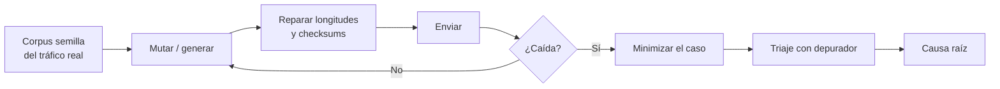

---
tags:
  - Fuzzing
  - Protocolos
  - Pentesting/Explotacion
  - Tipo/Introduccion
Descripción: "De cat /dev/urandom | nc al fuzzing guiado por cobertura: las cuatro generaciones de fuzzers y cuál aplica a un protocolo de red con estado"
Fecha de actualización: 2026-08-03
Nota previa: 
Nota siguiente: "[[01 - Construir el corpus y el harness]]"
Area: "[[Fuzzing y explotación.base|Fuzzing y explotación]]"
---
---

El *fuzzing* automatiza lo que ya sabes hacer a mano: mandar entradas malformadas y ver qué se rompe. Su valor está en que <mark style="background: #FFB86CA6;">encuentra la corrupción de memoria mejor que cualquier otra técnica y a un coste marginal</mark> — una vez montado, corre solo mientras tú haces otra cosa.

Lo que **no** encuentra: fallos de lógica, autorización o autenticación. Para eso hacen falta las pruebas dirigidas de [[08 - Fallos de autenticación y autorización en protocolos]].

## Las cuatro generaciones

### 1. Aleatorio puro

```shell-session
$ cat /dev/urandom | nc objetivo 12345
```

Ridículo, y aun así vale la pena tirarlo: cuesta cinco segundos y de vez en cuando tumba un servicio. Falla en cuanto el protocolo exige un número mágico, una longitud coherente o un checksum: los datos se descartan en la primera comprobación y el parser real nunca se ejecuta.

### 2. Mutación

Se parte de tráfico legítimo capturado y se altera un poco:

```python
def mutar(datos: bytes) -> bytes:
    b = bytearray(datos)
    pos = random.randrange(len(b))
    b[pos] ^= 1 << random.randrange(8)     # voltea UN bit
    return bytes(b)
```

Voltear **un solo bit** es deliberado: mantiene el mensaje reconocible, así que llega a las capas profundas del parser, y localiza el efecto. Cambiar un byte entero produce mensajes que se descartan antes de llegar a ningún sitio.

> [!important]+ Sin reparar el framing, el fuzzer no llega a ninguna parte
> Si el protocolo lleva longitud y checksum ([[01 - Datos de longitud variable]]), hay que **recalcularlos después de mutar**. Si no, cada caso muere en la comprobación de integridad y el fuzzer solo prueba el validador. Es el error más común y el que hace que la gente concluya que «el fuzzing no funciona aquí».
>
> Aquí es donde la capa de parseo de [[07 - Modificar el protocolo en vuelo]] se amortiza: envolver y desenvolver ya está resuelto.

### 3. Generación

Se construyen los mensajes desde una gramática del protocolo. Se controla exactamente qué campo se ataca y con qué valores, y se alcanzan estados que el cliente legítimo nunca produce — comandos no documentados, combinaciones de banderas imposibles.

Cuesta más de montar, pero es lo único que llega a la lógica profunda. La especificación de [[06 - Identificación de estructuras con Kaitai Struct]] es la base natural para generar casos.

### 4. Guiado por cobertura

El salto cualitativo, y el estado del arte. El fuzzer **instrumenta el binario** para saber qué ramas ejecuta cada entrada, y conserva las que descubren código nuevo, mutándolas después. Convierte una búsqueda ciega en una búsqueda dirigida por retroalimentación.

**AFL++** (v5.02c, junio 2026) y **libFuzzer** son los referentes. Con fuente se compila con el compilador del fuzzer; sin fuente, se instrumenta con QEMU o Frida —más lento, pero funciona con binarios cerrados.

```shell-session
# Con fuente: instrumentar al compilar
$ CC=afl-clang-fast CXX=afl-clang-fast++ ./configure && make
$ afl-fuzz -i corpus/ -o hallazgos/ -- ./parser @@

# Sin fuente: modo QEMU
$ afl-fuzz -Q -i corpus/ -o hallazgos/ -- ./servidor_cerrado @@

# Sin fuente, más rápido en algunos casos: modo Frida
$ afl-fuzz -O -i corpus/ -o hallazgos/ -- ./servidor_cerrado @@
```

## El problema propio de los protocolos: el estado

Los fuzzers guiados por cobertura están pensados para **ficheros**: una entrada, un proceso, un resultado. Un protocolo de red es distinto en tres cosas:

1. **Tiene estado.** Para llegar al comando interesante hay que autenticarse primero. Un caso de prueba no es un mensaje, es una **secuencia**.
2. **Es lento.** Levantar un proceso y hacer un *handshake* TCP por caso limita a decenas de ejecuciones por segundo, frente a decenas de miles con ficheros.
3. **Las respuestas importan.** El siguiente mensaje depende de lo que contestó el servidor.

Las respuestas del ecosistema:

| Herramienta | Enfoque |
| - | - |
| **AFLNet** | AFL++ con conciencia de estado: modela la máquina de estados a partir de los códigos de respuesta |
| **StateAFL** | Infiere el estado de la memoria del proceso, sin necesitar códigos de respuesta |
| **boofuzz** | Sucesor de Sulley. Defines la gramática y la secuencia en Python; **no guiado por cobertura**, pero muy práctico |
| **preeny / desock** | `LD_PRELOAD` que convierte los sockets en `stdin`/`stdout` → el servidor se fuzzea **como si fuera un fichero**, con AFL++ a toda velocidad |
| **Fuzzer propio** | Con la capa de parseo ya escrita, un mutador en Python de 100 líneas |

> [!important]+ `desock` es el truco que más rinde
> `LD_PRELOAD=libdesock.so ./servidor` intercepta `socket`/`bind`/`accept` y hace que el servidor lea de `stdin`. De golpe puedes usar **AFL++ en modo persistente** con toda su velocidad y su cobertura, sin pila de red de por medio. Pasas de decenas de ejecuciones por segundo a decenas de miles.
>
> Limitación: solo sirve para **una** conexión y sin estado entre conexiones. Para protocolos con *handshake* largo hay que prefijar la secuencia de autenticación en cada caso, o usar AFLNet.

## Qué se fuzzea de un protocolo, por rentabilidad

1. **Campos de longitud** — la fuente número uno de corrupción ([[01 - Datos de longitud variable]] para las variantes del patrón, [[01 - Desbordamientos de búfer - fijos y variables]] para lo que provocan).
2. **Campos de tag / comando** — barrido completo del rango, no aleatorio ([[03 - Indexación fuera de límites y expansión de datos]]).
3. **Cadenas** — muy largas, sin terminador, con NUL embebido, con Unicode raro.
4. **Contadores y números de elementos** — desbordamientos de enteros ([[02 - Errores de enteros - overflow, truncamiento y signo]]).
5. **Estructuras anidadas** — profundidad extrema, agotamiento de pila.
6. **Bloques comprimidos o cifrados** — bombas de expansión ([[05 - Vulnerabilidades de agotamiento de recursos]]).
7. **Orden de los mensajes** — enviar el comando 5 antes de autenticarse, dos *handshakes* seguidos, cerrar a mitad de mensaje.

Ese punto 7 es donde el *fuzzing* de protocolo se separa del de ficheros, y donde salen los fallos de máquina de estados.

> [!warning]+ El fuzzing tumba cosas
> Un fuzzer manda miles de mensajes malformados por segundo. Eso **satura el servicio, llena logs y dispara alertas** aunque no encuentre nada. Nunca contra producción sin autorización explícita, ventana pactada y contacto disponible. Lo razonable es montar una réplica del servicio en tu laboratorio y fuzzear ahí — que además te permite instrumentarlo con sanitizers ([[03 - Sanitizers y heap de depuración]]), lo que multiplica la tasa de detección.

## El bucle completo



Los dos pasos que la gente se salta y que son los que dan valor: **minimizar** (reducir el caso a lo mínimo que reproduce, con `afl-tmin`) y **triar** ([[02 - Triage de crashes con depurador]]). Un directorio con 4.000 caídas sin triar no es un hallazgo, es ruido.

> [!info]+ Fuentes
> - [AFL++](https://github.com/AFLplusplus/AFLplusplus) — versión verificada v5.02c (2026-06-29).
> - [AFLNet](https://github.com/aflnet/aflnet) y [StateAFL](https://github.com/stateafl/stateafl) para protocolos con estado.
> - [libdesock](https://github.com/fkie-cad/libdesock) — desocketización para fuzzing.
> - [boofuzz](https://github.com/jtpereyda/boofuzz) — último *release* v0.4.2 (2023), pero `master` con actividad reciente (junio 2026).
> - Trail of Bits, *Testing Handbook* — metodología de fuzzing, disponible como skill del proyecto.
