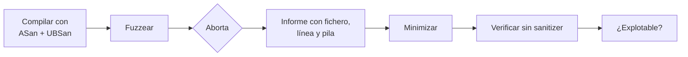

---
tags:
  - Fuzzing
  - Corrupcion-Memoria
  - Pentesting/Explotacion
Descripción: "ASan, UBSan, MSan y el Page Heap de Windows: parar el programa en el instante del fallo en vez de en el crash posterior"
Fecha de actualización: 2026-08-03
Nota previa: "[[02 - Triage de crashes con depurador]]"
Nota siguiente: "[[04 - Explotación de desbordamiento de pila]]"
Area: "[[Fuzzing y explotación.base|Fuzzing y explotación]]"
---
---

El problema del triaje es que **el crash ocurre lejos del bug**. Los sanitizers lo resuelven de raíz: instrumentan cada acceso a memoria y abortan <mark style="background: #8000E1A6;">en el instante exacto en que se produce el error</mark>, con fichero, línea y pila de llamadas. Es la diferencia entre horas de depuración y treinta segundos.

Y hay un efecto secundario más importante todavía: **detectan errores que no producen ningún crash**. Un desbordamiento de 4 bytes sobre un búfer de heap normalmente no rompe nada visible — el fuzzer no lo cuenta como hallazgo y el bug se queda ahí. Con ASan, se reporta.

## AddressSanitizer

```shell-session
$ clang -g -O1 -fsanitize=address -fno-omit-frame-pointer parser.c -o parser
$ ./parser caso_de_prueba.bin
```

Qué detecta: desbordamientos de heap, de pila y de globales (lectura y escritura), **use-after-free**, **use-after-return**, **use-after-scope**, doble liberación y fugas de memoria.

```text
==3998==ERROR: AddressSanitizer: heap-buffer-overflow on address 0x602000000118
WRITE of size 4 at 0x602000000118 thread T0                     ← ①
    #0 0x4f8a1d in parsear_array parser.c:42:9                  ← ②
    #1 0x4f7c2a in manejar_mensaje parser.c:88:5
0x602000000118 is located 0 bytes to the right of 8-byte region ← ③
    [0x602000000110,0x602000000118) allocated by thread T0 here:
    #0 0x4a1b2c in malloc
    #1 0x4f8a05 in parsear_array parser.c:39:18                 ← ④
```

**①** Tipo de error, tamaño y operación. **②** Fichero y **línea exacta** del acceso indebido. **③** Dónde está respecto a la reserva: «0 bytes a la derecha de una región de 8» es un desbordamiento por el final. **④** **Dónde se reservó** el bloque. Con ② y ④ tienes el bug: se reservaron 8 bytes en la línea 39 y se escriben más en la 42.

Para *use-after-free*, ASan da además la pila del `free`, que es justo la información que falta en un triaje normal.

> [!important]+ Coste y consecuencias
> ASan multiplica el tiempo por ~2× y la memoria por ~3×. Para *fuzzing* compensa con creces: se encuentran más bugs por hora aunque se ejecuten menos casos por segundo, porque detecta los silenciosos.
>
> Ajustes que conviene conocer:
> ```shell-session
> $ export ASAN_OPTIONS=abort_on_error=1:detect_leaks=0:symbolize=1
> $ export ASAN_SYMBOLIZER_PATH=$(which llvm-symbolizer)
> ```
> `abort_on_error=1` genera `SIGABRT`, que es lo que AFL++ cuenta como caída; sin él, ASan sale con código 1 y **el fuzzer no registra el hallazgo**. `detect_leaks=0` evita que las fugas del propio arnés inunden la salida. Y sin `symbolize=1` + `llvm-symbolizer` verás direcciones en vez de líneas de código.

## Los otros sanitizers

| Sanitizer | Flag | Detecta | Coste |
| - | - | - | - |
| **ASan** | `-fsanitize=address` | Límites, UAF, doble free, fugas | 2× |
| **UBSan** | `-fsanitize=undefined` | Desbordamiento con signo, desplazamientos inválidos, punteros desalineados, conversiones fuera de rango | ~1,2× |
| **MSan** | `-fsanitize=memory` | Lectura de memoria **sin inicializar** | 3× |
| **TSan** | `-fsanitize=thread` | Condiciones de carrera entre hilos | 5-15× |

**UBSan es el más barato y de los más útiles** para protocolos, porque caza los errores de enteros de [[02 - Errores de enteros - overflow, truncamiento y signo]] antes de que se conviertan en corrupción:

```shell-session
$ clang -g -fsanitize=undefined,integer -fno-sanitize-recover=all parser.c
```

`-fno-sanitize-recover=all` es importante: por defecto UBSan **avisa y continúa**, con lo que el fuzzer no ve nada.

**MSan** merece mención aparte para este dominio: detecta que el programa **usa memoria que nunca escribió**, que es exactamente el patrón de fuga por relleno no inicializado ([[01 - Datos de longitud variable]] — el problema del *padding* sin limpiar, tipo Etherleak). Exige recompilar **todas** las dependencias con MSan, lo que lo hace bastante engorroso.

ASan y UBSan se combinan; **ASan y MSan no** (usan el mismo mecanismo de sombra). TSan tampoco combina con ASan.

## Sin código fuente

### Windows: Page Heap

```shell-session
C:\> gflags.exe -i servicio.exe +hpa            # activar
C:\> gflags.exe -i servicio.exe -hpa            # desactivar al terminar
```

Coloca una **página de guarda** no mapeada justo después de cada reserva. Cualquier escritura un byte más allá provoca una excepción **inmediata**, en la instrucción exacta, sin recompilar nada.

Con `+ust` (*user-mode stack traces*) guarda además la pila de cada reserva. Y **Application Verifier** añade comprobaciones de handles, secciones críticas y APIs mal usadas.

Coste: cada reserva consume al menos una página (4 KB) más la de guarda. Un servicio que reserve mucho puede quedarse sin memoria. Es solo para depuración.

### Linux: Valgrind y opciones de glibc

```shell-session
$ valgrind --leak-check=full --track-origins=yes ./servidor
```

No hace falta recompilar, pero es **10-50× más lento** que el original (frente al 2× de ASan) y detecta menos. Es la opción cuando solo tienes el binario.

Y los ajustes sin coste, ya vistos en el triaje:

```shell-session
$ MALLOC_PERTURB_=42 MALLOC_CHECK_=3 ./servidor
```

Rellenan la memoria liberada con un patrón y añaden comprobaciones de consistencia del heap. No es un sanitizer, pero convierte bugs silenciosos en caídas ruidosas y cuesta cero.

### Hardware: MTE

En ARM64 con **MTE** (*Memory Tagging Extension*), la comprobación la hace la CPU: cada bloque y cada puntero llevan una etiqueta de 4 bits y el acceso falla si no coinciden. Coste bajísimo, lo que permite <mark style="background: #FFB86CA6;">detección de UAF y desbordamientos **en producción**</mark>, no solo en pruebas. Android ya lo despliega en componentes seleccionados y planea ampliarlo. Es lo más parecido a «ASan siempre encendido» que existe.

## Cómo encaja en el flujo



Ese paso de **verificar sin sanitizer** importa: ASan aborta ante cosas que en el binario de producción no causarían caída ni serían explotables. Antes de reportar, comprueba qué pasa con el binario real — y ahí vuelve el depurador ([[02 - Triage de crashes con depurador]]).

> [!info]+ Fuentes
> - [AddressSanitizer](https://clang.llvm.org/docs/AddressSanitizer.html), [UndefinedBehaviorSanitizer](https://clang.llvm.org/docs/UndefinedBehaviorSanitizer.html), [MemorySanitizer](https://clang.llvm.org/docs/MemorySanitizer.html) — documentación de LLVM.
> - [Sanitizer flags de AFL++](https://aflplus.plus/docs/env_variables/) — `AFL_USE_ASAN`, `AFL_USE_UBSAN`.
> - [gflags y Page Heap](https://learn.microsoft.com/en-us/windows-hardware/drivers/debugger/gflags) — Microsoft.
> - [Arm MTE en Android](https://source.android.com/docs/security/test/memory-safety/arm-mte).
> - Trail of Bits *Testing Handbook* — capítulo de sanitizers, disponible como skill del proyecto.
