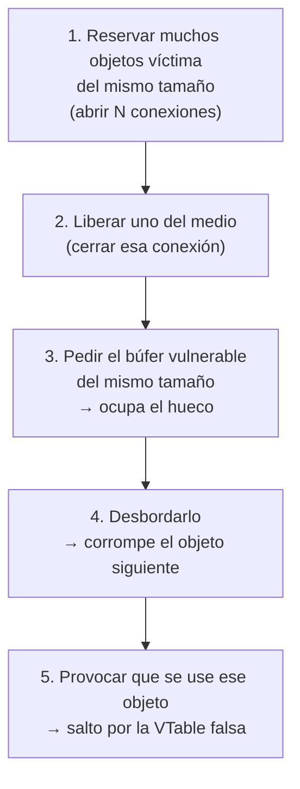

---
tags:
  - Corrupcion-Memoria
  - Fuzzing
  - Pentesting/Explotacion
Descripción: "Peinar el heap desde un protocolo de red: cómo funciona el allocator, cómo colocar el objeto víctima y por qué la VTable es el objetivo natural"
Fecha de actualización: 2026-08-03
Nota previa: "[[04 - Explotación de desbordamiento de pila]]"
Nota siguiente: "[[06 - Escritura arbitraria y subversión de lógica]]"
Area: "[[Fuzzing y explotación.base|Fuzzing y explotación]]"
---
---

En la pila hay un objetivo evidente y siempre en el mismo sitio: la dirección de retorno. En el heap **no hay nada garantizado al lado de tu búfer**. Explotar una corrupción de heap consiste en **colocar tú mismo algo aprovechable justo detrás**, y eso se consigue manipulando el *allocator* a través del propio protocolo.

## Cómo reparte memoria un allocator

Pedir memoria al sistema operativo (`mmap`, `VirtualAlloc`) es caro —cambio a modo kernel— y desperdicia espacio, porque la unidad mínima es una página de 4 KB. Así que los *allocators* piden bloques grandes y los reparten ellos.

La estructura clásica es la **lista de libres**: se lleva una lista de los huecos disponibles dentro de la región grande. Al pedir memoria se busca uno que quepa; al liberar, el bloque vuelve a la lista y, si sus vecinos también están libres, se fusionan para combatir la fragmentación.

De ahí sale la propiedad que hace posible todo lo demás:

> [!important]+ La regla que se explota
> **Si liberas un bloque y pides inmediatamente otro del mismo tamaño, es muy probable que te den el mismo.** Es lo que quieren los *allocators* — reutilizar caliente es bueno para la caché.
>
> Toda la explotación de heap se apoya en esto: si consigues que el objeto que te interesa ocupe el hueco que tú acabas de dejar, controlas su contenido.

Los *allocators* modernos añaden **pools por tamaño** (bloques de 16, 32, 64, 128… bytes) para reducir la fragmentación. Consecuencia práctica: **objetos del mismo tamaño acaban juntos**. Si el búfer que desbordas mide 128 bytes, busca un objeto interesante de esa misma clase de tamaño.

Y una distinción que importa:

- **Metadatos *in-band***: el tamaño y el estado del bloque van pegados a la memoria del usuario. Es lo de glibc. Al desbordar, corrompes también los metadatos, y hay que **reconstruirlos con valores válidos** o el `free` siguiente aborta.
- **Metadatos *out-of-band***: en estructuras aparte. Es lo de jemalloc, mimalloc y el Segment Heap de Windows. Más fácil de explotar en un sentido —no hay que reparar nada— pero sin la vía clásica de corromper la lista de libres.

## El objetivo: la VTable

En C++, todo objeto con funciones virtuales lleva como **primer campo** un puntero a su tabla de funciones virtuales.

```text
Objeto en el heap:
┌──────────────────┐
│ puntero a VTable │ ──→  [ fn1 ][ fn2 ][ fn3 ]  ← tabla en memoria de SOLO LECTURA
├──────────────────┤
│ datos del objeto │
└──────────────────┘
```

Llamar a un método virtual compila a:

```asm
mov rax, [rcx]          ; leer el puntero a la VTable del objeto
mov rax, [rax + 0x10]   ; leer la entrada de la tabla
call rax                ; llamar
```

La tabla en sí está en memoria de solo lectura, así que no se puede tocar. **Pero el puntero a la tabla está dentro del objeto, en el heap.** Si lo sustituyes por una dirección que tú controlas, la doble indirección salta a donde tú quieras.

Por eso, en el triaje, un `mov rax, [rax]` seguido de `call rax` con `RAX` lleno de tu patrón es la firma inconfundible de una corrupción de heap sobre un objeto C++ ([[02 - Triage de crashes con depurador]]).

## Peinar el heap desde un protocolo

El navegador tiene JavaScript para colocar la memoria a voluntad. Un servicio de red no: <mark style="background: #FFB86CA6;">las únicas primitivas de reserva son las que el protocolo te ofrece</mark>. Hay que buscarlas:

| Primitiva | De dónde sale |
| - | - |
| **Reservar tamaño elegido** | Un campo de longitud → el servidor reserva ese búfer |
| **Reservar tamaño fijo** | Abrir una conexión → estructura de sesión |
| **Liberar** | Cerrar la conexión, cancelar una operación, borrar un objeto |
| **Reservar objeto con VTable** | Cualquier comando que cree un objeto del lado servidor |

El patrón general de colocación (*heap grooming*):



Los pasos 1 y 2 son lo que se llama *feng shui* del heap: se reserva en masa para dejar la región ordenada y predecible, se abre un hueco del tamaño justo, y se fuerza a que el búfer vulnerable caiga ahí.

**Reconocer las primitivas en el protocolo** es el trabajo de verdad, y ahí es donde se rentabiliza haberlo analizado bien ([[05 - Del hex dump a la estructura del protocolo]]). Un comando que crea una sesión, un mensaje que reserva un búfer del tamaño que digas, un comando de borrado: con esos tres tienes todo lo necesario.

## Use-after-free: la variante limpia

Con un UAF ([[04 - Use-after-free, double-free y confusión de tipos]]) no hace falta desbordar nada:

1. El programa reserva un objeto y guarda un puntero.
2. Lo libera **sin poner el puntero a `NULL`**.
3. Tú pides una reserva del **mismo tamaño** con contenido que controlas → el *allocator* te da ese mismo bloque.
4. El programa usa el puntero viejo → llama por una VTable que has escrito tú.

El paso 3 es donde se gana o se pierde. En un servidor de red, lo que suele funcionar es un mensaje cuyo cuerpo se copia a un búfer del tamaño exacto del objeto liberado.

## Qué ha cambiado en los allocators

Las técnicas clásicas de corrupción de metadatos han ido cayendo:

| Mitigación | Dónde | Qué rompe |
| - | - | - |
| Comprobación de `unlink` | glibc desde 2004 | El *unlink attack* clásico |
| *Safe-linking* (punteros ofuscados con la dirección) | glibc ≥ 2.32 | Envenenamiento de *tcache* y *fastbins* |
| Segment Heap con metadatos fuera de banda | Windows 10+ | Corrupción de metadatos por desbordamiento contiguo |
| LFH con aleatorización | Windows | Predecir qué bloque te van a dar |
| Aleatorización de *chunks* | jemalloc, mimalloc | Colocación determinista |
| Guard pages en reservas grandes | Todos | Desbordamiento de bloques grandes |

Resultado: **corromper los metadatos del allocator es hoy poco práctico**, y la vía viva es corromper **datos de la aplicación** — punteros a VTable, punteros a función, longitudes, banderas de privilegio ([[06 - Escritura arbitraria y subversión de lógica]]).

## Y una nota de realismo

Un exploit de heap fiable contra un objetivo moderno con ASLR es trabajo de **días o semanas**, y depende de la versión exacta del binario, del *allocator* y del estado del proceso. En un pentest, lo razonable casi siempre es:

1. Demostrar la corrupción con ASan y el caso mínimo.
2. Demostrar el control (`RAX` con datos tuyos en el `call`).
3. Reportarlo como crítico, argumentando por qué es explotable.

Y dejar el desarrollo del exploit completo para cuando el alcance lo pida explícitamente.

> [!info]+ Fuentes
> - [glibc — Safe-Linking](https://sourceware.org/glibc/wiki/MallocInternals) y el anuncio de Checkpoint sobre la mitigación en 2.32.
> - [Windows 10 Segment Heap Internals](https://www.blackhat.com/docs/us-16/materials/us-16-Yason-Windows-10-Segment-Heap-Internals.pdf) — Mark Vincent Yason, Black Hat 2016.
> - [how2heap](https://github.com/shellphish/how2heap) — catálogo práctico de técnicas de heap por versión de glibc.
> - Forshaw, *Attacking Network Protocols*, cap. 10, «Heap Buffer Overflows» y «Manipulating the Heap Layout».
