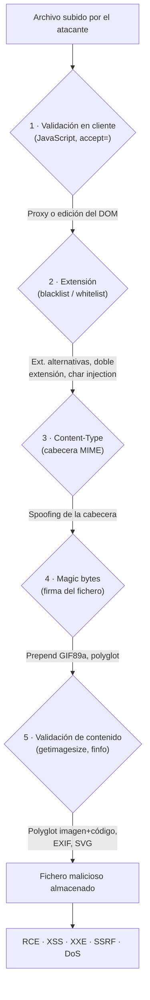

---
tags:
  - Web/Red-Team
  - Introduccion
  - File-Upload
  - Tipo/Introduccion
Descripción: "Una vulnerabilidad de subida de ficheros (file upload) existe cuando una aplicación permite al usuario almacenar un fichero en el servidor sin validar correctamente su tipo…"
Fecha de actualización: 2026-06-21
Nota previa: ""
Nota siguiente: "[[01 - Explotación básica - web shells y reverse shells]]"
Area: "[[File Upload.base|File Upload]]"
---
---

<mark style="background: #ADCCFFA6;">Una vulnerabilidad de subida de ficheros (`file upload`) existe cuando una aplicación permite al usuario almacenar un fichero en el servidor sin validar correctamente su tipo, contenido o destino.</mark> Subir archivos es una funcionalidad omnipresente —fotos de perfil, adjuntos, importación de CSV/XML, documentos corporativos—, y cada formulario de subida es una puerta por la que el atacante coloca datos arbitrarios en el back-end. Si esa puerta no filtra bien, el resultado va desde un defacement hasta el premio mayor: <mark style="background: #FFB86CA6;">ejecución remota de comandos (RCE) sobre el servidor</mark>.

# Por qué sigue siendo crítico

El file upload es la clase de bug catalogada como [`CWE-434: Unrestricted Upload of File with Dangerous Type`](https://cwe.mitre.org/data/definitions/434.html). <mark style="background: #FFB8EBA6;">Es de las vulnerabilidades más frecuentes en aplicaciones web y móviles</mark>, y la mayoría de sus CVE se puntúan como `High` o `Critical` precisamente porque la consecuencia habitual es el control total del servidor. En programas de bug bounty sigue apareciendo en 2025 con regularidad, sobre todo en su variante moderna: no el `.php` directo, sino los vectores secundarios (SVG, XXE, path traversal) que las apps con frameworks modernos siguen sin cubrir.

El peor escenario posible es el `unauthenticated arbitrary file upload`: cualquier usuario sin sesión puede subir cualquier tipo de archivo. Eso deja la aplicación a un paso de que cualquiera ejecute código en el back-end. Pero el riesgo no se limita a ese caso extremo; incluso una subida fuertemente restringida puede explotarse si falta alguna protección concreta.

# El espectro: arbitrary vs. limited

Conviene situar cada objetivo en un espectro, porque determina la estrategia:

- **Arbitrary file upload**: podemos subir cualquier extensión/contenido. El camino directo es subir un [[01 - Explotación básica - web shells y reverse shells|web shell o una reverse shell]] en el lenguaje del servidor y visitarlo para obtener RCE.
- **Limited file upload**: solo se admiten ciertos tipos (imágenes, PDFs). Aun así <mark style="background: #FF5582A6;">un tipo "inofensivo" puede ser un vector</mark>: un `SVG` lleva XSS o XXE, una imagen con metadatos maliciosos dispara `Stored XSS`, un nombre de fichero malicioso inyecta comandos. Cubrimos esto en [[06 - Uploads limitados - SVG, polyglots y metadatos|uploads limitados]].

La causa raíz casi siempre es la misma: <mark style="background: #8000E1A6;">validación débil o ausente</mark>. Y no solo por código inseguro escrito a mano —también por **librerías desactualizadas** de procesamiento (ImageMagick, ffmpeg, Ghostscript) con exploits públicos. Un upload que internamente pasa el fichero por uno de esos binarios hereda sus vulnerabilidades.

# Las capas de validación

Todo el módulo gira en torno a una idea: un upload seguro apila **varias capas** de validación, y nuestro trabajo es identificar cuáles existen y romper cada una. Este diagrama es el mapa del módulo —cada capa enlaza con la nota que la ataca:

Las cinco capas, de la más débil a la más robusta:

1. **Cliente** ([[02 - Bypass de validación en cliente|nota 02]]): JavaScript y `accept=` en el `<input>`. Trivial de saltar: todo lo que corre en el navegador está bajo nuestro control.
2. **Extensión** ([[03 - Bypass de blacklist de extensiones|03]] y [[04 - Bypass de whitelist y doble extensión|04]]): el back-end compara la extensión contra una lista negra o blanca. Débil porque la extensión es texto que controlamos.
3. **Content-Type** ([[05 - Validación de tipo - Content-Type y magic bytes|05]]): la cabecera `Content-Type` del fichero. La pone el navegador, así que la falsificamos.
4. **Magic bytes / firma** ([[05 - Validación de tipo - Content-Type y magic bytes|05]]): los primeros bytes del fichero (`GIF89a`, `\xFF\xD8` para JPEG…). Se imitan anteponiéndolos al payload.
5. **Contenido real** (`getimagesize`, `finfo`, re-procesado de imagen): la capa más dura. Se sortea con **polyglots** —ficheros que son imagen válida *y* código a la vez.

<mark style="background: #FFB8EBA6;">Las capas se combinan</mark>: un objetivo serio valida extensión *y* magic bytes *y* re-codifica la imagen. La metodología de [[08 - Detección y metodología en entornos reales|detección]] consiste justamente en averiguar qué capas hay antes de elegir el payload.

# Qué cambia en 2026

HTB escribió este módulo sobre un stack clásico (PHP + Apache, fichero servido directamente desde `/uploads/`). El principio sigue intacto, pero el contexto de producción ha cambiado y conviene tenerlo presente desde el inicio:

- **El `.php` directo es cada vez menos viable.** Muchas apps modernas sirven los uploads desde un **bucket S3 o un CDN** que no ejecuta código, o desde un dominio *sandbox* sin intérprete. <mark style="background: #FF5582A6;">Ahí el RCE clásico no aplica, pero los vectores client-side (XSS por SVG/HTML) y server-side (XXE, SSRF, path traversal) ganan protagonismo.</mark>
- **El procesamiento es el nuevo `sink`.** Si la imagen se redimensiona, se convierte o se le extraen metadatos, el objetivo real es la **librería** que lo hace, no el web server. ImageMagick (`ImageTragick`), ffmpeg y Ghostscript han sido vectores repetidos.
- **Almacenamiento y ejecución se separan.** El patrón seguro moderno (subir a almacenamiento sin ejecución, servir con `Content-Disposition: attachment` y `X-Content-Type-Options: nosniff`) es justo lo que rompe las técnicas viejas. Saber qué patrón usa el objetivo decide la viabilidad del ataque.

Con este marco —el espectro arbitrary/limited y las cinco capas de validación— el resto del sub-tema es metódico: identificar la superficie, detectar las capas, romperlas una a una y elegir el payload acorde al contexto.

> [!info]+ Fuentes
> - [CWE-434 — Unrestricted Upload of File with Dangerous Type](https://cwe.mitre.org/data/definitions/434.html) (MITRE)
> - [OWASP WSTG — Testing Upload of Unexpected File Types](https://owasp.org/www-project-web-security-testing-guide/latest/4-Web_Application_Security_Testing/10-Business_Logic_Testing/09-Test_Upload_of_Unexpected_File_Types)
> - [PortSwigger — File upload vulnerabilities](https://portswigger.net/web-security/file-upload)
> - [CVE Details — CWE-434 listing](https://www.cvedetails.com/vulnerability-list/cweid-434/vulnerabilities.html)

El primer caso, el más sencillo y el que da RCE inmediato, es la subida sin validación alguna: [[01 - Explotación básica - web shells y reverse shells]].
