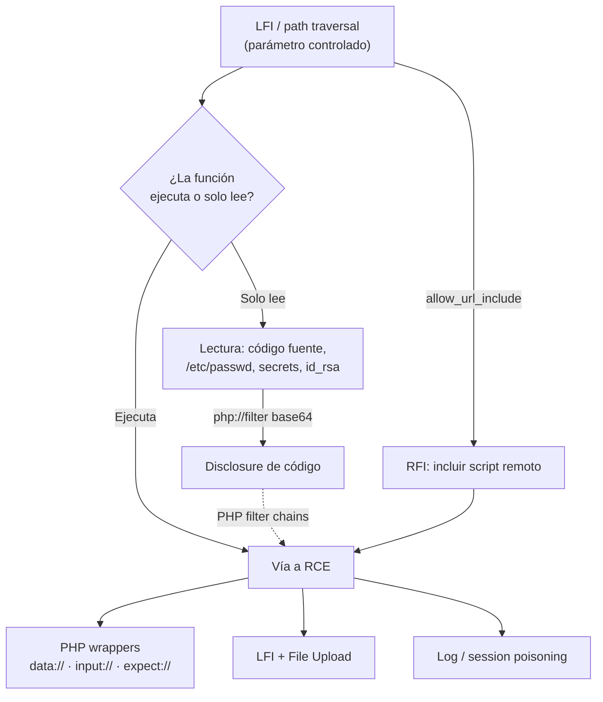

---
tags:
  - Web/Red-Team
  - Introduccion
  - File-Inclusion
  - Tipo/Introduccion
Descripción: "Los lenguajes de back-end modernos —PHP, JavaScript, Java, .NET— usan parámetros HTTP para decidir qué se muestra en la página: construyen páginas dinámicas cargando recursos…"
Fecha de actualización: 2026-06-21
Nota previa: ""
Nota siguiente: "[[01 - Local File Inclusion (LFI)]]"
Area: "[[File Inclusion.base|File Inclusion]]"
---
---

Los lenguajes de back-end modernos —`PHP`, `JavaScript`, `Java`, `.NET`— usan parámetros HTTP para decidir qué se muestra en la página: construyen páginas dinámicas cargando recursos según un parámetro. <mark style="background: #ADCCFFA6;">Una vulnerabilidad de File Inclusion existe cuando ese parámetro, controlado por el usuario, se usa para cargar un fichero sin sanear</mark>, permitiendo al atacante incluir ficheros arbitrarios del servidor (`Local File Inclusion`, LFI) o incluso remotos (`Remote File Inclusion`, RFI).

El sitio habitual donde aparece es el **motor de plantillas**. Para que todas las páginas compartan cabecera, menú y pie, la app sirve esos elementos estáticos y carga el contenido dinámico desde un fichero indicado en un parámetro: `/index.php?page=about` carga `about.php`. <mark style="background: #FFB8EBA6;">Si controlamos la parte `about`, podemos hacer que la app cargue otro fichero.</mark>

# Impacto: de leer código a RCE

El rango de impacto es amplio y depende de un único factor (que vemos abajo):

- **Disclosure de código fuente**: leer el código revela otras vulnerabilidades y, a menudo, credenciales o claves de base de datos embebidas.
- **Exposición de datos sensibles**: `/etc/passwd`, claves SSH (`id_rsa`), ficheros de configuración, secrets montados en contenedores.
- <mark style="background: #FFB86CA6;">**Ejecución remota de código (RCE)**: bajo ciertas condiciones, una LFI compromete el servidor entero</mark> —y, desde él, la red interna—.

# El factor decisivo: leer vs. ejecutar

No todas las funciones vulnerables son iguales. <mark style="background: #8000E1A6;">La clave es si la función solo **lee** el fichero o también lo **ejecuta**, y si admite **URLs remotas**.</mark> Esto determina si llegamos a RCE directo o solo a lectura. Esta tabla es el mapa mental para reconocer el potencial de cada sink (útil sobre todo en white-box):

| Función | Lee | Ejecuta | URL remota |
| - | :-: | :-: | :-: |
| **PHP** `include()` / `include_once()` | ✅ | ✅ | ✅ |
| **PHP** `require()` / `require_once()` | ✅ | ✅ | ✅ |
| **PHP** `file_get_contents()` | ✅ | ❌ | ✅ |
| **PHP** `fopen()` / `file()` | ✅ | ❌ | ✅ |
| **NodeJS** `fs.readFile()` / `sendFile()` | ✅ | ❌ | ❌ |
| **NodeJS** `res.render()` | ✅ | ✅ | ❌ |
| **Java** `include` | ✅ | ❌ | ❌ |
| **Java** `import` | ✅ | ✅ | ✅ |
| **.NET** `@Html.Partial()` / `Response.WriteFile()` | ✅ | ❌ | ❌ |
| **.NET** `include` | ✅ | ✅ | ✅ |

> [!info]+ Las filas "ejecuta + URL remota" son casos límite
> Las combinaciones de máximo riesgo (`Java import`, `.NET include` cargando una URL remota) son construcciones específicas de esos frameworks, poco habituales en apps reales — el caso dominante sigue siendo el `include()` de PHP. Los ejemplos de código de abajo ilustran los sinks realmente frecuentes (PHP, NodeJS, `<jsp:include>`, `@Html.Partial()`); trata las filas exóticas como recordatorio de que la clase existe en otros stacks, no como algo que vayas a encontrar a diario.

> [!important]+ La columna «URL remota» depende de la configuración
> En PHP el ✅ de `include`/`require` exige `allow_url_include = On` (**Off por defecto** → por eso la RFI con ejecución es rara); el de `file_get_contents`/`fopen`/`file` exige `allow_url_fopen` (**On por defecto** → el SSRF vía estas funciones es mucho más accesible). Las filas de NodeJS/Java/.NET son representativas; los *sinks* exactos por lenguaje están en [[08 - Detección y fuzzing automatizado|detección white-box]].

El código vulnerable típico en PHP es tan simple como esto —el parámetro va directo al `include()`—:

```php
if (isset($_GET['language'])) {
    include($_GET['language']);
}
```

El mismo patrón ocurre en NodeJS (`fs.readFile(path.join(__dirname, req.query.language))`, `res.render(\`/${req.params.language}/about.html\`)`), Java (`<jsp:include file="<%= request.getParameter("language") %>" />`) y .NET (`@Html.Partial(...Query["language"])`). <mark style="background: #FFB8EBA6;">Aunque los ejemplos del sub-tema sean PHP+Linux, las técnicas aplican a cualquier framework</mark>: todos comparten la misma raíz —cargar un fichero desde una ruta controlada—.

# LFI vs. path traversal vs. RFI

Tres conceptos que conviene no confundir:

- **Path traversal** (directory traversal): leer ficheros fuera del directorio previsto con `../`. Si la función solo lee, el resultado es **lectura** de ficheros, nada más.
- **LFI**: incluir un fichero **local**. Si la función ejecuta (`include`), el fichero incluido se **ejecuta** —ahí nace el camino a RCE—.
- **RFI**: incluir un fichero **remoto** (una URL que controlamos). Casi toda RFI es también LFI, pero no al revés: la función debe admitir URLs remotas y la config debe permitirlo (en PHP, `allow_url_include`, desactivado por defecto).

# Las rutas de explotación

Todo el sub-tema se organiza alrededor de cómo escalar desde "controlo un parámetro de inclusión" hasta leer o ejecutar. Este es el mapa:



<mark style="background: #FF5582A6;">Incluso una LFI de "solo lectura" puede convertirse en RCE</mark>: leyendo código se encuentran credenciales reutilizadas, y la técnica moderna de [[04 - PHP wrappers II - RCE y filter chains|PHP filter chains]] (2022) transforma una LFI de lectura pura en ejecución sin necesidad de subir nada. Por eso ninguna LFI es "menor".

> [!info]+ Fuentes
> - [OWASP WSTG — Testing for Local File Inclusion](https://owasp.org/www-project-web-security-testing-guide/v42/4-Web_Application_Security_Testing/07-Input_Validation_Testing/11.1-Testing_for_Local_File_Inclusion) · [Testing for RFI](https://owasp.org/www-project-web-security-testing-guide/v42/4-Web_Application_Security_Testing/07-Input_Validation_Testing/11.2-Testing_for_Remote_File_Inclusion)
> - [PortSwigger — File path traversal](https://portswigger.net/web-security/file-path-traversal)
> - [PHP — Supported protocols and wrappers](https://www.php.net/manual/en/wrappers.php.php)

Empezamos por la explotación más directa: leer ficheros locales con [[01 - Local File Inclusion (LFI)]].
