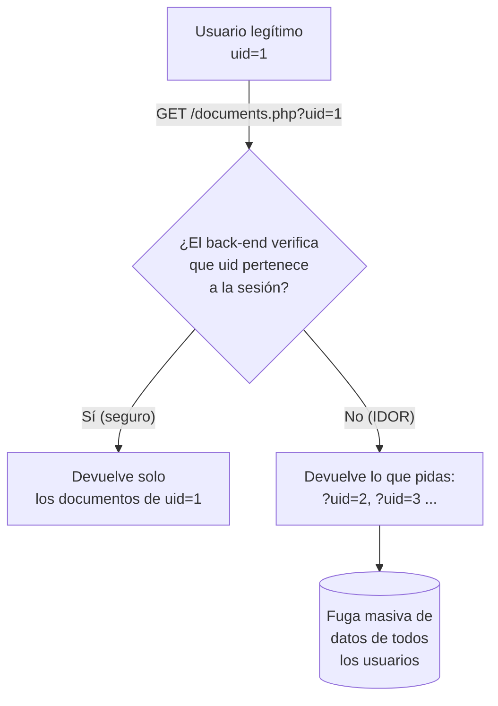

---
tags:
  - Web/Red-Team
  - Pentesting/Explotacion
  - IDOR
  - Tipo/Introduccion
Descripción: "Una vulnerabilidad IDOR (Insecure Direct Object Reference) ocurre cuando la aplicación expone una referencia directa a un objeto —un fichero, un registro de base de datos— que…"
Fecha de actualización: 2026-07-15
Nota previa: "[[05 - Herramientas para HTTP Verb Tampering]]"
Nota siguiente: "[[07 - Identificación de IDORs]]"
Area: "[[Web Attacks.base|Web Attacks]]"
---
---

<mark style="background: #ADCCFFA6;">Una vulnerabilidad `IDOR` (Insecure Direct Object Reference) ocurre cuando la aplicación expone una referencia directa a un objeto —un fichero, un registro de base de datos— que el usuario puede manipular para acceder a **otros** objetos similares</mark>. El fallo de fondo no es exponer la referencia, sino la **ausencia de control de acceso** en el back-end que verifique que ese objeto te pertenece.

Ejemplo mínimo: subes un fichero y recibes el enlace `download.php?file_id=123`. ¿Qué pasa si pides `download.php?file_id=124`? Si el back-end no comprueba la propiedad, descargas el fichero de otro. Y si el `id` es **secuencial o predecible**, puedes recorrer todos.

> [!example]+ Caso real — Twitter Mopub API Token Theft · $5.040 · [H1 #95552](https://hackerone.com/reports/95552)
> Un endpoint de Mopub filtraba el `api_key` y el `build_secret` de cualquier cuenta, protegido solo por un `organization_id` de 24 dígitos "inadivinable"… pero ese ID se filtraba en URLs públicas de crash-reports (`crashes.to/…`), que Akhil Reni enumeró con un Google dork. Días después vio que el `build_secret` filtrado servía para **loguearse en la cuenta** → account takeover. **Lección**: persigue el impacto completo antes de cerrar tu investigación — el ATO es lo que pagó el bounty (ver [[11 - Encadenamiento de IDOR|encadenamiento]]).

# Qué convierte esto en vulnerabilidad

Exponer una referencia directa **no es** un bug por sí solo. Lo es cuando habilita explotar otro fallo: un <mark style="background: #FFB86CA6;">control de acceso débil o inexistente en el servidor</mark>. Muchas apps restringen el acceso ocultando páginas, funciones y APIs en el **front-end**, pero no comparan la sesión del usuario con la lista de acceso del recurso en el **back-end**.

> [!important]+ El pecado original: confiar en el front-end
> Si lo único que impide a un usuario ver datos ajenos es que el front-end "solo muestra los suyos", entonces manipular la petición HTTP a mano revela que **todos** tienen acceso a **todo**. El front-end no es un control de seguridad. La defensa correcta es un sistema de control de acceso robusto (p. ej. `RBAC`, Role-Based Access Control) verificado **siempre** en servidor.

Construir un control de acceso completo, que cubra toda la app sin romper funcionalidad, es **difícil**. Por eso el IDOR es omnipresente y aparece incluso en aplicaciones enormes — han sufrido IDOR/broken access control Facebook, Instagram y Twitter, entre muchas otras.

# Impacto

El impacto depende de la naturaleza de la referencia expuesta:

- <mark style="background: #FFB8EBA6;">**IDOR Information Disclosure**</mark>: leer datos privados de otros (ficheros personales, datos de tarjeta, mensajes). El caso más básico.
- <mark style="background: #FFB86CA6;">**Modificación / borrado**</mark>: si la referencia controla una operación de escritura, puedes editar o borrar datos ajenos → hasta **account takeover** (p. ej. cambiar el email/password de otro).
- <mark style="background: #8000E1A6;">**Elevación de privilegios (IDOR Insecure Function Calls)**</mark>: llamar funciones admin-only expuestas en el front-end pero no protegidas en back-end (cambiar contraseñas, asignar roles) → toma de control total.

# Encaje moderno (más allá de HTB)

El módulo HTB es de 2021 y trata IDOR de forma monolítica. La taxonomía actual lo afina:

| Eje | Tipos | Dónde se ve |
| - | - | - |
| Dirección | **Horizontal** (otro usuario del mismo nivel) / **Vertical** (escalar a admin) | Web y API |
| Nivel | **Object-level** (acceder al objeto) / **Function-level** (invocar la función) | En APIs → [[01 - Broken Object Level Authorization (API1)\|BOLA]] y [[05 - Broken Function Level Authorization (API5)\|BFLA]] |

- IDOR es la cara "web" de lo que OWASP API llama **`BOLA`** (`API1:2023`) — la vulnerabilidad **nº1 en APIs**. Misma raíz, distinto nombre.
- En [[02 - IDOR en GraphQL|GraphQL]] el IDOR aparece al resolver nodos por `id`, y se agrava con el aliasing/batching.
- El [[07 - Second-Order IDOR (whitebox)|IDOR de segundo orden]] almacena la referencia y la usa después, escapando a la detección directa.
- <mark style="background: #FFB8EBA6;">Cambiar IDs secuenciales por `UUID`/`GUID` **no** arregla el IDOR</mark>: solo lo hace menos enumerable. Si el `UUID` se filtra (en respuestas, logs, referrers) o el objeto es adivinable, sigue siendo explotable. La defensa es control de acceso, no oscuridad del identificador.

Es `A01:2021 – Broken Access Control`, la categoría **nº1** del OWASP Top 10 y una de las clases de bug **más reportadas y mejor pagadas** en bug bounty por su facilidad de explotación e impacto. Empezamos por [[07 - Identificación de IDORs|identificar las referencias directas]].

## Referencias

- OWASP — [A01:2021 Broken Access Control](https://owasp.org/Top10/A01_2021-Broken_Access_Control/)
- PortSwigger — [Insecure direct object references (IDOR)](https://portswigger.net/web-security/access-control/idor)
- OWASP — [IDOR Prevention Cheat Sheet](https://cheatsheetseries.owasp.org/cheatsheets/Insecure_Direct_Object_Reference_Prevention_Cheat_Sheet.html)
- HTB Academy — *Web Attacks* (base, 2021)
