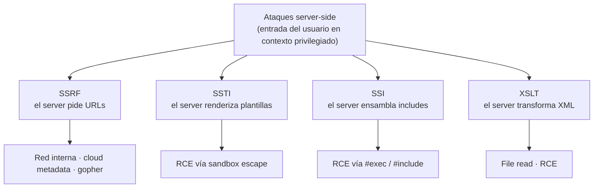

---
tags:
  - Web/Red-Team
  - Introduccion
  - Server-Side
  - Tipo/Introduccion
Descripción: "Los ataques server-side apuntan a la aplicación o el servicio que corre en el servidor, a diferencia de los client-side, que se ejecutan en la máquina del cliente"
Fecha de actualización: 2026-06-22
Nota previa: ""
Nota siguiente: "[[01 - Introducción a SSRF]]"
Area: "[[SSRF.base|SSRF]]"
---
Los ataques **server-side** apuntan a la aplicación o el servicio que corre en el servidor, a diferencia de los **client-side**, que se ejecutan en la máquina del cliente. <mark style="background: #ADCCFFA6;">La distinción es la frontera de confianza: un [[00 - Introducción a XSS|XSS]] ataca el navegador de la víctima; un ataque server-side ataca el propio servidor</mark> —y con él, la red interna, los secrets y, a menudo, la ejecución de comandos—. Este sub-tema cubre cuatro clases de vulnerabilidad server-side que comparten una misma raíz.

# El hilo común

Las cuatro nacen del mismo patrón: <mark style="background: #FF5582A6;">el servidor procesa entrada controlada por el atacante dentro de un contexto poderoso</mark> —pedir una URL, renderizar una plantilla, incluir contenido, transformar XML—. Cuando ese procesamiento no está aislado de la entrada, el atacante redirige la potencia del servidor hacia sus propios fines.

# Las cuatro clases

| Clase | El servidor… | Si se inyecta… | Impacto típico |
| - | - | - | - |
| **SSRF** | pide recursos remotos según una URL del usuario | una URL arbitraria | acceso a red interna, *cloud metadata*, bypass de firewall |
| **SSTI** | genera HTML con un motor de plantillas | sintaxis de plantilla | fuga de datos → **RCE** |
| **SSI Injection** | ensambla HTML con directivas *Server-Side Includes* | directivas SSI (`<!--#exec…-->`) | fuga de datos → **RCE** |
| **XSLT Injection** | transforma XML con hojas de estilo XSLT | código XSLT | lectura de ficheros → **RCE** |

- <mark style="background: #ADCCFFA6;">**Server-Side Request Forgery (SSRF)**</mark>: la app trae recursos de una ubicación remota a partir de datos del usuario (una URL). El atacante coacciona al servidor para que haga peticiones a destinos arbitrarios —internos o externos—. Es parte del [OWASP Top 10](https://owasp.org/Top10/A10_2021-Server-Side_Request_Forgery_%28SSRF%29/). Empezamos por aquí: [[01 - Introducción a SSRF]].
- <mark style="background: #ADCCFFA6;">**Server-Side Template Injection (SSTI)**</mark>: los motores de plantillas generan respuestas dinámicas a partir de entrada del usuario; si esa entrada se interpreta como **código de plantilla**, se llega de la fuga de datos al compromiso total del servidor. Ver [[00 - Motores de plantillas e introducción a SSTI|SSTI]].
- <mark style="background: #ADCCFFA6;">**Server-Side Includes (SSI) Injection**</mark>: las directivas SSI incrustadas en HTML instruyen al servidor para incluir contenido dinámico (cabeceras, pies); inyectar comandos en ellas lleva a fuga o RCE. Ver [[00 - Inyección SSI (Server-Side Includes)|SSI]].
- <mark style="background: #ADCCFFA6;">**XSLT Server-Side Injection**</mark>: XSLT transforma documentos XML en otros formatos (HTML); manipular la transformación permite inyectar y ejecutar código en el servidor. Ver [[00 - Inyección XSLT|XSLT]].

# Cómo se organiza este tema

Cada clase vive en su propia carpeta-sub-tema, agrupadas por el tag `Server-Side` y enlazadas entre sí por contexto. <mark style="background: #FFB86CA6;">SSRF y SSTI reciben tratamiento completo</mark> (detección, explotación, evasión, prevención y arsenal); SSI y XSLT, más acotadas en la práctica, se cubren de forma proporcional. Todas comparten herramientas y conceptos —en particular el canal **OOB** (Burp Collaborator / interactsh) y los wrappers/protocolos que ya aparecieron en [[00 - Introducción a File Inclusion|File Inclusion]] (`file://`, `gopher://`)—.

> [!info]+ Fuentes
> - [OWASP — SSRF](https://owasp.org/www-community/attacks/Server_Side_Request_Forgery) · [SSTI (WSTG)](https://owasp.org/www-project-web-security-testing-guide/v42/4-Web_Application_Security_Testing/07-Input_Validation_Testing/18-Testing_for_Server_Side_Template_Injection) · [SSI Injection](https://owasp.org/www-community/attacks/Server-Side_Includes_(SSI)_Injection)
> - HTB Academy — *Server-side Attacks* (módulo 145)

Arrancamos por la más transversal y de mayor alcance en redes internas y cloud: [[01 - Introducción a SSRF]].
