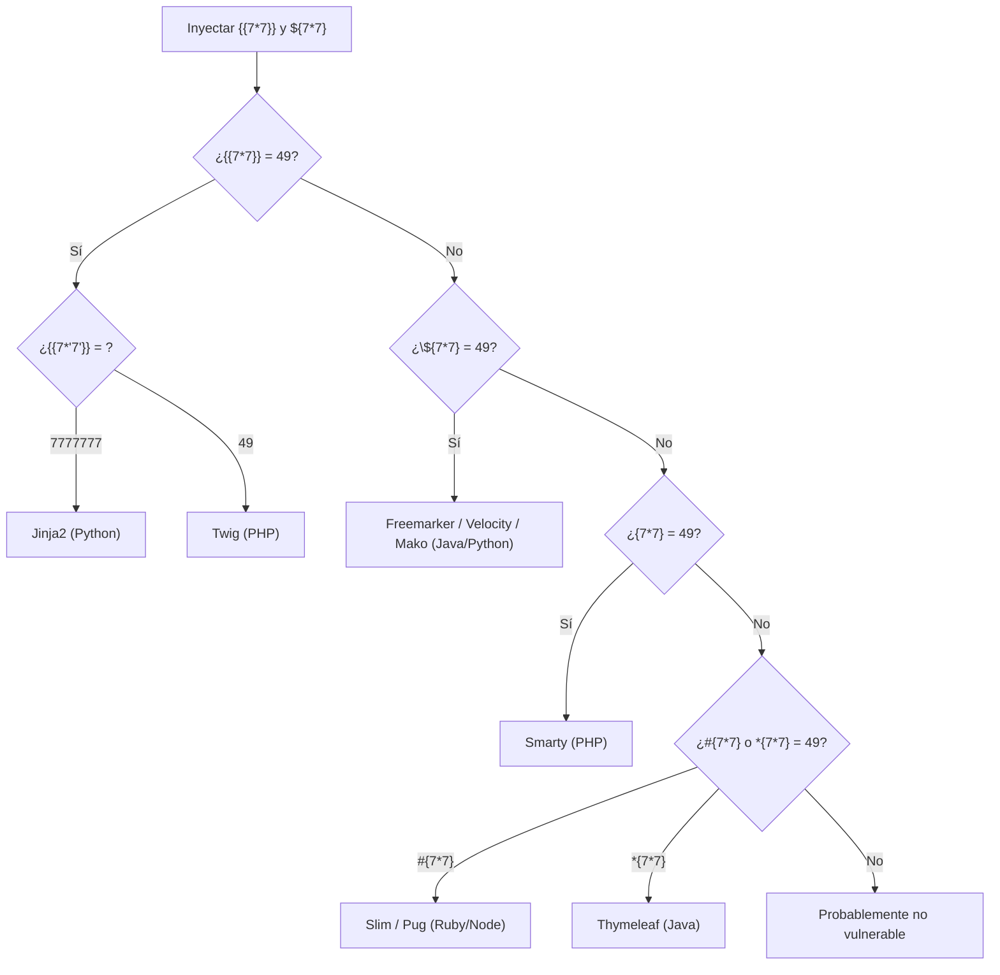

---
tags:
  - Web/Red-Team
  - Pentesting/Enumeracion
  - Server-Side/SSTI
Descripción: "Antes de explotar hay que hacer dos cosas: confirmar que hay SSTI y averiguar qué motor se usa"
Fecha de actualización: 2026-06-22
Nota previa: "[[00 - Motores de plantillas e introducción a SSTI]]"
Nota siguiente: "[[02 - Explotación de SSTI - Jinja2]]"
Area: "[[SSTI.base|SSTI]]"
---
---

Antes de explotar hay que hacer dos cosas: **confirmar** que hay SSTI y **averiguar qué motor** se usa. Lo segundo es decisivo —cada motor tiene su sintaxis y sus funciones de explotación—, así que el payload correcto depende de identificarlo bien.

# Confirmar la SSTI

El método es el mismo que para cualquier inyección (como el `'` en [[00 - Introducción a SQL Injection|SQLi]]): inyectar caracteres con **significado sintáctico** en los motores de plantillas y observar si rompen el render. El *string* de prueba canónico reúne todos esos caracteres especiales:

```txt
${{<%[%'"}}%\
```

<mark style="background: #ADCCFFA6;">Si la app es vulnerable, esta cadena viola la sintaxis de la plantilla y provoca un error</mark> (un `500`, normalmente). Igual que un `'` dispara un error SQL, este polyglot dispara un error de plantilla. Un error no lo confirma al 100 %, pero eleva mucho la sospecha; la confirmación llega al ver **evaluación** real en el siguiente paso.

# Identificar el motor: el árbol de decisión

La técnica clásica explota las pequeñas diferencias de comportamiento entre motores ante operaciones matemáticas. Se inyectan `${7*7}` y `{{7*7}}` y se sigue el árbol según qué se evalúe a `49`:



<mark style="background: #FF5582A6;">La prueba clave para los dos motores más comunes</mark>: si `{{7*7}}` devuelve `49`, es Jinja2 **o** Twig; para distinguirlos se inyecta `{{7*'7'}}`:

- **Jinja2** (Python) → `7777777` (multiplica string por entero, comportamiento Python).
- **Twig** (PHP) → `49` (convierte y multiplica numéricamente).

# Firmas por motor

| Payload | Resultado | Motor probable | Lenguaje |
| - | - | - | - |
| `{{7*7}}` → `49` y `{{7*'7'}}` → `7777777` | | **Jinja2** | Python |
| `{{7*7}}` → `49` y `{{7*'7'}}` → `49` | | **Twig** | PHP |
| `${7*7}` → `49` | | **Freemarker / Velocity / Mako** | Java / Python |
| `{7*7}` → `49` | | **Smarty** | PHP |
| `#{7*7}` → `49` | | **Slim / Pug** (interpolación `#{}`) | Ruby / Node |
| `*{7*7}` → `49` | | **Thymeleaf** | Java |

> [!info]+ Desambiguar el trío que comparte `${7*7}` (Freemarker / Velocity / Mako)
> Los tres dan `49` a `${7*7}` pero tienen payloads de RCE **totalmente distintos** (ver [[04 - Evasión de filtros y sandbox en SSTI|Otros motores]]), así que "es uno de estos tres" no basta para elegir payload. Un segundo test los separa: `${7*'7'}` → **error** en Freemarker (no multiplica string × int), **`49`** en Velocity. Mako se delata por su sintaxis Python embebida (`${...}` junto a bloques `<% ... %>`).

> [!important]+ Si no se refleja: SSTI a ciegas
> Si `{{7*7}}` no aparece evaluado en la respuesta pero sospechas SSTI (el input va a una plantilla de email, PDF o log), considera **SSTI ciega**: payloads con retardo medible o, mejor, interacción **OOB** (que el payload fuerce una petición a tu `interactsh`/Collaborator). Mismo oráculo que la [[04 - Blind SSRF|SSRF ciega]].

> [!warning]+ Distinguir de un simple reflejo (XSS)
> Que `{{7*7}}` se **evalúe a 49** es la firma de SSTI (ejecución server-side). Si el `{{7*7}}` se refleja **literal** en el HTML, no hay motor evaluándolo: será [[00 - Introducción a XSS|XSS]] u otra cosa, no SSTI. Comprueba siempre que el resultado es el **producto**, no la cadena.

> [!important]+ Contexto importa
> El payload debe encajar en el contexto donde cae tu input (atributo, texto, comentario de plantilla). Si `{{7*7}}` no se evalúa pero sospechas SSTI, prueba a **cerrar** el contexto previo y variantes por motor (`` en Jinja, etiquetas de bloque). Los escáneres ([[06 - Arsenal de herramientas SSTI|SSTImap]]) automatizan este barrido de firmas.

> [!info]+ Fuentes
> - [PortSwigger — Identifying SSTI](https://portswigger.net/web-security/server-side-template-injection#identify) · [Hackmanit — Template injection table](https://github.com/Hackmanit/template-injection-table)
> - [PayloadsAllTheThings — SSTI (detección)](https://github.com/swisskyrepo/PayloadsAllTheThings/tree/master/Server%20Side%20Template%20Injection)

Identificado el motor, la explotación diverge. Empezamos por el más común en stacks Python: [[02 - Explotación de SSTI - Jinja2]].
