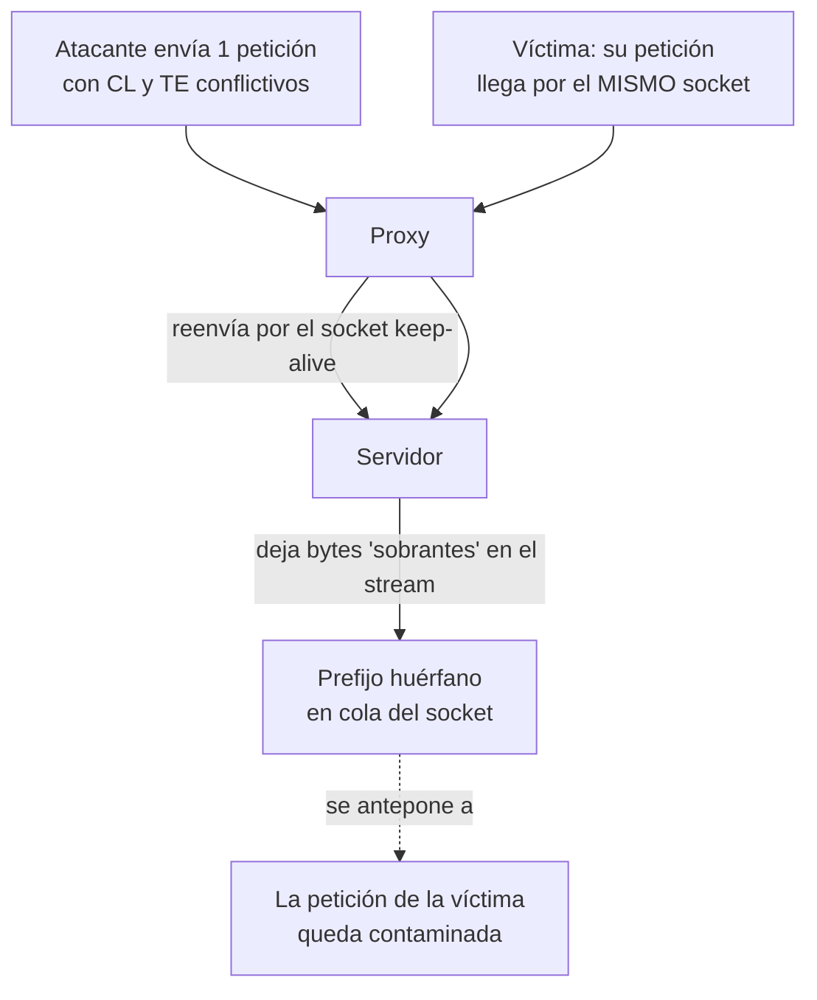

---
tags:
  - Web/Red-Team
  - Pentesting/Explotacion
  - HTTP/Request-Smuggling
  - Tipo/Introduccion
Descripción: "El HTTP Request Smuggling (o Desync Attack) explota una discrepancia entre un front-end (proxy inverso, caché, WAF) y un back-end (servidor web) al parsear la misma petición…"
Fecha de actualización: 2026-07-14
Nota previa: "[[05 - Prevención y herramientas de CRLF]]"
Nota siguiente: "[[07 - CL.TE]]"
Area: "[[HTTP Attacks.base|HTTP Attacks]]"
---
---

El **HTTP Request Smuggling** (o **Desync Attack**) explota una <mark style="background: #ADCCFFA6;">discrepancia entre un **front-end** (proxy inverso, caché, WAF) y un **back-end** (servidor web) al parsear la **misma** petición HTTP</mark>. Es el ataque más potente del path: permite comprometer a **otros usuarios** y saltar WAFs. Exige entender bien `TCP` y [[HTTP]], porque el bug vive en cómo cada sistema decide **dónde termina** una petición.

# El stream TCP y las fronteras de petición

`TCP` es orientado a **stream**: transmite un flujo continuo de bytes; la capa de aplicación no ve "paquetes", ve datos crudos. Desde [[HTTP]]/1.1, una misma conexión TCP se **reutiliza** (`keep-alive`) para varias parejas petición-respuesta — sobre todo entre el proxy y el servidor, que mantienen el socket abierto. Las peticiones viajan **pegadas, sin separador**:

```http
POST / HTTP/1.1
Host: clte.htb
Content-Length: 5

HELLOGET / HTTP/1.1
Host: clte.htb
```

El cuerpo del `POST` es `HELLO` (5 bytes); el `GET` empieza **inmediatamente después**. <mark style="background: #ADCCFFA6;">Para parsear bien, proxy y servidor tienen que coincidir en dónde está la **frontera** entre una petición y la siguiente</mark>.

# Content-Length vs Transfer-Encoding

Hay dos formas de declarar la longitud del cuerpo, y su convivencia es toda la munición:

**`Content-Length` (CL)** — longitud exacta en bytes:

```http
POST / HTTP/1.1
Content-Length: 29

param1=HelloWorld&param2=Test
```

**`Transfer-Encoding: chunked` (TE)** — el cuerpo llega en trozos, cada uno precedido por su tamaño en **hex**, terminando en un chunk de tamaño `0`:

```http
POST / HTTP/1.1
Transfer-Encoding: chunked

1d
param1=HelloWorld&param2=Test
0

```

`0x1d` = 29. Con los CRLF visibles: `1d\r\nparam1=HelloWorld&param2=Test\r\n0\r\n\r\n`.

> [!important] La regla que todos deberían seguir (y no siguen)
> El RFC de HTTP/1.1 dice: <mark style="background: #FFB8EBA6;">si una petición trae **ambas** cabeceras, `Content-Length` **MUST be ignored**</mark> y manda `Transfer-Encoding`. El smuggling nace cuando **un sistema no cumple** esta regla: uno usa CL, el otro TE, y sus fronteras dejan de coincidir.

# La desincronización

Cuando proxy y servidor **discrepan** en la frontera —por un bug, por no soportar `chunked`, o por parsear mal `CL`/`TE`— parte de tu petición queda "huérfana" en el stream TCP: un sistema la ve como fin de tu petición, el otro como **principio de la siguiente**.



<mark style="background: #FFB86CA6;">El prefijo que dejaste se **antepone** a la petición del siguiente usuario</mark>, que puede ser cualquiera. Como las peticiones de distintos usuarios comparten el socket proxy↔servidor, controlas el principio de la petición **de otra persona**. Rompes la propiedad más básica de HTTP: que las peticiones son independientes.

# La taxonomía (lo que viene)

Según **quién** usa CL y quién TE, hay tres variantes clásicas:

| Variante | Front-end usa | Back-end usa |
| - | - | - |
| [[07 - CL.TE\|CL.TE]] | `Content-Length` | `Transfer-Encoding` |
| [[09 - TE.CL\|TE.CL]] | `Transfer-Encoding` | `Content-Length` |
| [[08 - TE.TE\|TE.TE]] | ambos TE, pero uno se **induce a ignorarlo** (ofuscando la cabecera) | |

# Impacto

Según la discrepancia: <mark style="background: #FFB86CA6;">robo de datos de otros usuarios, secuestro de sus peticiones, XSS masivo, envenenamiento de [[01 - Introducción a Web Cache Poisoning|caché]], y **bypass de WAF**</mark> (cuelas una petición prohibida "escondida" dentro de una permitida).

> [!info] Contexto: la era Kettle y los desyncs modernos
> El request smuggling lo resucitó **James Kettle** con *HTTP Desync Attacks* (2019). El material de HTB cubre lo clásico (CL.TE/TE.CL/TE.TE), pero desde entonces han aparecido vectores que veremos en la [[11 - Explotación de Request Smuggling|explotación]]: **CL.0** (el back-end ignora el CL), **client-side desync** y **browser-powered desync** (2022, explotables **sin** proxy intermedio, desde el propio navegador de la víctima), y el smuggling sobre [[13 - Introducción a HTTP2|HTTP/2]]. Es de los campos mejor pagados en bug bounty porque un solo desync afecta a **todos** los usuarios.

## Referencias

- [James Kettle — HTTP Desync Attacks (2019)](https://portswigger.net/research/http-desync-attacks-request-smuggling-reborn)
- [PortSwigger — HTTP request smuggling](https://portswigger.net/web-security/request-smuggling)
