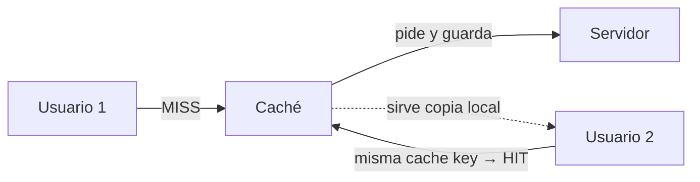

---
tags:
  - Web/Red-Team
  - Pentesting/Explotacion
  - HTTP/Cache-Poisoning
  - Tipo/Introduccion
Descripción: "El Web Cache Poisoning fuerza a una caché a almacenar y servir contenido malicioso a todos los usuarios que pidan un recurso"
Fecha de actualización: 2026-07-14
Nota previa: "[[00 - Introducción a las HTTP Misconfigurations]]"
Nota siguiente: "[[02 - Identificación de parámetros unkeyed]]"
Area: "[[HTTP Misconfigurations.base|HTTP Misconfigurations]]"
---
---

El **Web Cache Poisoning** fuerza a una caché a <mark style="background: #FFB86CA6;">almacenar y servir contenido malicioso a todos los usuarios</mark> que pidan un recurso. Como la caché está para aliviar al backend sirviendo copias a mucha gente, envenenar una sola copia <mark style="background: #8000E1A6;">convierte un bug de un solo usuario en un ataque de alcance masivo</mark> y, a menudo, sin interacción de la víctima (basta con que visite la página). Un [[02 - XSS Reflejado|XSS reflejado]] normalmente exige engañar a cada víctima con un enlace; cacheado, se sirve solo a cuantos abran la URL.

Cachés habituales: `Nginx`, `Apache`, `Squid`, `Varnish`, y sobre todo los **CDN** (Cloudflare, Fastly, Akamai, CloudFront) y proxies inversos.

# Cómo trabaja una caché

La caché se sitúa **entre el cliente y el servidor**. Si el recurso pedido no está en su almacén local (`MISS`), lo pide al backend, lo guarda y sirve las peticiones futuras desde ahí (`HIT`) durante un tiempo (`TTL`). Cachea recursos estáticos (CSS, JS) y también **respuestas dinámicas** generadas a partir de la entrada del usuario (una búsqueda, un idioma).



# La Cache Key: keyed vs unkeyed

El problema: comparar peticiones **byte a byte** para decidir si dos merecen la misma respuesta es inviable (cada navegador manda `User-Agent`, `Referer`, `Accept` distintos que **no** cambian la respuesta). La caché usa por eso solo un **subconjunto** de la petición para decidir: la <mark style="background: #ADCCFFA6;">**cache key**</mark>.

<mark style="background: #ADCCFFA6;">Por defecto la cache key incluye la **ruta**, los **parámetros GET** y la cabecera **`Host`**</mark>. Todo lo que entra en la key es **keyed**; el resto, **unkeyed**.

```http
GET /index.html?language=en HTTP/1.1     ← ruta + ?language=en + Host = cache key
Host: example.com
User-Agent: ...Windows...                 ← unkeyed (no afecta a la key)
Accept: text/html                          ← unkeyed
```

Dos peticiones con **la misma cache key** reciben **la misma respuesta cacheada**, aunque difieran en cabeceras unkeyed. Cambiar `language=de` sí genera una key distinta (es GET param, keyed) → respuesta distinta, como se espera.

> [!important] La esencia del ataque
> <mark style="background: #FFB86CA6;">Si una entrada **unkeyed** influye en la respuesta, tienes un cache poisoning</mark>. El atacante manda una petición con la cache key de la víctima pero con un **valor unkeyed malicioso**; el backend refleja ese valor en la respuesta; la caché la guarda bajo esa cache key… y se la sirve a **cualquier** usuario que pida esa key. La víctima nunca ve la cabecera envenenada — la envió el atacante, pero cosecha la respuesta cacheada.

# Configuración (Nginx) y la cabecera X-Cache

```nginx
proxy_cache_key $scheme$proxy_host$uri$args;   # key = esquema+host+ruta+TODOS los args
add_header X-Cache-Status $upstream_cache_status;   # HIT / MISS en la respuesta
```

Cambiar la key para incluir **solo** un parámetro (`$arg_language`) deja el resto **unkeyed**: `/x?language=de&timestamp=1` y `...&timestamp=2` comparten respuesta cacheada. Esas configuraciones a medida son justo donde nacen los fallos.

# Detección: reconocer que hay caché (y su comportamiento)

Antes de envenenar, confirma que hay caché y observa sus cabeceras-indicador:

| Cabecera | Qué revela |
| - | - |
| `X-Cache` / `X-Cache-Status` | `HIT` / `MISS` (Varnish, Nginx) |
| `CF-Cache-Status` | Estado en Cloudflare |
| `Age` | Segundos que lleva cacheada la respuesta |
| `Cache-Control` / `Expires` | Política y TTL |
| `Vary` | Qué cabeceras **añade** a la cache key (p. ej. `Vary: User-Agent`) |
| `X-Served-By`, `X-Cache-Hits` | Fastly y otros CDN |

La técnica base: pedir dos veces el recurso y ver si la segunda llega con `HIT`/`Age>0`. Si un input que reflejas en la respuesta **no** cambia el `HIT`, ese input es **unkeyed** — candidato a poison. Lo sistematizamos en [[02 - Identificación de parámetros unkeyed]].

> [!info] Contexto profesional y ataques hermanos
> La metodología moderna la formalizó **James Kettle (PortSwigger)**: (1) identificar entradas unkeyed, (2) provocar una respuesta dañina, (3) lograr que se cachee. Un pariente cercano es la **Web Cache Deception** (Omer Gil, 2017): en vez de envenenar, engaña a la caché para que **almacene páginas sensibles** de otro usuario (p. ej. pidiendo `/account/settings/foo.css`). Y ojo con los **CDN**: cada uno normaliza la cache key distinto, y esas diferencias son explotables ([[04 - Técnicas avanzadas de Cache Poisoning]]).

## Referencias

- [PortSwigger — Web cache poisoning](https://portswigger.net/web-security/web-cache-poisoning)
- [James Kettle — Practical Web Cache Poisoning (2018)](https://portswigger.net/research/practical-web-cache-poisoning)
- [Omer Gil — Web Cache Deception](https://www.blackhat.com/docs/us-17/wednesday/us-17-Gil-Web-Cache-Deception-Attack.pdf)
