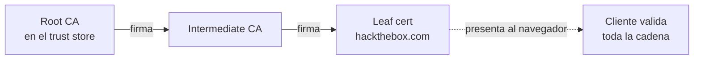

---
tags:
  - Web/Red-Team
  - Pentesting/Enumeracion
  - TLS
Descripción: "TLS combina cifrado simétrico y asimétrico, y la parte asimétrica se apoya en una Public Key Infrastructure (PKI)"
Fecha de actualización: 2026-07-14
Nota previa: "[[00 - Introducción a HTTPS y TLS]]"
Nota siguiente: "[[02 - Handshake TLS 1.2 y 1.3]]"
Area: "[[HTTPs-TLS.base|HTTPs/TLS]]"
---
---

TLS combina cifrado simétrico y asimétrico, y la parte asimétrica se apoya en una **Public Key Infrastructure (PKI)**. <mark style="background: #ADCCFFA6;">Una PKI es el conjunto de roles y procesos que gestionan los certificados digitales: su creación, distribución y revocación</mark>. Sin ella, la criptografía de clave pública sería impracticable a escala de Internet. Entender la PKI es el prerrequisito para el resto del módulo: casi todos los ataques atacan un paso de la negociación de claves o un fallo en la validación del certificado.

# El problema que resuelve la PKI

En criptografía asimétrica cada actor tiene un **par de claves**: una **pública** (para cifrar, conocida por todos) y una **privada** (para descifrar, secreta). Un mensaje cifrado con la pública solo lo descifra la privada correspondiente.

| Algoritmo | Tipo |
| - | - |
| `RSA`, `DSA`, `ECDSA`, `EdDSA` | Asimétrico |
| `AES`, `DES`, `3DES`, `Blowfish`, `ChaCha20` | Simétrico |

El problema aparece al **obtener** la clave pública de otro. Si Alice quiere hablar con `hackthebox.com`, pide su clave pública y cifra con ella. Pero **¿cómo sabe que esa clave es realmente de HTB y no de un atacante que interceptó la petición y le coló la suya?** Si un `man-in-the-middle` sustituye la clave pública, Alice cifraría **para el atacante**, que descifra, lee y reenvía. <mark style="background: #FFB86CA6;">Este ataque de sustitución de clave es exactamente lo que los certificados vienen a impedir</mark>.

# Certificados: atar una clave pública a una identidad

Un **certificado** (formato **X.509**) vincula criptográficamente una clave pública a una identidad. Sus campos clave para un pentester:

- **Common Name (`CN`)**: el dominio al que pertenece la clave.
- **Subject Alternative Names (`SAN`)**: dominios adicionales cubiertos. <mark style="background: #FF5582A6;">Campo de oro para recon</mark>: revela subdominios y hostnames internos.
- **Validez**: fechas de emisión y expiración. Un cert expirado = advertencia del navegador.
- **Issuer**: la CA que lo firmó.
- **Clave pública** y **algoritmo de firma** (`SHA-256` hoy; `SHA-1` está roto y deprecado).

# Autoridades de Certificación y cadena de confianza

Una **Certificate Authority (CA)** es una entidad autorizada a emitir certificados, y lo hace **firmándolos** con su clave privada. La identidad de la CA la avala su propio **CA Certificate**, firmado a su vez por otra CA, y así hasta llegar a una **root CA**. Esa secuencia es la <mark style="background: #ADCCFFA6;">**cadena de certificados** (`certificate chain`)</mark>.



El navegador valida la cadena entera: si cualquier certificado es inválido o inseguro, muestra una advertencia. <mark style="background: #8000E1A6;">La raíz de la confianza es el **certificate store**</mark>: un conjunto de root CAs preinstaladas y confiadas por el sistema/navegador. Comprometer la clave privada de una CA sería catastrófico —permitiría firmar certificados para **cualquier** dominio— por eso son de los recursos más protegidos que existen.

# OpenSSL en la práctica

`OpenSSL` implementa los algoritmos criptográficos sobre los que se apoya media Internet (de ahí que un bug suyo como [[07 - Heartbleed|Heartbleed]] afecte a millones de servidores). Comandos que usarás:

```shell-session
# Generar par de claves RSA 2048
$ openssl genrsa -out key.pem 2048
# Extraer la clave pública
$ openssl rsa -in key.pem -pubout > pub.pem

# Descargar el certificado de un servidor (recon)
$ openssl s_client -connect hackthebox.com:443 | openssl x509 > htb.pem
# Ver el certificado en claro (CN, SAN, issuer, fechas)
$ openssl x509 -in htb.pem -noout -text
```

Se puede convertir entre formatos (`PEM` ↔ `DER` ↔ `PKCS#7`) y crear un **certificado autofirmado** (`self-signed`), sin firma de CA:

```shell-session
$ openssl req -x509 -newkey rsa:4096 -keyout key.pem -out selfsigned.pem -sha256 -days 365
# ...Common Name (FQDN): hackthebox.com
```

> [!warning] Un self-signed no te impersona a nadie
> Puedes rellenar el `CN` con `hackthebox.com` e imitar todos los campos, pero al no estar firmado por una CA de confianza <mark style="background: #FF5582A6;">el navegador muestra la advertencia de certificado</mark>. La impersonación real solo funcionaría si obtuvieras la clave privada de una CA (o de la propia web). En un lab con MitM, sin embargo, un self-signed sí sirve para interceptar clientes que ignoran la advertencia o no validan la cadena (apps móviles mal configuradas, `curl -k`, IoT).

# PKI moderna: lo que HTB no cuenta y sí usas hoy

El material de HTB se queda en OpenSSL manual. En 2026 la operativa real gira en torno a:

- **ACME / Let's Encrypt**: certificados **gratuitos y automatizados** (`certbot`). Han hecho que HTTPS sea universal — y que ya no haya excusa para servir HTTP plano.
- **Certificate Transparency (CT)**: toda CA pública debe publicar cada certificado emitido en **logs públicos y auditables**. Para el atacante es <mark style="background: #FF5582A6;">una mina de subdominios</mark>: consultar [crt.sh](https://crt.sh) o `curl`ear la API revela hostnames que no aparecen por fuerza bruta de DNS. Es una técnica de recon de primer nivel en bug bounty.

```shell-session
# Enumerar subdominios de un dominio vía CT logs
$ curl -s "https://crt.sh/?q=%25.hackthebox.com&output=json" | jq -r '.[].name_value' | sort -u
```

- **Revocación**: cuando una clave se compromete, el certificado debe invalidarse antes de expirar, vía **CRL** (listas) u **OCSP** (consulta en tiempo real). El **OCSP stapling** deja que el propio servidor adjunte la prueba de no-revocación, evitando fugas de privacidad. En un pentest, un servidor sin comprobación de revocación es un matiz a reportar.
- **Pinning**: fijar qué clave/CA se espera. El HTTP Public Key Pinning (`HPKP`) murió en navegadores por su fragilidad, pero el pinning sigue vivo en **apps móviles** — y bypassearlo (`Frida`, `objection`) es parte del pentest de móviles.

> [!info] Valor de la PKI para el pentester
> Más allá del cifrado, el certificado es **inteligencia**: `SAN` y CT logs mapean la superficie de ataque; el `issuer` y el algoritmo de firma delatan configs viejas; una cadena rota o un self-signed en producción son hallazgos. La auditoría sistemática de todo esto se ve en [[11 - Detección, testeo y hardening de TLS]].

## Referencias

- [RFC 5280 — X.509 PKI Certificate](https://www.rfc-editor.org/rfc/rfc5280)
- [crt.sh — Certificate Transparency search](https://crt.sh)
- [Let's Encrypt — How it works](https://letsencrypt.org/how-it-works/)
