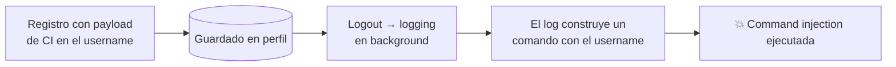

---
tags:
  - Web/Red-Team
  - Pentesting/Explotacion
  - Modern-Exploitation
Descripción: "Último caso de segundo orden, y el más engañoso: una command injection donde el punto obvio está bien filtrado, pero un proceso en background (logging) que el atacante ni ve…"
Fecha de actualización: 2026-07-15
Nota previa: "[[09 - Second-Order LFI]]"
Nota siguiente: "[[11 - Detección, herramientas y prevención de ataques de segundo orden]]"
Area: "[[Modern Exploitation.base|Modern Exploitation]]"
---
---

Último caso de segundo orden, y el más engañoso: una [[00 - Introducción a Command Injection|command injection]] donde el punto **obvio** está bien filtrado, pero un **proceso en background** (logging) que el atacante ni ve resulta inyectable.

# El punto obvio está filtrado

Un dashboard donde **configuramos una IP** (`POST /update`, campo `deviceIP`) y un endpoint `/ping` que la usa para hacer ping. El campo `deviceIP` es la entrada evidente para [[00 - Introducción a Command Injection|command injection]]. Probamos `whoami` con la [[02 - Operadores de inyección de comandos|metodología habitual]] → rechazado por caracteres inválidos. Fuzzeamos qué caracteres pasan con `wfuzz` y `special-chars.txt` de SecLists (un cambio válido da `200`, uno bloqueado `400`):

```shell-session
$ wfuzz -u http://target/update -w ./special-chars.txt \
    -d '{"deviceIP":"FUZZ","password":""}' -H 'Content-Type: application/json' \
    -b 'session=<JWT>' --sc 200

000000024:  200   ...  "."
```

<mark style="background: #FFB86CA6;">El único carácter especial permitido es el punto</mark>. Sin operadores (`;`, `|`, `` ` ``, `$()`), no hay inyección posible por `deviceIP`. El punto obvio es un callejón sin salida.

# La pista: un mensaje de debug en el logout

Analizando el tráfico, al **hacer logout** la respuesta contiene un mensaje que <mark style="background: #FF5582A6;">revela una ruta del servidor y sugiere que la app **registra datos basados en el perfil de usuario**</mark>. A primera vista es un information disclosure menor, pero delata un **mecanismo de logging** que consume datos del usuario — un posible punto de inyección de segundo orden.

La app no deja modificar el perfil existente, pero **sí** registrar usuarios nuevos. Así que inyectamos el payload en los campos `name`/`username` **al registrarnos**.

# Explotación

Registramos un usuario con un payload de command injection (p. ej. con backticks) en el nombre:

```text
username: htb`id`
name:     test`id`
```

Luego **iniciamos sesión y cerramos sesión**. En el logout, el mecanismo de logging escribe los datos del perfil en un comando del sistema **sin sanear** → <mark style="background: #8000E1A6;">el comando inyectado se ejecuta</mark>.



El endpoint obvio (`/ping`) tenía un filtro correcto; el logging en background **no**. <mark style="background: #FFB8EBA6;">Sin el mensaje de debug filtrado en el logout, no habría forma de saber que ese mecanismo existe</mark> — de ahí lo traicionero del segundo orden.

# La lección operativa

> [!important]+ Prueba TODOS los campos, no solo el obvio
> El error del pentester perezoso: probar command injection solo donde "se ve" que se ejecuta un comando (`/ping`). Los datos del perfil (username, name, descripción) suelen alimentar **procesos ocultos**: logs, generación de reports, notificaciones, tareas cron, integraciones. <mark style="background: #FFB86CA6;">Marca cada campo con un canario y observa dónde acaba</mark>. Con cientos de inputs, apóyate en escáneres (stored/OOB de Burp), pero prueba **a mano** los campos de perfil que la app pueda reutilizar en background.

# Prevención

- **Sanear/parametrizar en TODO** punto que construya un comando, incluidos los procesos en background (no solo el endpoint visible). Idealmente, evitar `system()`/shell y usar APIs que no invoquen shell (`execve` con args separados).
- **No filtrar los mensajes de error/debug** en producción (aquí, el debug del logout reveló el mecanismo).
- Aplicar la [[09 - Prevención de Command Injection|prevención de command injection]] de forma consistente en toda la base de código, no solo en las entradas evidentes.

Con esto cerramos los ejemplos de segundo orden. La nota siguiente consolida la [[11 - Detección, herramientas y prevención de ataques de segundo orden|detección, herramientas y prevención]].

## Referencias

- HTB Academy — *Command Injections* ([[00 - Introducción a Command Injection|base]])
- PortSwigger — [OS command injection](https://portswigger.net/web-security/os-command-injection)
- SecLists — [special-chars.txt](https://github.com/danielmiessler/SecLists/blob/master/Fuzzing/special-chars.txt)
- HTB Academy — *Modern Web Exploitation Techniques* (base, 2023)
