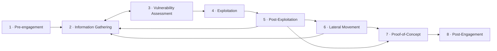

---
tags:
  - Pentesting
  - Tipo/Introduccion
Descripción: "Las 8 fases del proceso de pentesting, cómo se realimentan entre sí y cómo se mapean contra PTES, NIST SP 800-115, OSSTMM, la Kill Chain y MITRE ATT&CK"
Fecha de actualización: 2026-07-31
Nota previa: "[[01 - Marco legal y regulatorio del pentesting]]"
Nota siguiente: "[[03 - Pre-engagement I - contratos, NDA y scoping]]"
Area: "[[Fases del Pentesting.base|Fases del Pentesting]]"
---
---

Un proceso de pentesting es <mark style="background: #ADCCFFA6;">la secuencia de pasos y eventos que lleva al pentester desde el contrato hasta el objetivo acordado</mark>. La palabra clave es *secuencia*, no *receta*: cada paso depende de lo que el anterior haya devuelto, y ninguna infraestructura se comporta igual que otra. Por eso el proceso se define en **fases** amplias y no en una lista de comandos — las fases dan estructura y vocabulario común; los pasos concretos se improvisan sobre la información obtenida.

# Las ocho fases

| # | Fase | Qué se hace |
| --- | --- | --- |
| 1 | [[03 - Pre-engagement I - contratos, NDA y scoping\|Pre-engagement]] | Se define y contrata el trabajo: NDA, objetivos, alcance, plazos y `Rules of Engagement`. |
| 2 | [[05 - Recopilación de información\|Information Gathering]] | OSINT, enumeración de infraestructura, de servicios y de hosts. La fase a la que más se vuelve. |
| 3 | [[06 - Evaluación de vulnerabilidades\|Vulnerability Assessment]] | Analizar lo recopilado, buscar vulnerabilidades conocidas y deducir vectores de ataque. |
| 4 | [[07 - Explotación\|Exploitation]] | Preparar, adaptar y ejecutar el ataque contra el vector priorizado para obtener acceso. |
| 5 | [[08 - Post-explotación\|Post-Exploitation]] | Persistencia, reconocimiento local, *pillaging*, escalada de privilegios y exfiltración. |
| 6 | [[09 - Movimiento lateral\|Lateral Movement]] | Pivotar y moverse por la red interna hacia otros hosts al mismo nivel o superior. |
| 7 | [[10 - Prueba de concepto (PoC)\|Proof-of-Concept]] | Documentar la cadena de ataque de forma que el cliente pueda reproducirla y priorizar la remediación. |
| 8 | [[11 - Post-engagement - cierre, retest y retención\|Post-Engagement]] | Limpieza, informe, reunión de revisión, retest y retención/destrucción de datos. |

## El proceso no es un círculo, es un grafo con bucles

La representación circular que abunda en la literatura induce a error: sugiere que se recorre una vuelta y se termina. En la práctica, <mark style="background: #8000E1A6;">las fases 2 a 6 forman bucles que se recorren muchas veces durante el mismo engagement</mark>, una por cada host, servicio o credencial nueva.

Los dos bucles que más se recorren son estos:

- **Information Gathering ⇄ Vulnerability Assessment**. Si el análisis no produce un vector viable, no se pasa a explotar: se vuelve a enumerar más a fondo. La mayoría de los engagements que se atascan lo hacen por haber enumerado poco, no por explotar mal.
- **Post-Exploitation → Lateral Movement → Information Gathering**. Cada host comprometido reinicia el ciclo desde una perspectiva nueva. Las credenciales encontradas en el host A son la entrada de la enumeración del host B.

> [!important]+ Por qué importa saber en qué fase estás
> En un engagement de tres semanas con 40 hosts y varias cadenas de ataque abiertas es fácil perder el hilo. Nombrar la fase en cada entrada del *activity log* y de las notas —"día 4, host `SRV-FS01`, post-explotación, pillaging de shares"— es lo que permite reconstruir la cadena de ataque al escribir el informe sin tener que reproducir el trabajo. Ver [[01 - Toma de notas y organización]].

# Cómo se mapea contra los estándares

Ninguna de las metodologías reconocidas divide el trabajo exactamente igual, pero todas cubren el mismo terreno. Conocer la equivalencia sirve para dos cosas muy concretas: redactar la sección de *Methodology* del informe con el marco que el cliente exige, y responder en una auditoría de cumplimiento sin reescribir el proceso.

| Fase del proceso | PTES | NIST SP 800-115 | Cyber Kill Chain | MITRE ATT&CK (táctica) |
| --- | --- | --- | --- | --- |
| Pre-engagement | *Pre-engagement Interactions* | *Planning* | — | — |
| Information Gathering | *Intelligence Gathering* | *Discovery* | *Reconnaissance* | `Reconnaissance`, `Resource Development` |
| Vulnerability Assessment | *Threat Modeling* + *Vulnerability Analysis* | *Discovery* | *Weaponization* | — |
| Exploitation | *Exploitation* | *Attack* | *Delivery* + *Exploitation* | `Initial Access`, `Execution` |
| Post-Exploitation | *Post Exploitation* | *Attack* | *Installation* + *C2* | `Persistence`, `Privilege Escalation`, `Credential Access`, `Collection` |
| Lateral Movement | *Post Exploitation* | *Attack* | *Actions on Objectives* | `Discovery`, `Lateral Movement`, `Exfiltration`, `Impact` |
| Proof-of-Concept / Post-Engagement | *Reporting* | *Reporting* | — | — |

Algunos matices que evitan usarlos mal:

- **PTES** es el que mejor encaja como esqueleto de un engagement completo, pero su contenido técnico lleva sin actualizarse desde 2014: no cubre cloud, Entra ID, Kubernetes, CI/CD ni agentes de IA. <mark style="background: #FFB8EBA6;">Sirve como estructura, no como catálogo de técnicas.</mark>
- **NIST SP 800-115** (septiembre de 2008) aporta la parte de gobierno y planificación —y es la que citan los clientes del sector público estadounidense—, pero su fase de ataque es un bucle genérico *Gaining Access → Escalating Privileges → System Browsing → Install Additional Tools*.
- **OSSTMM 3** no encaja en esta tabla porque no organiza por fases sino por **canales** (humano, físico, inalámbrico, telecomunicaciones y redes de datos) y por métricas cuantificables (`RAV`). Es útil si el cliente quiere una medida numérica y comparable entre auditorías; poco práctico como guion de trabajo.
- **OWASP WSTG** (v4.2, con la v5.0 en desarrollo) sustituye a las fases 2-4 cuando el alcance es web o API. Se integra dentro de PTES, no compite con él.
- **MITRE ATT&CK** no es una metodología de pentest sino una taxonomía de comportamiento adversario; su valor es mapear *qué* técnicas se ejecutaron para que el equipo defensor sepa qué debería haber detectado. En su versión **v19** (abril de 2026) la matriz Enterprise pasó a **15 tácticas** al dividir *Defense Evasion* en `Stealth` y `Defense Impairment`.

> [!info]+ Fuentes
> Comparativa de metodologías y estado de PTES/OWASP: [OWASP Web Security Testing Guide](https://owasp.org/www-project-web-security-testing-guide/). Cambios de la matriz: [ATT&CK v19 release notes, abril 2026](https://attack.mitre.org/resources/updates/updates-april-2026/). La clasificación entre estándares de **cumplimiento** y estándares de **metodología** está desarrollada en [[02 - Estándares de evaluación]].

# La regla de oro: un pentest no es un CTF

La diferencia práctica entre ambos está en la función objetivo. En un CTF se optimiza **velocidad hasta la flag**: encontrado un camino, se recorre y se termina. En un pentest se optimiza **cobertura y calidad del análisis**: encontrado un camino, se documenta y se sigue buscando los otros, porque <mark style="background: #FF5582A6;">el fallo que el cliente sufrirá de verdad es el que no miraste</mark>.

Ese cambio de función objetivo explica casi todas las diferencias de método: por qué se enumera exhaustivamente antes de explotar, por qué se descarta el exploit que puede tumbar el servicio aunque funcione, por qué se toman notas de lo que **no** funcionó, y por qué la fase más larga del proceso no es la explotación sino la recopilación de información.

> [!example]+ Este proceso, recorrido de principio a fin
> El sub-tema [[00 - Anatomía de un engagement completo|Ataque a redes empresariales]] es un engagement completo contra una red simulada —de perímetro a compromiso de dominio— donde se ven las ocho fases encadenadas, con los bucles, los callejones sin salida y las decisiones reales que un walkthrough limpio esconde. Es el ejemplo trabajado de todo lo que esta nota describe en abstracto.
