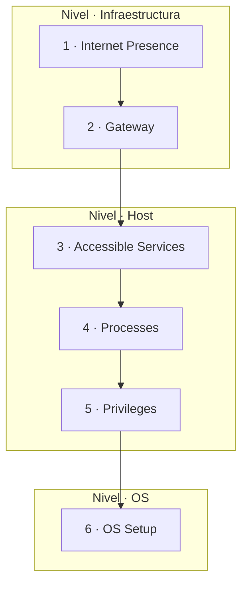

---
tags:
  - Pentesting/Enumeracion
  - Footprinting
  - Introduccion
  - Tipo/Introduccion
Descripción: "La enumeración es la recopilación de información sobre un objetivo mediante métodos activos (escaneos) y pasivos (servicios de terceros)"
Fecha de actualización: 2026-07-18
Nota previa:
Nota siguiente: "[[01 - Reconocimiento de dominio]]"
Area: "[[Footprinting.base|Footprinting]]"
---
---

<mark style="background: #ADCCFFA6;">La enumeración es la recopilación de información sobre un objetivo mediante métodos activos (escaneos) y pasivos (servicios de terceros)</mark>. No es un paso, es un **bucle**: cada dato descubierto abre nuevas preguntas y nuevas fuentes. El *footprinting* es la aplicación de esa enumeración a la infraestructura y sus servicios — el trabajo que precede a cualquier explotación seria.

> [!important]+ Enumeración ≠ OSINT
> <mark style="background: #FFB8EBA6;">OSINT es un procedimiento independiente y exclusivamente pasivo</mark>; se ejecuta por separado. La enumeración incluye interacción activa con el objetivo. Confundirlos lleva a "escanear" cuando tocaba observar sin ser visto. El OSINT corporativo profundo se trata en su propio módulo — aquí lo tocamos solo donde alimenta el footprinting.

# La mentalidad: encontrar el camino, no forzar la puerta

El error clásico del que empieza: encontrar `SSH`, `RDP` o `WinRM` y lanzarse a *brute-force* con credenciales comunes. <mark style="background: #FF5582A6;">El *brute-force* es ruidoso y te mete en una `blacklist`</mark> que puede dejar el resto del test inviable — sobre todo si no conoces aún las defensas de la empresa. La analogía de HTB es buena: un cazatesoros no clava la pala en un sitio al azar; estudia mapas y terreno primero.

<mark style="background: #8000E1A6;">El objetivo no es entrar en los sistemas, sino encontrar todas las formas de llegar a ellos</mark>. Ese cambio de foco —de "explotar" a "entender"— es lo que separa al que se atasca del que avanza. Cuando no sabes cómo seguir, casi nunca te falta habilidad de explotación: te falta comprensión técnica del objetivo.

## Las preguntas de la enumeración

La disciplina se apoya en preguntarse, en cada punto, tanto por lo visible como por lo invisible:

- ¿Qué **podemos** ver, por qué lo vemos, qué imagen nos da y cómo lo usamos?
- ¿Qué **no** podemos ver, por qué no lo vemos y qué imagen resulta de esa ausencia?

De ahí los **3 principios** que no cambian (aunque haya excepciones a las reglas):

1. **Hay más de lo que se ve a simple vista** — considera todos los puntos de vista.
2. **Distingue entre lo que ves y lo que no ves.**
3. **Siempre hay formas de obtener más información** — entiende el objetivo.

# La metodología de 6 capas

Un proceso complejo necesita una metodología estándar para no dejarse nada. HTB propone una **estática, de 6 capas**, agrupadas en 3 niveles. Las capas son "muros": buscas la grieta por la que pasar al siguiente, no revientas el muro de frente (donde rompes con esfuerzo puede no haber salida).

| Capa | Objetivo | Categorías de información |
| --- | --- | --- |
| **1 · Internet Presence** | Identificar la presencia en Internet y la infraestructura accesible externamente. | Dominios, subdominios, vHosts, ASN, netblocks, IPs, instancias cloud, medidas de seguridad. |
| **2 · Gateway** | Identificar las medidas que protegen la infraestructura. | Firewalls, DMZ, IPS/IDS, EDR, proxies, NAC, segmentación, VPN, Cloudflare. |
| **3 · Accessible Services** | Identificar interfaces y servicios accesibles. | Tipo de servicio, funcionalidad, configuración, puerto, versión, interfaz. |
| **4 · Processes** | Identificar procesos internos, orígenes y destinos ligados a los servicios. | PID, datos procesados, tareas, origen, destino. |
| **5 · Privileges** | Identificar permisos y privilegios sobre los servicios accesibles. | Grupos, usuarios, permisos, restricciones, entorno. |
| **6 · OS Setup** | Identificar componentes internos y configuración del sistema. | Tipo de SO, nivel de parches, config de red, ficheros sensibles. |

<mark style="background: #FFB86CA6;">Este módulo vive casi todo en la **Capa 3 (Accessible Services)</mark>: enumerar cada servicio de red para entender su función, hablar su protocolo y sacarle información. Las capas 1-2 (presencia y gateway) las cubren el reconocimiento web y otros módulos; las 4-6 (procesos, privilegios, SO) caen ya en post-explotación y escalada.

> [!info]+ La metodología no es una guía paso a paso
> Una metodología es un **resumen de procedimientos sistemáticos**, no una receta. *Cómo* se identifica cada componente cambia con el tiempo y las herramientas: hay decenas de herramientas de recon web, cada una con su enfoque. <mark style="background: #FFB8EBA6;">El conjunto de herramientas y comandos NO es la metodología — es un cheatsheet</mark> que consultas dentro de ella. Por eso este PKM separa el *qué/porqué* (estas notas) del *con qué* ([[18 - Arsenal de footprinting]]).

# Encaje en el pentest

El footprinting es la fase de [[05 - Recopilación de información|enumeración]] aplicada a la red. Se apoya en el escaneo con [[00 - Introducción a Nmap|Nmap]] (Capa 3) y en el reconocimiento pasivo de dominio/cloud/OSINT que empieza en [[01 - Reconocimiento de dominio]]. Y como toda interacción con el objetivo, **es detectable**: enumerar servicios genera logs y patrones, así que el sigilo aplica también aquí (ver [[08 - Detección de escaneos y evasión moderna|detección y evasión]] del módulo Nmap y la nota [[17 - Detección y evasión en footprinting]] de este).

> [!info]+ El mapa del atacante puede superar al del defensor
> El reconocimiento no es solo un paso técnico, es doctrina. Un atacante persistente invierte tanto en documentar el objetivo que <mark style="background: #FFB86CA6;">puede acabar conociendo la red mejor que su propio dueño</mark> — que rara vez mantiene un mapa preciso. A la enumeración activa de estas capas se suma el *passive mapping*: interpretar tráfico en modo promiscuo, respuestas DNS externas, latencias de `traceroute` o fugas en foros de soporte, sin tocar nunca el objetivo. El porqué estratégico de invertir tanto en reconocer está en [[00 - El mindset del atacante persistente]].
