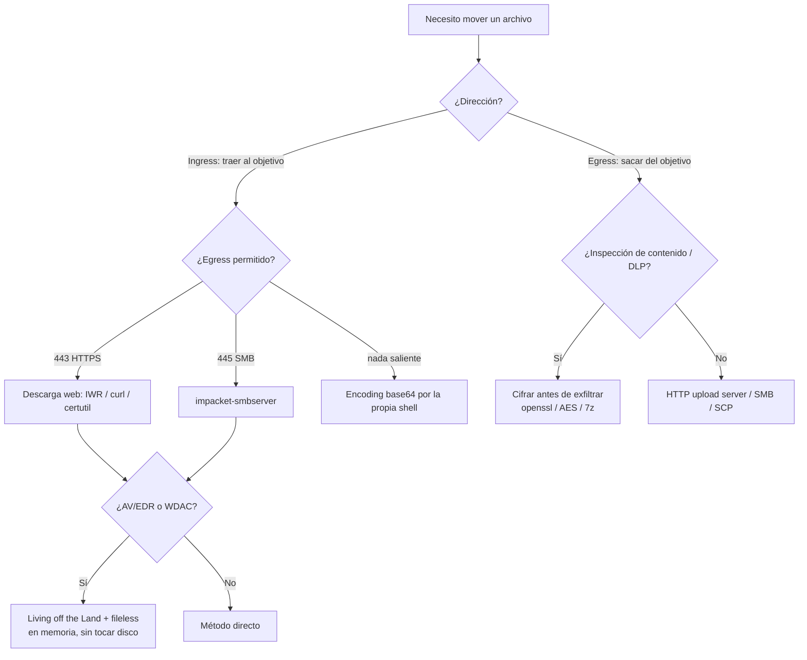

---
tags:
  - File-Transfer
  - Pentesting/Post-Explotacion
  - Introduccion
  - Tipo/Introduccion
Descripción: "Tarde o temprano toda intrusión necesita mover un archivo: subir un binario de escalada al objetivo, bajar un volcado de credenciales a la máquina de ataque, plantar un…"
Fecha de actualización: 2026-07-19
Nota previa: 
Nota siguiente: "[[01 - Transferencia en Windows - descarga]]"
Area: "[[Transferencia de archivos.base|Transferencia de archivos]]"
---
---

Tarde o temprano toda intrusión necesita **mover un archivo**: subir un binario de escalada al objetivo, bajar un volcado de credenciales a la máquina de ataque, plantar un implante, o exfiltrar datos del cliente para la prueba de concepto. <mark style="background: #ADCCFFA6;">La transferencia de archivos es el pegamento entre las fases de explotación, post-explotación y movimiento lateral</mark>: sin ella, un RCE se queda en una shell inútil.

El problema es que en 2026 **casi nada de esto es transparente**. El lab de HTB asume una red plana sin defensas; una red corporativa real interpone capas que rompen los métodos "de manual".

# El escenario realista

HTB plantea un caso que resume bien la fricción de un `engagement` moderno. Ganamos RCE en un IIS por *unrestricted file upload*, subimos una `web shell` y saltamos a una `reverse shell`. Queremos subir `PowerUp.ps1` para enumerar la escalada, pero:

- **PowerShell está bloqueado** por *Application Control* ([[Windows Defender Application Control|WDAC]] / [[AppLocker]]). No podemos ejecutar scripts arbitrarios.
- Detectamos `SeImpersonatePrivilege` y queremos subir el binario de `PrintSpoofer`. Usamos `certutil` para bajarlo de nuestro GitHub, pero **el filtrado de contenido web bloquea** GitHub, Dropbox, Drive…
- Montamos un FTP, pero **el firewall bloquea el saliente al puerto 21/TCP**.
- Probamos `impacket-smbserver` y descubrimos que el **445/TCP saliente sí está permitido**. Por ahí copiamos el binario y escalamos.

<mark style="background: #FF5582A6;">La lección: no hay un método universal, hay el método que la red del cliente deja pasar.</mark> El pentester prueba protocolos hasta encontrar el hueco, y lo hace intentando dejar el mínimo rastro.

> [!info]+ El caso real detrás del escenario
> Ese encadenar `BITSAdmin`/`certutil` y otros binarios legítimos para traer payloads es exactamente la técnica de malware *fileless* como **Astaroth**: la campaña de 2020 que documentó Microsoft abusaba de `BITSAdmin` (más `ExtExport`/`explorer`/`userinit`); su uso de `certutil` lo había documentado antes Cybereason (2019). La misma mecánica que usa el red team la usan los actores reales — por eso los EDR modernos vigilan justo estos binarios. Fuentes: [Microsoft Security (2020)](https://www.microsoft.com/en-us/security/blog/2020/03/23/latest-astaroth-living-off-the-land-attacks/) · [Cybereason (2019)](https://www.cybereason.com/blog/research/information-stealing-malware-targeting-brazil-full-research).

# Dos direcciones, dos perfiles de riesgo

Conviene razonar siempre en términos de dirección, porque cambia el vector de detección:

| Dirección | Qué movemos | Riesgo dominante |
| --- | --- | --- |
| <mark style="background: #ADCCFFA6;">**Ingress** (atacante → objetivo)</mark> | Herramientas, exploits, implantes | AV/EDR sobre el fichero escrito; *app allow-listing* al ejecutarlo |
| <mark style="background: #ADCCFFA6;">**Egress / exfil** (objetivo → atacante)</mark> | Loot, hashes, ficheros del cliente | DLP e inspección de contenido; *egress filtering* del firewall |

En *ingress* el fichero acaba en disco y lo escanea el AV; en *egress* el fichero sale por la red y lo puede oler un IDS/DLP. <mark style="background: #8000E1A6;">Esto significa que el cifrado y el troceado importan mucho más en la exfiltración</mark>, mientras que en la subida importa más elegir un método que no dispare el análisis heurístico al escribir en disco (ver [[06 - Transferencias protegidas]]).

# Qué te frena (y dónde encaja cada defensa)

- **AV / EDR**: firmas + heurística sobre el fichero y, vía [[AMSI]], sobre el script en memoria. Rompe descargas de scripts conocidos (`PowerUp.ps1`, `mimikatz`).
- **Application allow-listing** (WDAC, AppLocker): impide *ejecutar* lo que traes, aunque logres escribirlo. Fuerza a vivir de binarios firmados ([[08 - Living off the Land]]).
- **Egress filtering**: el firewall solo deja salir ciertos puertos/destinos. Por eso 445 (SMB) y 443 (HTTPS) suelen ser tus mejores apuestas: casi siempre abiertos.
- **Content filtering / proxy**: bloquea dominios de "compartir archivos". Obliga a alojar el payload en infraestructura propia o `redirectors`.
- **IDS/IPS y DLP**: inspeccionan el tráfico. Un `mimikatz.exe` en claro por HTTP salta una firma; cifrado o troceado, no.

# El marco de decisión

Antes de teclear, tres preguntas deciden el método:

1. **¿Qué SO y qué shell tengo?** Windows vs Linux, interactiva vs no interactiva (una `webshell` ciega no admite `scp` interactivo → base64 o descarga HTTP).
2. **¿Qué sale/entra por la red?** `nmap`/`nc` desde el objetivo revelan qué puertos salientes viven. Prioriza 443 y 445.
3. **¿Qué ya está en la caja?** Vivir de lo que hay (`curl.exe`, `certutil`, `bitsadmin` en Windows; `curl`, `wget`, `/dev/tcp` en Linux) evita subir herramientas y esquiva el *allow-listing*.

<mark style="background: #FFB8EBA6;">La regla operativa: fileless siempre que se pueda</mark> — ejecutar en memoria (`IEX (New-Object Net.WebClient).DownloadString(...)`, `curl … | bash`) deja mucho menos rastro forense que escribir el fichero en disco. Cuando toque tocar disco, hazlo en rutas *world-writable* poco vigiladas (`C:\Windows\Temp`, `/dev/shm`, `/tmp`) y borra después.

# Recorrido del sub-tema

El resto del tema recorre los métodos por plataforma y por canal, y cierra con los dos ejes que HTB apenas roza: cómo se **detecta** cada transferencia y cómo se **evade** hoy.

- Por SO: [[01 - Transferencia en Windows - descarga|Windows descarga]] / [[02 - Transferencia en Windows - subida|subida]], [[03 - Transferencia en Linux|Linux]].
- Por canal alternativo: [[04 - Transferencia con código|con código]] (Python/PHP/…), [[05 - Métodos misceláneos|nc, WinRM, RDP]], [[07 - Recibir archivos over HTTP-S|catching files]].
- Sigilo: [[06 - Transferencias protegidas|cifrado]], [[08 - Living off the Land|LOLBAS/GTFOBins]], [[09 - Detección]], [[10 - Evasión de detección]], y el [[11 - Arsenal de herramientas]] moderno.

Este sub-tema es la continuación natural de [[00 - Introducción a shells y payloads|shells y payloads]]: primero consigues ejecución, luego mueves lo que necesitas por ella.
